# Note for things I meet :copyright:

**Time Line**:clock9::clock11:

- [x] :date:2020-10-16 One week summary 


[TOC]


##  1. Resources List

- [Emoij](https://github.com/zhangjw-THU/Emoji) :point_right:GitHub 表情包
- [markdown doc](https://guides.github.com/features/mastering-markdown/) :point_right:markdown 语法
- [matrix](https://www.cnblogs.com/solvit/p/11345482.html):point_right:Latex 矩阵公式
- [mermaid](http://mermaid-js.github.io/mermaid/):point_right:mermaid 画图


:happy: markdown 特殊符号:

| **符号** | **说明**         | **编码** | **符号** | **说明**            | **编码** | **符号** | **说明**         | **编码** |
| -------- | ---------------- | -------- | -------- | ------------------- | -------- | -------- | ---------------- | -------- |
| **”**    | **双引号**       | **"**    | **×**    | **乘号**            | **×**    | **←**    | **向左箭头**     | **←**    |
| **&**    | **AND符号**      | **&**    | **÷**    | **除号**            | **÷**    | **↑**    | **向上箭头**     | **↑**    |
| **<**    | **小于符号**     | **<**    | **±**    | **正负符号**        | **±**    | **→**    | **向右箭头**     | **→**    |
| **>**    | **大于符号**     | **>**    | ƒ        | **function符号**    | **ƒ**    | **↓**    | **向下箭头**     | **↓**    |
|          | **空格**         | ** **    | **√**    | **根号**            | **√**    | **↑**    | **双向箭头**     | **↔**    |
| **?**    | **倒问号**       | **¿**    | **∞**    | **无限大符号**      | **∞**    | **⇐**    | **双线向左箭头** | **⇐**    |
| **?**    | **双左箭头**     | **«**    | **∠**    | **角度符号**        | **∠**    | **⇑**    | **双线向上箭头** | **⇑**    |
| **?**    | **双右箭头**     | **»**    | **∫**    | **微积分符号**      | **∫**    | ⇒        | **双线向右箭头** | **⇒**    |
| **‘**    | **左单引号**     | **‘**    | **°**    | **度数符号**        | **°**    | ⇓        | **双线向下箭头** | **⇓**    |
| **’**    | **右单引号**     | **’**    | **≠**    | **不等于符号**      | **≠**    | ⇔        | **双线双向箭头** | **⇔**    |
| **“**    | **左双引号**     | **“**    | **≡**    | **相等符号**        | **≡**    | **♠**    | **黑桃符号**     | **♠**    |
| **”**    | **右双引号**     | **”**    | **≤**    | **小于等于符号**    | **≤**    | **♣**    | **梅花符号**     | **♣**    |
| ¶        | **段落符号**     | **¶**    | **≥**    | **大于等于符号**    | **≥**    | **♥**    | **红心符号**     | **♥**    |
| **§**    | **章节符号**     | **§**    | **⊥**    | **垂直符号**        | **⊥**    | ♦        | **方块符号**     | **♦**    |
| **©**    | **版权所有符号** | **©**    | ½        | **二分之一符号**    | **½**    | **α**    | **Alpha符号**    | **α**    |
| ®        | **注册商标符号** | **®**    | ¼        | **四分之一符号**    | **¼**    | **β**    | **Bata符号**     | **β**    |
| ™        | **商标符号**     | **™**    | ¾        | **四分之三符号**    | **¾**    | **γ**    | **Gamma符号**    | **γ**    |
| €        | **欧元符号**     | **€**    | **‰**    | **百分符号**        | **‰**    | **Δ**    | **Delta符号**    | **Δ**    |
| **￠**   | **美分符号**     | **¢**    | **∴**    | **所以符号**        | **∴**    | **θ**    | **Theta符号**    | **θ**    |
| **￡**   | **英镑符号**     | **£**    | **π**    | **圆周率符号**      | **π**    | **λ**    | **Lambda符号**   | **λ**    |
| **￥**   | **日圆符号**     | **¥**    | **1**    | **批注1符号**       | **¹**    | **Σ**    | **Sigma符号**    | **Σ**    |
| **…**    | **…**            | **…**    | **2**    | **批注2符号、平方** | **²**    | **τ**    | **Tau符号**      | **τ**    |
| **⊕**    |                  | **⊕**    |          |                     |          |          |                  |          |

##  2. Git & GitHub

:book:[pro git](https://git-scm.com/book/zh/v2)

- [x] CH01-起步
- [ ] CH02-基础 2.2
- [ ] CH03-Git分支
- [ ] CH04-服务器上的Git
- [ ] CH05-分布式Git


```shell
echo "# leetcode" >> README.md
git init
git add README.md
git commit -m "first commit"
git branch -M main
git remote add origin https://github.com/picturetxl/leetcode.git
git push -u origin main
```

+ `git init`  用来初始化,因为要用`git`这个工具去追踪文件的修改历史,所以如何记录这个历史信息,`git`需要创建一些文件去追踪,所以要进行`git`的初始化 即把当前目录变成git管理的仓库
+ `git add Readme.md` 用来将文件`Readme.md`添加到`stage area`
  + `git commit -m "first commit"`
    
+ `git branch -M main` #重命名分支,默认的叫master
+ `git remote add origin https://github.com/picturetxl/leetcode.git` # origin远程库的名字 git 默认的名
+ `git push -u origin main` # 将本地库main 推送到远程库origin


获取帮助手册

```shell
$ git help <verb>
$ git <verb> --help
$ man git-<verb>
```


Git 有三种状态，你的文件可能处于其中之一： **已提交（committed）**、**已修改（modified）** 和 **已暂存（staged）**。

- 已修改表示修改了文件，但还没保存到数据库中。仅仅是修改了
- 已暂存表示对一个已修改文件的当前版本做了标记，使之包含在下次提交的快照中,保存在`starged area`暂存区。
- 已提交表示数据已经安全地保存在本地数据库中 即`.git`目录。


##  3.vscode addon

### 3.1 markdown

:question:vscode 中的markdown 写的时候没有snippet提示.

[solution](https://github.com/Microsoft/vscode/issues/28048)
:closed_book: 在settings.json下添加下面的代码,因为vscode 的markdown的snippet的触发默认是关闭的.需要添加下面的设置将其打开

```json
    "[markdown]": {
        "editor.quickSuggestions": true,
        "editor.wordWrap": "on",
    }
```


##  4. Assembly Language

- :book: 《汇编语言(第3版)》-:handbag:王爽

- 

- 学习环境: 8086CPU

- 每一种微处理器,由于硬件设计和内部结构的不同,就需要用不同的电平脉冲来控制,使它工作,所以每一种微处理器都有自己的机器指令集,也就是机器语言.

- 汇编指令是机器指令便于记忆的书写格式.

- CPU内部器件:

  - 寄存器: 8086CPU的所有寄存器都是16位的
    - 通用寄存器:`AX` `BX` `CX` `DX`
    - 段寄存器: `CS-代码段` `IP-指令指针`

- :unlock: :key:在内存或磁盘上,指令和数据没有任何区别,都是二进制信息.那么**CPU怎么知道是指令还是数据呢?**

- [x] CPU只认被`CS:IP`指向的内存单元中的内容为指令

- 微机存储器的容量是以字节为最小单位来计算的.对于拥有128个存储单元的存储器,我们可以说,它的容量是128个字节.

- 总线:

  - 地址总线:用来寻址
  - 数据总线:数据传送.
    - 数据总线的宽度决定了CPU和外界的数据传输速度.
    - 8086CPU的数据宽度是16. 说明一次可以传送2个字节.
  - 控制总线:对外部期间的控制.
    - 控制总线的宽度决定了CPU对外部器件的控制能力.

- :round_pushpin: **add 进位丢失**

  - :unlock: add al,93H 若al是C5H, 那么add之后,158H,但是al是8bit寄存器,只能存放两位十六进制数,故ax的值为0058H.这里的丢失指的是进位值不能在8位寄存器中保存,但是CPU并不真的丢弃这个进位值. 
    - [ ] #TODO::question:进位保存到哪了?
  - :large_blue_diamond: 如果执行add ax,93H,则**低8位的进位会存储在ah中**,CPU在执行这条指令时认为只有一个16位的寄存器.

- **在进行数据传送或运算时,要注意指令的两个操作对象的位数应当是一致的**

- :question: 在计算物理地址的时候,采用公式:**物理地址=段地址*16+偏移地址**,但是你做一个*16的操作后,比如1230H就变成了12300H,而寄存器是16bit的,也就是只能存4位十六进制数,但是此时存了5位.

  - [ ] #TODO::question:如何解决物理地址超过4位16进制数.

- 改变CPU的行为

  - CPU从何处执行指令是由`CS` `IP`中的内容决定的.

  - 因此通过修改`CS` `IP` 的值来改变CPU的行为.

  - `jmp`指令:mov指令不可以直接修改`CS` `IP`中的值

    ```assembly
    jmp 2AE3:3 # jmp 段地址:偏移地址
    jmp ax     # jmp 寄存器 like move IP,ax
    ```


## 5. Linux 系统编程

:books:《Linux/Unix系统编程手册》上下册

- [ ] CH01-历史和标准
- [ ] CH02-基本概念
- [ ] CH03-系统编程概念
- [ ] CH04-文件IO:通用的IO模型
- [ ] CH05-深入探究文件IO
- [ ] CH06-进程
- [ ] CH09-进程凭证
- [ ] CH35-进程优先权和进程调度
- [ ] 


### 进程和线程


获取进程号:

```c
#include <unistd.h>
pid_t getpid(void);
```

`pid_t`，该类型是由 SUSv3 所规定的整数类型，专用于存储进程号。


获取该进程的父进程:

```c
#include <unistd.h>
pit_t getppid();
```

最大进程号:Linux内核限制进程号.

> 一旦进程号达到 32767，会将进程号计数器重置为 **300**，而不是 1。之所以如此，是因为低数值的进程号为系统进程和守护进程所长期占用，在此范围内搜索尚未使用的进程号只会是浪费时间。


`pstree` 可以看到进程树


> 如果子进程的父进程终止，则子进程就会变成“孤儿”，init 进程随即将收养该进程，子进程后续对 getppid()的调用将返回进程号 1


进程的内存布局:

1. 文本段:进程的运行的指令.
   + 
2. 初始化数据段:
3. 未初始化数据段:
4. 栈
5. 堆


`size` 命令可以查看可执行程序的段信息.

```c
/* mem_segments.c

   A program that does nothing in particular, but the comments indicate
   which memory segments each type of variable is allocated in.
*/
#define _BSD_SOURCE
#include <stdio.h>
#include <stdlib.h>

char globBuf[65536];            /* Uninitialized data segment */
int primes[] = { 2, 3, 5, 7 };  /* Initialized data segment */
static int
square(int x)                   /* Allocated in frame for square() */
{
    int result;                 /* Allocated in frame for square() */

    result = x * x;
    return result;              /* Return value passed via register */
}
static void
doCalc(int val)                 /* Allocated in frame for doCalc() */
{
    printf("The square of %d is %d\n", val, square(val));

    if (val < 1000) {
        int t;                  /* Allocated in frame for doCalc() */

        t = val * val * val;
        printf("The cube of %d is %d\n", val, t);
    }
}
int
main(int argc, char *argv[])    /* Allocated in frame for main() */
{
    static int key = 9973;      /* Initialized data segment */
    static char mbuf[10240000]; /* Uninitialized data segment */
    char *p;                    /* Allocated in frame for main() */

    p = malloc(1024);           /* Points to memory in heap segment */

    doCalc(key);

    exit(EXIT_SUCCESS);
}
```

- [ ] 如何验证这个代码的每个部分在哪个段中呢?


---

---


## 6. AutoConf 

[AutoConf reference](http://www.gnu.org/savannah-checkouts/gnu/autoconf/manual/autoconf-2.69/index.html)


###  为什么要有automake这样的工具?

在看[GitHub json project](https://github.com/recp/json)时看到这些.所以写了这篇博客记录学到的东东.
`automake` 比`make` 更好.原因(见手册P13):

1. 自动依赖跟踪 `automatic dependency tracking`
2. 递归构建(子目录也支持) `recursive builds in subdirectories`
3. 可靠的时间戳(用于网络项目) `reliable timestamps`

> 总之就是`automake`比`make`方便.所以你要用,而且这个工具是可以构建不同的系统之间的package.这样你就不需要面对用户的不同系统配置时发生错误而买单.就是发行软件时很方便,用户也很方便,维护也很方便.
> **没有比较`CMake`** 


### ubuntu 安装

```shell
sudo apt install autoconf
sudo apt install libtool
```

### 整体观

**The GNU Build System** 是由三个核心组件组成:

1. Autoconf
2. Automake
3. Libtool

---


### 各种命令

#### autoscan

**不是给用户用的,而是帮助程序员的**
在安装autoconf时

`autoscan`可以帮助程序员自动创建`configure.ac` .
`autoscan`可以检查源代码的目录树.有以下两种方式:

1. 一种是给定参数,这个参数是源代码的根目录.
2. 另一种是不给参数,`autoscan`会扫描当前的目录.

执行`autoscan`过后会生成`configure.scan`,你只需要重命名为`configure.ac`然后根据需要更改里面的内容,就相当于gnu给你了模板.

> 执行过后:

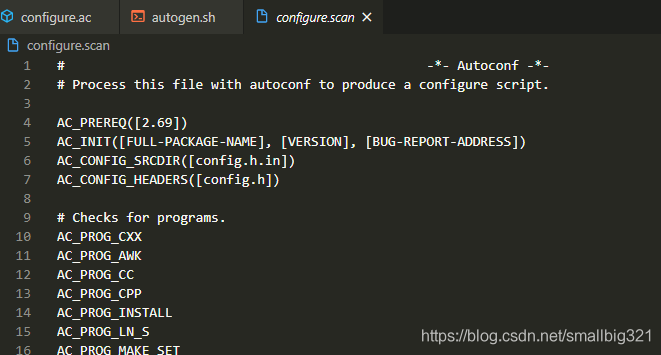
不仅如此,`autoscan`还生成了`autoscan.log`这个文件用来说明哪些宏是必须的原因.


#### autoheader

创建一个含有#define的头文件来供`configure`去使用.

`autoheader`会产生一个一个`config.h.in`  而`configure`程序会生成`configure.h`
那为啥这么做呢?搞那么多就为了生成一个`configure.h` 手册也做了说明`P44-4.9.2-Using autoheader to Create confgure.h.in`


#### autoconf

`autoconf` 是架在了shell上,这种设计原因手册也说了详细见手册`P15-3.1.1 A Shell Script Compiler`


语法规则:

```shell
macro_name([arg1],[arg2]...)
```

宏名和小括号之间不能有空格,参数用中括号括起来.当然手册也说了可以不要,但没必要纠结什么时候不要,我都加上不就好了.能简洁到哪里?

#### automake 

automake 是从Makefile.am中生成Makefile.in文件的工具


```c
#*****************************************************************************
# Copyright (c), Recep Aslantas.                                             *
#                                                                            *
# MIT License (MIT), http://opensource.org/licenses/MIT                      *
# Full license can be found in the LICENSE file                              *
#                                                                            *
#*****************************************************************************

# autoconf command version need to bigger than 2.69 
AC_PREREQ([2.69])

# package name | version | bug reports address
AC_INIT([json], [0.1.5], [info@recp.me])

#set automake variable 
AM_INIT_AUTOMAKE([-Wall -Werror foreign subdir-objects])

AC_CONFIG_MACRO_DIR([m4])
AC_CONFIG_SRCDIR([src/])
AC_CONFIG_HEADERS([config.h])

# Checks for programs.
AC_PROG_CC
AM_PROG_CC_C_O

AC_PROG_INSTALL
AM_PROG_AR

AC_ENABLE_SHARED
AC_ENABLE_STATIC

LT_INIT

# Checks for libraries.
AC_CHECK_LIB([c], [strlen, strncmp, calloc, free])

m4_ifdef([AM_SILENT_RULES], [AM_SILENT_RULES([yes])])
AC_SYS_LARGEFILE

# Checks for header files.
AC_CHECK_HEADERS([limits.h \
                  stddef.h \
                  stdint.h \
                  stdlib.h \
                  string.h ])

# Checks for typedefs, structures, and compiler characteristics.
AC_CHECK_HEADER_STDBOOL
AC_C_INLINE
AC_TYPE_INT32_T
AC_TYPE_INT64_T
AC_TYPE_SIZE_T
AC_TYPE_UINT16_T
AC_TYPE_UINT32_T
AC_TYPE_UINT64_T
AC_TYPE_UINT8_T

# Checks for library functions.
AC_FUNC_ERROR_AT_LINE

AC_CONFIG_FILES([makefile])

AC_OUTPUT

```


## 7. UML

现实世界和对象世界存在着一道鸿沟,这道鸿沟的名字叫做抽象.而跨越这条鸿沟,就需要UML来解决这样的问题:

+ 一种把现实世界映射到对象世界的方法
+ 一种从对象世界描述现实世界的方法
+ 一种验证对象世界行为是否正确反映了现实世界的方法


建立模型的过程是一个抽象的过程,所以要建立模型,首先要知道如何抽象现实世界(人,事,物,规则).

建立模型的关键就是弄明白有什么人,什么人做什么事,什么事产生什么物,中间有什么规则,再把人,事,物之间的关系定义出来,一个模型基本成型了.


`参与者(actor)`:代表现实中的`人`

`用例use case`:参与者想要做什么并且获得什么,即业务目标.代表现实中的`事`

`业务场景business scenario`or`用例场景 use case scenario`:这件事情是怎么样做的,依据什么规则,代表`现实世界的规则`.

`业务对象模型business object model`:说明在达成这些业务目标的过程中涉及到的事物,代表现实世界的`物`


检验是否在用面向对象方法去思考问题:

:rotating_light:


### 7.1 基本知识

UML软件开发过程的基本特征是以**用例驱动**软件开发全过程.用例将影响开发过程的所有阶段和视图.

### 7.2 用例建模

软件开发过程中,首先需要准确地描述客户需求中的功能需求,即**系统需要做什么**,以便进一步确定系统应建立那些对象和所建立对象之间的关系.

用例建模是用于描述一个系统的功能(即系统应该做什么)的建模技术.

+ 系统
+ 执行者
  + 每个执行者可以叙述他如何使用系统,或者说他需要系统提供什么功能

> 用例包含多个用例图.

#### 7.2.1 用例建模的步骤

> 也是画用例图的步骤

##### 7.2.1.1 定义系统的边界

回答什么应该放在系统内,什么不应该放在系统内的问题.

对应于用例图的实线方框

##### 7.2.1.2 确定执行者

执行者是指在**系统外部**和系统交互的**人**或**其他系统**

1. 执行者之间可以有继承关系
2. 执行者代表一种角色而不是具体的人
3. 对同一个人担任角色的限制
4. 执行者可分为主执行者和副执行者
5. 三个凡是->确定执行者
   1. 凡是直接是使用系统的人员
   2. 凡是直接向系统提供外界信息或在系统的控制下运行的硬件设备
   3. 凡是直接与系统进行交互的外部系统
6. **用例恰似一个类**,可以有多个实例,用例的实例叫做场景.
7. 用例之间的关联
   1. 继承关联
   2. 扩展关联<<extend>>
   3. 包含关联<<include>>
   4. 使用关联<<use>>

##### 7.1.1.3 用例活动图

对用例进行详细的描述


#### 7.2.1.3 案例

> 案例一:自动售货机
>
> 注意use和extend的不同.


### 7.3 对象类建模


#### 7.3.1 属性语法

>  `可见性` `名称`: `类型` `[=默认值]`

+ 可见性:
  + `+` 表示public or protected
  + `-` 表示private
  + `#`表示derived
  + static属性用下划线


#### 7.3.2 方法语法

> `可见性` `方法名` `(参数列表)` `返回值类型` 


#### 7.3.3 关联关系


##### 7.3.3.1 聚合 has a

> 表示是某一个部分
>
> 图示:白色的钻石标记


##### 7.3.3.2 组合 made up of 

> 是聚合的加强版:强的拥有关系,表示整体和部分的关系,**部分和整体的声明周期相同**
>
> 整体结束了，不分也就结束了 -> **这是区分聚合还是组合的关键:就是看能不能单独存在,是一种共生存的状态**
>
> 图示：黑色的钻石表示


##### 7.3.3.3 依赖 

> 暂时使用
>
> 图示:点线
>
> 通常是实现细节，而不是对象状态的内在部分

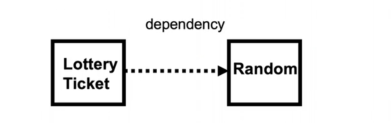


##### 7.3.3.4 泛化 is a

+ 继承
  + ~~类的继承:实线,黑色箭头~~
  + ~~抽象类(至少有一个虚函数)的继承:实线,白色箭头~~


## 8.LeetCode

说明:

|           图标            |        说明        |
| :-----------------------: | :----------------: |
|    :triangular_ruler:     |       数学题       |
|          :books:          | 蕴含题目背后有思想 |
|    :white_check_mark:     |                    |
|          :star:           |        easy        |
|       :star::star:        |        mid         |
|    :star::star::star:     |        hard        |
|          :smile:          |      独立完成      |
|             👎             |    题目出的不好    |
|     :checkered_flag:      |         C          |
| :triangular_flag_on_post: |        C++         |
|          :dart:           |       python       |
|        :hourglass:        |       待处理       |
|          :gift:           |   参考别人的想法   |
|         :trophy:          |        双百        |
|         :couple:          |       双指针       |


### 8.1 Array 

####  :smile:1480. Running Sum of 1d Array  :star::triangular_flag_on_post: 

```c
Input: nums = [1,2,3,4]
Output: [1,3,6,10]
Explanation: Running sum is obtained as follows: [1, 1+2, 1+2+3, 1+2+3+4].
```

> 前n项和保存在输出数组中

```cpp
class Solution {
public:
    vector<int> runningSum(vector<int>& nums) {
        vector<int> result;
        int temp=0;
        for(auto n :nums){
            temp += n;
            result.push_back(temp);
        }
        return result;
    }
};
```

Runtime: 4 ms, faster than `86.49%` of C++ online submissions for Running Sum of 1d Array.

Memory Usage: 8.9 MB, less than `97.22%` of C++ online submissions for Running Sum of 1d Array.


#### :smile:1431. Kids With the Greatest Number of Candies :star::triangular_flag_on_post: 

```c
Input: candies = [2,3,5,1,3], extraCandies = 3
Output: [true,true,true,false,true] 
Explanation: 
Kid 1 has 2 candies and if he or she receives all extra candies (3) will have 5 candies --- the greatest number of candies among the kids. 
Kid 2 has 3 candies and if he or she receives at least 2 extra candies will have the greatest number of candies among the kids. 
Kid 3 has 5 candies and this is already the greatest number of candies among the kids. 
Kid 4 has 1 candy and even if he or she receives all extra candies will only have 4 candies. 
Kid 5 has 3 candies and if he or she receives at least 2 extra candies will have the greatest number of candies among the kids. 
```

> 将extraCandies的数目加到candies的每一项,如果该项是candies中最大的则为true,否则是false

```cpp
class Solution {
public:
    bool isMax(int temp,const vector<int>&candies){
        for(auto c:candies){
            if(temp < c){
                return false;
            }
        } 
        return true;
    }
    vector<bool> kidsWithCandies(vector<int>& candies, int extraCandies) {
        vector<bool> result;
        for(auto candy:candies){
            int temp = candy + extraCandies;
            if (isMax(temp,candies)){
                result.push_back(true);
            }else{
                result.push_back(false);
            }
        }
        return result;
    }
};
```

Runtime: 4 ms, faster than `82.56%` of C++ online submissions for Kids With the Greatest Number of Candies.

Memory Usage: 9.2 MB, less than `100.00%` of C++ online submissions for Kids With the Greatest Number of Candies.


#### :smile:1470. Shuffle the Array:star: :triangular_flag_on_post:

```
Given the array nums consisting of 2n elements in the form [x1,x2,...,xn,y1,y2,...,yn].
Return the array in the form [x1,y1,x2,y2,...,xn,yn].

Input: nums = [2,5,1,3,4,7], n = 3
Output: [2,3,5,4,1,7] 
Explanation: Since x1=2, x2=5, x3=1, y1=3, y2=4, y3=7 then the answer is [2,3,5,4,1,7].
```

> 根据n将nums分成两半A和B,然后A数组放一个给到结果数组,B数组放一个.依次进行

```cpp
class Solution {
public:
    vector<int> shuffle(vector<int>& nums, int n) {
        vector<int> result;
        int pre_half = 0;
        int last_half = nums.size()/2;
        for(int i=0;i<n;i++){
            result.push_back(nums[pre_half]);
            result.push_back(nums[last_half]);
            pre_half++;
            last_half++;
        }
        return result;
    }
};
```

Runtime: 8 ms, faster than `90.91%` of C++ online submissions for Shuffle the Array.

Memory Usage: 10.3 MB, less than `100.00%` of C++ online submissions for Shuffle the Array.


#### :gift:1512. Number of Good Pairs:star: :triangular_flag_on_post:

```c
Given an array of integers nums.
A pair (i,j) is called good if nums[i] == nums[j] and i < j.
Return the number of good pairs.

Input: nums = [1,2,3,1,1,3]
Output: 4
Explanation: There are 4 good pairs (0,3), (0,4), (3,4), (2,5) 0-indexed.
```

> 相同的数进行配对.

双循环:暴力解法

```cpp
class Solution {
public:
    int numIdenticalPairs(vector<int>& nums) {
        int result = 0;
        for(int i=0;i<nums.size();i++){
            for(int j=i+1;j<nums.size();j++){
                if(nums[i]==nums[j]){
                    result++;
                }
            }
        }
        return result;
    }
};
```

**优化**: 发现结果值只是计算pair的对数,没有让输出具体的index.同时又发现pair的对数和相同数有几个是相同的.就是说可以用一个hash表进行统计.比如案例中的统计1的pair的时候,刚遇到1,数量为0,第二次遇到则进行累加.

```cpp
class Solution {
public:
    int numIdenticalPairs(vector<int>& nums) {
        int result = 0;
        unordered_map<int,int> hash;
        for(int i=0;i<nums.size();i++){
            result += hash[nums[i]];//* hash 初始值为0,即对应数的count为0
            hash[nums[i]]++;
            //* 合并:  result += hash[nums[i]]++;
        }
        return result;
    }
};
```

Runtime: 0 ms, faster than `100.00%` of C++ online submissions for Number of Good Pairs.

Memory Usage: 7.6 MB, less than `48.64%` of C++ online submissions for Number of Good Pairs.


#### :gift:1365. How Many Numbers Are Smaller Than the Current Number :star::star::books::triangular_flag_on_post: 

```c
Input: nums = [8,1,2,2,3]
Output: [4,0,1,1,3]
Explanation: 
For nums[0]=8 there exist four smaller numbers than it (1, 2, 2 and 3). 
For nums[1]=1 does not exist any smaller number than it.
For nums[2]=2 there exist one smaller number than it (1). 
For nums[3]=2 there exist one smaller number than it (1). 
For nums[4]=3 there exist three smaller numbers than it (1, 2 and 2).
```

> 对于nums数组中的每一个数,在nums中有多少个数小于它

暴力解法:

```cpp
class Solution {
public:
    
    vector<int> smallerNumbersThanCurrent(vector<int>& nums) {
        vector<int> result;
       
        for(int i=0;i<nums.size();i++){
            int current = nums[i];
            int count = 0;
            for(int j=0;j<nums.size();j++){
                if(current > nums[j]){
                    count++;
                }
            }
            result.push_back(count);
        }
        return result;
    }
};
```

Runtime: 44 ms, faster than `45.57%` of C++ online submissions for How Many Numbers Are Smaller Than the Current Number.

Memory Usage: 10.5 MB, less than `44.05%` of C++ online submissions for How Many Numbers Are Smaller Than the Current Number.

**优化**: 通过:link:[计数排序](#计数排序)的思想进行优化

计数排序告诉我们可以使用空间换取时间,只需要更大的数组用来存放每个元素的个数,再进行累加确定元素的位置即可.

```cpp
class Solution {
public:
    
    vector<int> smallerNumbersThanCurrent(vector<int>& nums) {
        vector<int> count(101,0);
        //* 统计元素出现的次数
        for(int i = 0;i<nums.size();i++){
            count[nums[i]] ++;
        }
        //* 统计小于该元素的个数
        for(int j = 1;j<count.size();j++){
            count[j] += count[j-1];
        }
        vector<int> re(nums.size(),0);
        for(int i=0;i<nums.size();i++){
             if (nums[i] == 0)//* 当nums数组中出现多个0的时候,小于的个数为0
                re[i] = 0;
            else
                re[i] = count[nums[i]-1];
        }
        return re;
    }
};
```

Runtime: 8 ms, faster than `92.09%` of C++ online submissions for How Many Numbers Are Smaller Than the Current Number.

Memory Usage: 10.5 MB, less than `44.05%` of C++ online submissions for How Many Numbers Are Smaller Than the Current Number.


#### :smile:1313. Decompress Run-Length Encoded List:star::triangular_flag_on_post:

```c
Input: nums = [1,2,3,4]
Output: [2,4,4,4]
Explanation: The first pair [1,2] means we have freq = 1 and val = 2 so we generate the array [2].
The second pair [3,4] means we have freq = 3 and val = 4 so we generate [4,4,4].
At the end the concatenation [2] + [4,4,4] is [2,4,4,4].
```

> 首先nums是2的倍数.两两一对,第一个数表示第二个数出现的次数,然后合成一个数组

```cpp
class Solution {
public:
    vector<int> decompressRLElist(vector<int>& nums) {
        vector<int> result;
        for(int i=0;i<nums.size();i+=2){
            int freq = nums[i];
            int val = nums[i+1];
            result.insert(result.end(),freq,val);
        }
        return result;
    }
};
```

使用了vector::insert的fill方式，简化了代码


#### :smile:1389. Create Target Array in the Given Order:star::triangular_flag_on_post:

```c
Given two arrays of integers nums and index. Your task is to create target array under the following rules:
Initially target array is empty.
From left to right read nums[i] and index[i], insert at index index[i] the value nums[i] in target array.
Repeat the previous step until there are no elements to read in nums and index.
Return the target array.
    
Input: nums = [0,1,2,3,4], index = [0,1,2,2,1]
Output: [0,4,1,3,2]
Explanation:
nums       index     target
0            0        [0]
1            1        [0,1]
2            2        [0,1,2]
3            2        [0,1,3,2]
4            1        [0,4,1,3,2]
```

> 就是告诉你在哪插入什么值，使用c++很简单地就解决了

```cpp
class Solution {
public:
    vector<int> createTargetArray(vector<int>& nums, vector<int>& index) {
        vector<int> result;
        for(int i=0;i<nums.size();i++){
            result.insert(result.begin()+index[i],nums[i]);
        }
        return result;
    }
};
```

Runtime: 0 ms, faster than `100.00%` of C++ online submissions for Create Target Array in the Given Order.

Memory Usage: 8.9 MB, less than `66.16%` of C++ online submissions for Create Target Array in the Given Order.


#### :smile:1486. XOR Operation in an Array:star::triangular_flag_on_post:

```c
Given an integer n and an integer start.
Define an array nums where nums[i] = start + 2*i (0-indexed) and n == nums.length.
Return the bitwise XOR of all elements of nums.

Input: n = 5, start = 0
Output: 8
Explanation: Array nums is equal to [0, 2, 4, 6, 8] where (0 ^ 2 ^ 4 ^ 6 ^ 8) = 8.
Where "^" corresponds to bitwise XOR operator.
```

> 给你一个start和n生成一个nums数组满足`nums[i] = start + 2*i `,然后每个元素进行XOR操作

```cpp
class Solution {
public:
    int xorOperation(int n, int start) {
        int result = start;
        for(int i=1;i<n;i++){
            result = result ^ (start+2*i);
        }
        return result;
    }
};
```

Runtime: 0 ms, faster than `100.00%` of C++ online submissions for XOR Operation in an Array.

Memory Usage: 6.3 MB, less than `7.24%` of C++ online submissions for XOR Operation in an Array.


#### :hourglass:1588. Sum of All Odd Length Subarrays:star::star::star:

```c
Given an array of positive integers arr, calculate the sum of all possible odd-length subarrays.
A subarray is a contiguous subsequence of the array.
Return the sum of all odd-length subarrays of arr.
    
Input: arr = [1,4,2,5,3]
Output: 58
Explanation: The odd-length subarrays of arr and their sums are:
[1] = 1
[4] = 4
[2] = 2
[5] = 5
[3] = 3
[1,4,2] = 7
[4,2,5] = 11
[2,5,3] = 10
[1,4,2,5,3] = 15
If we add all these together we get 1 + 4 + 2 + 5 + 3 + 7 + 11 + 10 + 15 = 58
```

> 奇数个数的子数组(连续的)的和

- [ ] TODO:

  :link:SubarraySums By Stanford](https://web.stanford.edu/class/cs9/sample_probs/SubarraySums.pdf)

#### :smile:1295. Find Numbers with Even Number of Digits:star::triangular_flag_on_post:


```c
Input: nums = [12,345,2,6,7896]
Output: 2
Explanation: 
12 contains 2 digits (even number of digits). 
345 contains 3 digits (odd number of digits). 
2 contains 1 digit (odd number of digits). 
6 contains 1 digit (odd number of digits). 
7896 contains 4 digits (even number of digits). 
Therefore only 12 and 7896 contain an even number of digits.
```

> 统计数组中元素的位数是奇数的元素个数

```cpp
class Solution {
public:
    int findNumbers(vector<int>& nums) {
        int result = 0;
        for(auto value:nums){
            int even_or_odd = to_string(value).size();
            if(even_or_odd % 2 == 0){
                result++;
            }
        }
        return result;
    }
};
```


Runtime: 12 ms, faster than`58.50%` of C++ online submissions for Find Numbers with Even Number of Digits.

Memory Usage: 10.2 MB, less than `100.00%` of C++ online submissions for Find Numbers with Even Number of Digits.


#### :smile:1534. Count Good Triplets :star::triangular_flag_on_post:

```c
Given an array of integers arr, and three integers a, b and c. You need to find the number of good triplets.
A triplet (arr[i], arr[j], arr[k]) is good if the following conditions are true:
0 <= i < j < k < arr.length
|arr[i] - arr[j]| <= a
|arr[j] - arr[k]| <= b
|arr[i] - arr[k]| <= c
Where |x| denotes the absolute value of x.
Return the number of good triplets.

Input: arr = [3,0,1,1,9,7], a = 7, b = 2, c = 3
Output: 4
Explanation: There are 4 good triplets: [(3,0,1), (3,0,1), (3,1,1), (0,1,1)].
```

> 暴力解法：三层循环

```cpp
class Solution {
public:
    int countGoodTriplets(vector<int>& arr, int a, int b, int c) {
        int result = 0;
        for(int i=0;i<arr.size();i++){
           for(int j=i+1;j<arr.size();j++){
               for(int k=j+1;k<arr.size();k++){
                   if(abs(arr[i]-arr[j])<=a and abs(arr[j]-arr[k])<=b and abs(arr[k]-arr[i])<=c){
                       result++;
                   }
               }
           } 
        }       
        return result;
    }
};
```

Runtime: 48 ms, faster than `33.95%` of C++ online submissions for Count Good Triplets.

Memory Usage: 8.5 MB, less than `25.36%` of C++ online submissions for Count Good Triplets.

> 如果进行优化，也只能在if中进行提前判断，这种做法并没有本质的提高

#### :smile:1266. Minimum Time Visiting All Points:star::triangular_flag_on_post:

```c
On a plane there are n points with integer coordinates points[i] = [xi, yi]. Your task is to find the minimum time in seconds to visit all points.
You can move according to the next rules:
In one second always you can either move vertically, horizontally by one unit or diagonally (it means to move one unit vertically and one unit horizontally in one second).
You have to visit the points in the same order as they appear in the array.

Input: points = [[1,1],[3,4],[-1,0]]
Output: 7
Explanation: One optimal path is [1,1] -> [2,2] -> [3,3] -> [3,4] -> [2,3] -> [1,2] -> [0,1] -> [-1,0]   
Time from [1,1] to [3,4] = 3 seconds 
Time from [3,4] to [-1,0] = 4 seconds
Total time = 7 seconds
```


> 最少时间访问所有节点。横着走一格，竖着走一格，斜着走一格都花费1秒

能尽量走斜线就走斜线，因为走斜线，横竖都增加一格。不能走再进行横竖走。

```cpp
class Solution {
public:
    int minTimeToVisitAllPoints(vector<vector<int>>& points) {
        int count = 0;
        //* 可以转换成从一个点走到另一个点额最小时间
        for(int i=0;i<points.size()-1;i++){
            vector<int> start = points[i];
            vector<int> end = points[i+1];
            if(fabs(start[0]-end[0]) > fabs(end[1]-start[1])){
                //* x坐标之间的距离大于y坐标之间的距离
                count += fabs(end[1]-start[1]);
                count += fabs(start[0]-end[0]) - fabs(end[1]-start[1]);
            }else{
                 //* y坐标之间的距离大于x坐标之间的距离
                count += fabs(end[0]-start[0]);
                count += fabs(start[1]-end[1]) - fabs(end[0]-start[0]);
            }
        }
        return count;
    }
};
```

Runtime: 20 ms, faster than `27.39%` of C++ online submissions for Minimum Time Visiting All Points.

Memory Usage: 11.2 MB, less than `30.83%` of C++ online submissions for Minimum Time Visiting All Points.


#### :smile:1572. Matrix Diagonal Sum:star::triangular_flag_on_post:


```c
Input: mat = [[1,2,3],
              [4,5,6],
              [7,8,9]]
Output: 25
Explanation: Diagonals sum: 1 + 5 + 9 + 3 + 7 = 25
Notice that element mat[1][1] = 5 is counted only once.
```

> 对角线的和。主对角线`(i，i)` 副对角线`(i,n-i-1)`,当n为奇数的时候多加了一次中心元素。

```cpp
class Solution {
public:
    int diagonalSum(vector<vector<int>>& mat) {
        int result = 0;
        int n = mat.size();
        for(int i=0;i<n;i++){
            result += mat[i][i];        //* 主对角线
            result += mat[i][n-i-1];    //* 副对角线
        }
        if(n%2!=0)
            result -= mat[n/2][n/2];        //* 中心元素
        
        return result;
    }
};
```

Runtime: 24 ms, faster than `97.95%` of C++ online submissions for Matrix Diagonal Sum.

Memory Usage: 11.9 MB, less than `52.07%` of C++ online submissions for Matrix Diagonal Sum.


#### :smile::hourglass:1252. Cells with Odd Values in a Matrix:star::star::triangular_flag_on_post:


```c
Given n and m which are the dimensions of a matrix initialized by zeros and given an array indices where indices[i] = [ri, ci]. For each pair of [ri, ci] you have to increment all cells in row ri and column ci by 1.
Return the number of cells with odd values in the matrix after applying the increment to all indices.

Input: n = 2, m = 3, indices = [[0,1],[1,1]]
Output: 6
Explanation: Initial matrix = [[0,0,0],[0,0,0]].
After applying first increment it becomes [[1,2,1],[0,1,0]].
The final matrix will be [[1,3,1],[1,3,1]] which contains 6 odd numbers.
```

> indeices 数组是说 行和列都增加1 比如：indices = [[0,1],[1,1]] 则0行都要增加1 1列也都要增加1 1行再增加1 ，1列再增加1，然后统计有多少个奇数

```cpp
class Solution {
public:
    int oddCells(int n, int m, vector<vector<int>>& indices) {
        vector<int> rows(n,0);
        vector<int> cols(m,0);
        //* 统计行和列共需要增加几次
        for(auto in:indices){
            rows[in[0]]++;
            cols[in[1]]++;
        }
        int rec=0;
        //* 构造矩阵
        for(int i=0;i<n;i++){
            for(int j=0;j<m;j++){
                int value = rows[i] + cols[j];
                if(value%2!=0){
                    rec++;
                }
            }
        }
        return rec;
    }
};
```

Runtime: 8 ms, faster than `63.10%` of C++ online submissions for Cells with Odd Values in a Matrix.

Memory Usage: 8.3 MB, less than `7.57%` of C++ online submissions for Cells with Odd Values in a Matrix.

> - [ ] 这道题在英文版的discuss中还存在一种O(n)的解法，但是较难理解。[:link:link](https://leetcode.com/problems/cells-with-odd-values-in-a-matrix/discuss/426647/C%2B%2B-0ms-9.2MB.-Faster-than-100-and-uses-lesser-memory-than-100-submissions)


#### :trophy:1450. Number of Students Doing Homework at a Given Time

```c
Input: startTime = [1,2,3], endTime = [3,2,7], queryTime = 4
Output: 1
Explanation: We have 3 students where:
The first student started doing homework at time 1 and finished at time 3 and wasn't doing anything at time 4.
The second student started doing homework at time 2 and finished at time 2 and also wasn't doing anything at time 4.
The third student started doing homework at time 3 and finished at time 7 and was the only student doing homework at time 4.
    
    
Return the number of students doing their homework at time queryTime. More formally, return the number of students where queryTime lays in the interval [startTime[i], endTime[i]] inclusive.
```

> 求在queryTime还在做作业的学生数

```cpp
class Solution {
public:
    int busyStudent(vector<int>& startTime, vector<int>& endTime, int queryTime) {
        int ret = 0;
        for(int i=0;i<endTime.size();i++){
            if(queryTime <= endTime[i] and queryTime >= startTime[i]){
                ret++;
            }
        }
        return ret;
    }
};
```

Runtime: 0 ms, faster than `100.00%` of C++ online submissions for Number of Students Doing Homework at a Given Time.

Memory Usage: 11.4 MB, less than `100.00%` of C++ online submissions for Number of Students Doing Homework at a Given Time.


#### :smile::hourglass:1464. Maximum Product of Two Elements in an Array:star::books::triangular_flag_on_post:

```c
Given the array of integers nums, you will choose two different indices i and j of that array. Return the maximum value of (nums[i]-1)*(nums[j]-1).

Input: nums = [3,4,5,2]
Output: 12 
Explanation: If you choose the indices i=1 and j=2 (indexed from 0), you will get the maximum value, that is, (nums[1]-1)*(nums[2]-1) = (4-1)*(5-1) = 3*4 = 12. 
```

> 给你一个数组，然后找出两个值满足`(nums[i]-1)*(nums[j]-1).`最大的

暴力法：

```cpp
class Solution {
public:
    int maxProduct(vector<int>& nums) {
        int max = INT_MIN;
        for(int i=0;i<nums.size();i++){
            for(int j=i+1;j<nums.size();j++){
                if((nums[i]-1)*(nums[j]-1)>max){
                    max = (nums[i]-1)*(nums[j]-1);
                }
            }
        }
        return max;
    }
};
```


Runtime: 36 ms, faster than `12.23%` of C++ online submissions for Maximum Product of Two Elements in an Array.

Memory Usage: 10.4 MB, less than `100.00%` of C++ online submissions for Maximum Product of Two Elements in an Array.

**优化**：可以通过找到第一大值和第二大值，他们的乘积结果一定是最大的

```cpp
class Solution {
public:
    int maxProduct(vector<int>& nums) {
        auto m1 = 0, m2 = 0;
        //* 一遍循环求出两个最大值
        for (auto n: nums) {
            if (n > m1)
                m2 = exchange(m1, n);//* 求第一大
            else
                m2 = max(m2, n);//* 求第二大
        }
        return (m1 - 1) * (m2 - 1);
    }
};
```

Runtime: 8 ms, faster than `91.32%` of C++ online submissions for Maximum Product of Two Elements in an Array.

Memory Usage: 10.5 MB, less than `100.00%` of C++ online submissions for Maximum Product of Two Elements in an Array.

- [ ] 一遍遍历可以找出第一大和第二大值，这种写法值得品味。


#### :smile:832. Flipping an Image:star::triangular_flag_on_post:

```c
Input: [[1,1,0],[1,0,1],[0,0,0]]
Output: [[1,0,0],[0,1,0],[1,1,1]]
Explanation: First reverse each row: [[0,1,1],[1,0,1],[0,0,0]].
Then, invert the image: [[1,0,0],[0,1,0],[1,1,1]]
```

$$
\begin{bmatrix} 1 & 1 & 0 \\ 1 & 0 & 1 \\0 & 0 & 0 \end{bmatrix}
\quad
\begin{bmatrix} 0 & 1 & 1 \\ 1 & 0 & 1 \\0 & 0 & 0 \end{bmatrix}
\quad
\begin{bmatrix} 1 & 0 & 0 \\ 0 & 1 & 1 \\1 & 1 & 1 \end{bmatrix}
$$


>  两个操作：1-先每行倒着写 2-1换成0 0 换成1

```cpp
class Solution {
public:
    vector<vector<int>> flipAndInvertImage(vector<vector<int>>& A) {
        for(int i=0;i<A.size();i++){
            reverse(A[i].begin(),A[i].end());
        }
        for(int i = 0;i<A.size();i++){
            for(int j=0;j<A[i].size();j++){
                if(A[i][j]){
                    A[i][j]=0;
                }else{
                    A[i][j]=1;
                }
            }
        }
        return A;
    }
};
```

Runtime: 8 ms, faster than `76.52%` of C++ online submissions for Flipping an Image.

Memory Usage: 9.1 MB, less than `100.00%` of C++ online submissions for Flipping an Image.


#### :smile:1304. Find N Unique Integers Sum up to Zero:star::triangular_flag_on_post:

```c
Input: n = 5
Output: [-7,-1,1,3,4]
Explanation: These arrays also are accepted [-5,-1,1,2,3] , [-3,-1,2,-2,4].
```

> 给定一个整数n，生成n个元素的数组。这个数组的和等于0

```cpp
class Solution {
public:
    vector<int> sumZero(int n) {
        vector<int> A(n);
        for (int i = 0; i < n; ++i)
            A[i] = i * 2 - n + 1;
        return A;
    }
};
```

> 这道题怎么说，有点意思，看似很随意，但还是能找到规律。
>
> Naive idea
> `n = 1, [0]`
> `n = 2, [-1, 1]`
>
> Now write more based on this
> `n = 3, [-2, 0, 2]`
> `n = 4, [-3, -1, 1, 3]`
> `n = 5, [-4, -2, 0, 2, 4]`
>
> It spreads like the wave.
>
> Find the rule
> `A[i] = i * 2 - n + 1`

Runtime: 4 ms, faster than `44.28%` of C++ online submissions for Find N Unique Integers Sum up to Zero.

Memory Usage: 7.2 MB, less than `99.95%` of C++ online submissions for Find N Unique Integers Sum up to Zero.


#### :smile:1351. Count Negative Numbers in a Sorted Matrix:star::star: :triangular_flag_on_post::books:

```c
Input: grid = [[4,3,2,-1],[3,2,1,-1],[1,1,-1,-2],[-1,-1,-2,-3]]
Output: 8
Explanation: There are 8 negatives number in the matrix.
```

> 统计一个matrix中有多少个负数

```cpp
class Solution {
public:
    int countNegatives(vector<vector<int>>& grid) {
        int rec = 0;
        for(int i=0;i<grid.size();i++){
            for(int j=0;j<grid[i].size();j++){
                if(grid[i][j]<0){
                    rec++;
                }
            }
        }
        return rec;
    }
};
```

Runtime: 24 ms, faster than `99.16%` of C++ online submissions for Count Negative Numbers in a Sorted Matrix.

Memory Usage: 11 MB, less than `91.37%` of C++ online submissions for Count Negative Numbers in a Sorted Matrix.

**优化** ： 可以将复杂度变成O(m+n)，因为题目要求了这个矩阵是排好序的.矩阵类似与这样

```c
++++++
++++--
++++--
+++---
+-----
+-----
```

这样的矩阵，我只需要知道一个小于0，就可以算出一列剩下的数都是小于0的

```cpp
class Solution {
public:
    int countNegatives(vector<vector<int>>& grid) {
        int m = grid.size(), n = grid[0].size(), r = 0, c = n - 1, cnt = 0;
        //* 按列去统计负数
        while (r < m and c >= 0) {
            if (grid[r][c] < 0) {
                --c;//* 下一列
                cnt += m - r;//* 该列有m-r个负数 
            }else {
                ++r;//* 下一行
            }
        }
        return cnt;
    }
};
```

$$
\begin{bmatrix} 4 & 3 & 2 & -1 \\ 3 & 2 & 1 & -1 \\ 1 & 1 & -1 & -2 \\ -1 & -1 & -2 & -3 \end{bmatrix}
$$

> 代码执行顺序：本质上是寻找某一列的第一个负数
>
> 1. 先检查第一行最后一列的值-1是否小于0 ，得知小于0 则可以计算出该列有4个负数
>
> 2. 这时候第一列结束，再进行第二列的统计，所以--c
> 3. 这时候检查第一行的第三列2 此时大于0 说明此列还没到负数的界限，所以下一行++r
> 4. 这时，检查第二行的第三列-1 此时小于0 计算该列有2个负数
> 5. ......

Runtime: 28 ms, faster than `94.04%` of C++ online submissions for Count Negative Numbers in a Sorted Matrix.

Memory Usage: 11 MB, less than `91.37%` of C++ online submissions for Count Negative Numbers in a Sorted Matrix.


#### :smile:1475. Final Prices With a Special Discount in a Shop:star::triangular_flag_on_post:

```c
Given the array prices where prices[i] is the price of the ith item in a shop. There is a special discount for items in the shop, if you buy the ith item, then you will receive a discount equivalent to prices[j] where j is the minimum index such that j > i and prices[j] <= prices[i], otherwise, you will not receive any discount at all.
Return an array where the ith element is the final price you will pay for the ith item of the shop considering the special discount.


Input: prices = [8,4,6,2,3]
Output: [4,2,4,2,3]
Explanation: 
For item 0 with price[0]=8 you will receive a discount equivalent to prices[1]=4, therefore, the final price you will pay is 8 - 4 = 4. 
For item 1 with price[1]=4 you will receive a discount equivalent to prices[3]=2, therefore, the final price you will pay is 4 - 2 = 2. 
For item 2 with price[2]=6 you will receive a discount equivalent to prices[3]=2, therefore, the final price you will pay is 6 - 2 = 4. 
For items 3 and 4 you will not receive any discount at all.
```

> 你有一个价格数组，需要对价格进行折扣，折扣规则是：价格数组中比当前值小的数，这个数下标还得是最小的。那就是可以倒着找这个小的数。

```cpp
class Solution {
public:
    vector<int> finalPrices(vector<int>& prices) {
        vector<int> result;
        for(int i=0;i<prices.size();i++){
            int item = prices[i];
            int j = i+1;
            bool flag = false;
            while(j<prices.size()){
                if(prices[j]<=item){
                    result.push_back(item - prices[j]);
                    flag = true;
                    break;
                }
                ++j;
            }
            if(!flag){
                result.push_back(item);
            }
        }
        return result;
    }
};
```

Runtime: 4 ms, faster than `96.75%` of C++ online submissions for Final Prices With a Special Discount in a Shop.

Memory Usage: 10.5 MB, less than `100.00%` of C++ online submissions for Final Prices With a Special Discount in a Shop.


#### :smile:905. Sort Array By Parity:star::triangular_flag_on_post::couple::books:

```c
Given an array A of non-negative integers, return an array consisting of all the even elements of A, followed by all the odd elements of A.
You may return any answer array that satisfies this condition.
Input: [3,1,2,4]
Output: [2,4,3,1]
The outputs [4,2,3,1], [2,4,1,3], and [4,2,1,3] would also be accepted.
```

> 给一个数组A,将数组中偶数拎出来,然后再将奇数拎出来

```cpp
class Solution {
public:
    vector<int> sortArrayByParity(vector<int>& A) {
        vector<int> result;
        for(int i=0;i<A.size();i++){
            if(A[i]%2==0){
                result.push_back(A[i]);
            }
        }
        for(int i=0;i<A.size();i++){
            if(A[i]%2!=0){
                result.push_back(A[i]);
            }
        }
        return result;
    }
};
```

> 原地替换的解法

```cpp
class Solution {
public:
    vector<int> sortArrayByParity(vector<int>& A) {
        for (int i = 0, j = 0; j < A.size(); j++)
            if (A[j] % 2 == 0) 
                swap(A[i++], A[j]);
        return A;
    }
};
```

> 类似于双指针,如果j指向的是偶数.那么交换i和j指向的数,然后i往后移

Runtime: 16 ms, faster than `77.22%` of C++ online submissions for Sort Array By Parity.

Memory Usage: 16.7 MB, less than `57.09%` of C++ online submissions for Sort Array By Parity.


#### 👎1299. Replace Elements with Greatest Element on Right Side

```c
Given an array arr, replace every element in that array with the greatest element among the elements to its right, and replace the last element with -1.
Input: arr = [17,18,5,4,6,1]
Output: [18,6,6,6,1,-1]
```

> 用数组右侧最大的元素替换其他的元素,最后一个元素用-1替换 ???? 不明白这题的意思


#### :gift:1460. Make Two Arrays Equal by Reversing Sub-arrays:star::triangular_flag_on_post::question:

```c
Given two integer arrays of equal length target and arr.
In one step, you can select any non-empty sub-array of arr and reverse it. You are allowed to make any number of steps.
Return True if you can make arr equal to target, or False otherwise.

Input: target = [1,2,3,4], arr = [2,4,1,3]
Output: true
Explanation: You can follow the next steps to convert arr to target:
1- Reverse sub-array [2,4,1], arr becomes [1,4,2,3]
2- Reverse sub-array [4,2], arr becomes [1,2,4,3]
3- Reverse sub-array [4,3], arr becomes [1,2,3,4]
There are multiple ways to convert arr to target, this is not the only way to do so.
```

> arr能不能通过子数组逆序转变成target数组

> - [ ] **`没有证明`**,看讨论区说只要这两个数组的元素相同,不管逆多少次都可以变成target数组

```cpp
class Solution {
public:
    bool canBeEqual(vector<int>& target, vector<int>& arr) {
        sort(target.begin(),target.end());
        sort(arr.begin(),arr.end());
        return target == arr;
    }
};
```

Runtime: 28 ms, faster than `61.56%` of C++ online submissions for Make Two Arrays Equal by Reversing Sub-arrays.

Memory Usage: 14.3 MB, less than `12.58%` of C++ online submissions for Make Two Arrays Equal by Reversing Sub-arrays.


#### :gift:561. Array Partition I:star::star::triangular_flag_on_post:

```c
Given an integer array nums of 2n integers, group these integers into n pairs of integer, say (a1, b1), (a2, b2), ..., (an, bn) which makes the sum of min(ai, bi) for all i from 1 to n as large as possible.

Input: nums = [1,4,3,2]
Output: 4
Explanation: n is 2, and the maximum sum of pairs is 4 = min(1, 2) + min(3, 4).
```

> 一个2n的数组,两两配对取最小值,然后使得这些最小值之和最大.

如何使得最小值之和最大,两两配对要尽可能的接近,这样不会浪费较大的那个值.

```cpp
class Solution {
public:
    int arrayPairSum(vector<int>& nums) {
        sort(nums.begin(),nums.end());
        int sum = 0;
        for(int i=0;i<nums.size();i+=2){
            sum += nums[i];
        }
        return sum;
    }
};
```

Runtime: 124 ms, faster than `92.55%` of C++ online submissions for Array Partition I.

Memory Usage: 28.6 MB, less than `5.29%` of C++ online submissions for Array Partition I.


#### 977. Squares of a Sorted Array

```c
Given an array of integers A sorted in non-decreasing order, return an array of the squares of each number, also in sorted non-decreasing order.

Input: [-4,-1,0,3,10]
Output: [0,1,9,16,100]
```

> 给定一个非降序的数组,然后返回非降序的数组平方

最简单的方式:但是效果不好

```cpp
class Solution {
public:
    vector<int> sortedSquares(vector<int>& A) {
        for(auto &value:A){
            value *=value;
        }
        sort(A.begin(),A.end());
        return A;
    }
};
```

Runtime: 116 ms, faster than `35.50%` of C++ online submissions for Squares of a Sorted Array.

Memory Usage: 26.2 MB, less than `5.05%` of C++ online submissions for Squares of a Sorted Array.

**优化**:双指针的方式:link:[reference](https://leetcode.com/problems/squares-of-a-sorted-array/discuss/495394/C%2B%2B%3A-Simplest-one-pass-two-pointers)

因为是平方,所以负数平方是正数.`[-4, -2, 0, 1, 3]` 本质上是 `[4, 2, 0, 1, 3]`,下图是步骤


```cpp
class Solution {
public:
    vector<int> sortedSquares(vector<int>& A) {
        vector<int> res(A.size());
        int l = 0, r = A.size() - 1;
        //* k用来指定最后的结果数组的位置
        for (int k = A.size() - 1; k >= 0; k--) {//* 需要倒着放
            if (abs(A[r]) > abs(A[l])) 
                res[k] = A[r] * A[r--];
            else 
                res[k] = A[l] * A[l++];
        }
        return res;
    }
};
```

Runtime: 48 ms, faster than `94.52%` of C++ online submissions for Squares of a Sorted Array.

Memory Usage: 26.3 MB, less than `5.05%` of C++ online submissions for Squares of a Sorted Array.


#### 👎1051. Height Checker

```c
Students are asked to stand in non-decreasing order of heights for an annual photo.
Return the minimum number of students that must move in order for all students to be standing in non-decreasing order of height.
Notice that when a group of students is selected they can reorder in any possible way between themselves and the non selected students remain on their seats.

Input: heights = [1,1,4,2,1,3]
Output: 3
Explanation: 
Current array : [1,1,4,2,1,3]
Target array  : [1,1,1,2,3,4]
On index 2 (0-based) we have 4 vs 1 so we have to move this student.
On index 4 (0-based) we have 1 vs 3 so we have to move this student.
On index 5 (0-based) we have 3 vs 4 so we have to move this student.
```

> 排个座位,不知道为啥例子最后输出是3,而且讨论区也说后面的testcase有问题.


#### :smile:1502. Can Make Arithmetic Progression From Sequence:star::triangular_flag_on_post:


```c
Given an array of numbers arr. A sequence of numbers is called an arithmetic progression if the difference between any two consecutive elements is the same.
Return true if the array can be rearranged to form an arithmetic progression, otherwise, return false.

Input: arr = [3,5,1]
Output: true
Explanation: We can reorder the elements as [1,3,5] or [5,3,1] with differences 2 and -2 respectively, between each consecutive elements.
```

> 给定一个数组,排完序之后是不是等差数列

```cpp
class Solution {
public:
    bool canMakeArithmeticProgression(vector<int>& arr) {
        sort(arr.begin(), arr.end());
        int diff = arr[1] - arr[0];
        for (int i = 1; i < arr.size()-1; i++) {
            if (diff != (arr[i + 1] - arr[i])) {
                return false;
            }
        }
        return true;
    }
};
```


Runtime: 4 ms, faster than `98.14%` of C++ online submissions for Can Make Arithmetic Progression From Sequence.

Memory Usage: 9.3 MB, less than `7.85%` of C++ online submissions for Can Make Arithmetic Progression From Sequence.


#### 1380. Lucky Numbers in a Matrix

```c
Given a m * n matrix of distinct numbers, return all lucky numbers in the matrix in any order.
A lucky number is an element of the matrix such that it is the minimum element in its row and maximum in its column.

Input: matrix = [[3,7,8],[9,11,13],[15,16,17]]
Output: [15]
Explanation: 15 is the only lucky number since it is the minimum in its row and the maximum in its column
```

> 所谓的lucky number是行最小and列最大

$$
\begin{bmatrix} 3 & 7 & 8 \\ 9 & 11 & 13 \\ 15 & 16 & 17 \end{bmatrix}
$$

先找出每行的最小值,然后判断该列是不是最大的,如果是就放到结果数组中去.


---

---


## 9.VIM

[:link:VSCodeVim](https://github.com/VSCodeVim/Vim)

### 9.1 什么是修改:question:

从进入插入模式开始到`Esc`结束所作的修改


### 9.2 按键

回车`<CR>`

上`<Up>`

下`<Down>`

左`<Left>`

右`<Right>`

ctrl a `<C-a>`


|         .         | 重复上次修改                                      |     normal :art:     |          |                                                              |      |
| :---------------: | :------------------------------------------------ | :------------------: | -------- | ------------------------------------------------------------ | ---- |
|         x         | 删除光标下的字符                                  |     normal:art:      |          |                                                              |      |
|         u         | 撤销修改                                          |     normal:art:      |          |                                                              |      |
|        dd         | 删除整行                                          |     normal:art:      |          |                                                              |      |
|        >G         | 缩进                                              |     normal:art:      |          |                                                              |      |
|         =         | 自动缩进                                          |                      |          |                                                              |      |
|         >         | 增加缩进                                          |                      |          |                                                              |      |
|         <         | 减少缩进                                          |                      |          |                                                              |      |
|         $         | 光标移到行尾                                      |     normal:art:      |          |                                                              |      |
|         A         | 光标移到行尾并进入插入模式                        |     normal:art:      | 相当于$a | 会进入insert模式                                             |      |
|         C         |                                                   |     normal:art:      | c$       |                                                              |      |
|         s         | 删除光标下的字符并进入插入模式                    |     normal:art:      | cl       |                                                              |      |
|         S         |                                                   |     normal:art:      | ^c       |                                                              |      |
|         I         |                                                   |     normal:art:      | ^i       |                                                              |      |
|         o         |                                                   |     normal:art:      | A<CR>    |                                                              |      |
|         O         |                                                   |     normal:art:      | ko       |                                                              |      |
|      f{char}      | 行查找字符                                        |     normal:art:      |          |                                                              |      |
|         ;         | 重复上一次查找,进入下一个匹配的字符               |     normal:art:      |          |                                                              |      |
|         ,         | 进入上一个匹配的字符                              |     normal:art:      |          |                                                              |      |
|         *         | 将光标放在word上,按*,即可实现全局进行查找         |     normal:art:      |          |                                                              |      |
|     :set hls      | 设置搜索高亮 highlight search                     |    command:comet:    |          |                                                              |      |
|        cw         | 会删除从光标位置到单词结尾间的字符,并进入插入模式 |     normal:art:      |          |                                                              |      |
| :s/content/copy/g | 全局替换,将content替换成copy                      |    command:comet:    |          |                                                              |      |
|        daw        | delete a word 删除一个单词                        |                      |          |                                                              |      |
|       <C-a>       | 光标不在数字上,在当前行正向查找一个数字.          |                      |          | :x:在vscode中 ctrl a表示全选                                 |      |
|        g~         | 反转大小写                                        |                      |          | 在vscode中并不是很友好                                       |      |
|        gu         | 小写                                              |                      |          | 在vscode中并不是很友好                                       |      |
|        gU         | 大写                                              |                      |          | 在vscode中并不是很友好                                       |      |
|       <C-h>       | 删除前一个字符                                    | insert mode:pencil2: |          | 也适合在终端中使用                                           |      |
|       <C-w>       | 删除前一个单词                                    | insert mode:pencil2: |          | 也适合在终端中使用                                           |      |
|       <C-u>       | 删至行首                                          | insert mode:pencil2: |          | 也适合在终端中使用                                           |      |
|        zz         | 将当前行显示在窗口正中                            |     normal mode      |          |                                                              |      |
|         R         | 替换模式，会从光标下进行开始替换                  |                      |          |                                                              |      |
|         v         | 激活面向字符的可视模式                            |                      |          |                                                              |      |
|         V         | 激活面向行的可视模式                              |                      |          |                                                              |      |
|       <C-v>       | 激活面向块的可视模式                              |                      |          | 列插入：<C-v>进行列选择，然后c进行删除列区域然后插入模式<br /> 长度不同的行结尾处进行同时插入：先`<C-v>`，`j`,等等选中需要在行结尾处进行插入的行，然后`$`,再`A`，进行插入 |      |
|         o         | 切换高亮选区的活动端                              |                      |          |                                                              |      |
|                   |                                                   |                      |          |                                                              |      |


---

---


## 10. OS

- [ ] CH01-关于本书的对话
- [ ] CH02-操作系统介绍
- [ ] 第一部分-虚拟化
  - [ ] CH03-关于虚拟化的对话
  - [ ] CH04-抽象-进程
  - [ ] CH05-插叙:进程API
  - [ ] CH06-机制:受限直接执行
  - [ ] CH07-进程调度:介绍
  - [ ] CH08-调度:多级反馈队列
  - [ ] CH09-调度:比例份额


### 10.1虚拟化

#### 10.1.1 CPU虚拟化

##### :question:程序如何转化为进程

1. 操作系统将代码和所有静态数据加载到内存中
2. 操作系统为程序的运行时栈分配一些内存
3. 执行IO相关的任务
4. 启动程序,从main例程.CPU将控制权转移到新创建的进程中,从而程序开始执行


---

---


## 11. 数据结构与算法


### 11.0 前置说明

#### 11.0.1 Problem Sets

##### :question: 如何理解循环不变式

#### 11.0.2 算法伪代码说明

+ 


### 11.1 排序

#### 11.1.1 计数排序 COUNTING-SORT


计数排序的基本思想是:对每一个输人元素x，确定小于x的元素个数。利用这一信息，就可以直接把x放到它在输出数组中的位置上了。例如，如果有17个元素小于c，则x就应该在第18个输出位置上。当有几个元素相同时，这一方案要略做修改。因为不能把它们放在同一个输出位置上。

:house: ​空间换时间: 关键是如何统计小于x的元素的个数 and 当元素相同时,如何处理

> 个人认为这个伪代码有问题.
>
> + 第一个就是下标的问题,到底是从1开始还是从0开始,不统一.
> + 

``` c
COUNTING-SORT(A,B,k)
	let C[1..k] to be a new array
	for i = 0 to k
		C[i] = 0
	for j = 1 to A.length
		C[A[j]] = C[A[j]] + 1
	//C[i] now contains the number of elements equal to i
	for i = 1 to k
		C[i] = C[i] + C[i-1]
	//C[i] now contains the number of elements less than or equal to i
	for j = A.lengh downto 1
		B[C[A[j]]] = A[j]
        C[A[j]] = C[A[j]] - 1
```


待排序数组A,用于统计的数组C.排好序的数组B

a. :one:先统计A里面元素出现的个数,用A中的元素做下标,:two:然后统计个数,:three:对应于伪代码中的第5和6行,:four:这时,数组C表示0在A中出现了2次,1在数组中出现了0次.....

b. :one:将a中统计好的数组C,:two:进行逐次累加.:three:对应于伪代码中的第7和8行,:four:这时数组C表示小于等于0的数有两个,小于等于1的数有2个,小于等于2的数有4个.......

cdef. 倒叙遍历,因为如果有相同的元素,可以像第13行往前放.

```cpp
#include <iostream>
#include <vector>
#include <string>

using namespace std;

void print_vector(vector<int> v){
    for(auto value:v){
        cout<<value<<" ";
    }
}
vector<int> counting_sort(const vector<int>&v){
    vector<int> count(10,0);
    for(int i=0;i<v.size();i++){
        count[v[i]] = count[v[i]] + 1;//* 相当于统计ｖ中每一个元素的个数,此时,count数组表示v中的元素出现了多少次
    }
    for(int i=1;i<count.size();i++){
        count[i] = count[i] + count[i-1];//* 计算小于每个元素的个数,此时,count数组表示比v中元素小于或等于的元素有多少个
    }
    print_vector(count);
    cout<<endl;
    vector<int> result(v.size(),0);
    for(int j = v.size()-1;j>=0;j--){//* 倒序遍历,当数组中有相同元素时方便将元素往前放
        int index = count[v[j]]-1;
        result[index] = v[j];
        count[v[j]] = count[v[j]] - 1;//* 用于当数组中有多个元素的时候,需要往前放
    }
    print_vector(result);
    return result;
}
int main(int argc, char const *argv[]){
    vector<int> v{8,2,3,2,1};
    vector<int> re = counting_sort(v);
    return 0;
}

```


### 11.2 NP

P类问题：可以在多项式时间内解决的问题

NP类问题：可以在多项式时间内验证该问题别人给出的答案是否正确的问题

> P类问题同时也是NP类问题：因为P类问题可以在多项式时间内解出，那就意味着可以在多项式时间内验证某个解是否正确 --》 最笨的方法就是我在多项式时间内解出这个解 和别人给的解进行比较，即可得到给出的解是否正确。所以说P类问题也是NP类问题。

NP完全类问题：


## 12.EXCEL - VBA 

> visual basic application --> VBA

### 12.1 写在开头

#### 12.1.1课时安排

> 每周二上课

| check              |     时间     |               内容               |      地点       | 课时 |  实际人数   |
| ------------------ | :----------: | :------------------------------: | :-------------: | :--: | :---------: |
| :heavy_check_mark: | 14::00-14:45 |    VBA开发环境搭建和入门案例     | ERP研究所会议室 |  1   | 郑,张,温,衣 |
| :heavy_check_mark: | 14::00-15:30 | VBA操作工作表,工作簿,单元格对象1 | ERP研究所会议室 |  2   | 郑,张,温,衣 |
| :heavy_check_mark: | 14::00-15:30 | VBA操作工作表,工作簿,单元格对象2 | ERP研究所会议室 |  2   |  郑,张,温   |
| :heavy_check_mark: | 14::00-15:30 |        VBA事件和典型应用         | ERP研究所会议室 |  2   | 郑,张,温,衣 |
| :heavy_check_mark: | 14::00-14:45 |       VBA中使用函数和公式        | ERP研究所会议室 |  1   | 郑,张,温,衣 |
| :heavy_check_mark: | 14::00-15:30 |   VBA自定义函数和传参实现复用    | ERP研究所会议室 |  2   | 郑,张,温,衣 |
| :heavy_check_mark: | 14::00-14:45 |       VBA控件和窗体的使用        | ERP研究所会议室 |  1   | 郑,张,温,衣 |
| :heavy_check_mark: | 14::00-14:45 |         VBA用户信息交互          | ERP研究所会议室 |  1   | 郑,张,温,衣 |

#### 教学目标

>  熟练掌握VBA,直接理解BPC内部的VBA代码并学会调试代码.使用VBA技巧给日常工作带来方便,提高工作效率. 

#### 网上的文档


#### 记笔记的软件

[typora]( https://www.typora.io/ )


#### 文档约定

|          符号           |       意义       | 备注 |
| :---------------------: | :--------------: | :--: |
|         :happy:         | 表示vb的语法相关 |      |
|        :warning:        | 过程中出现的警告 |      |
|      :red_circle:       | 过程中出现的错误 |      |
|        :hammer:         |      小技巧      |      |
| :ballot_box_with_check: |     解决方案     |      |
|                         |                  |      |
|                         |                  |      |
|                         |                  |      |
|                         |                  |      |


### 12.2 环境搭建

#### 12.2.1 打开开发工具

##### 1. 文件


##### 2. 选项


##### 3. 自定义功能区


##### 4. 完成


##### 5. 完整演示

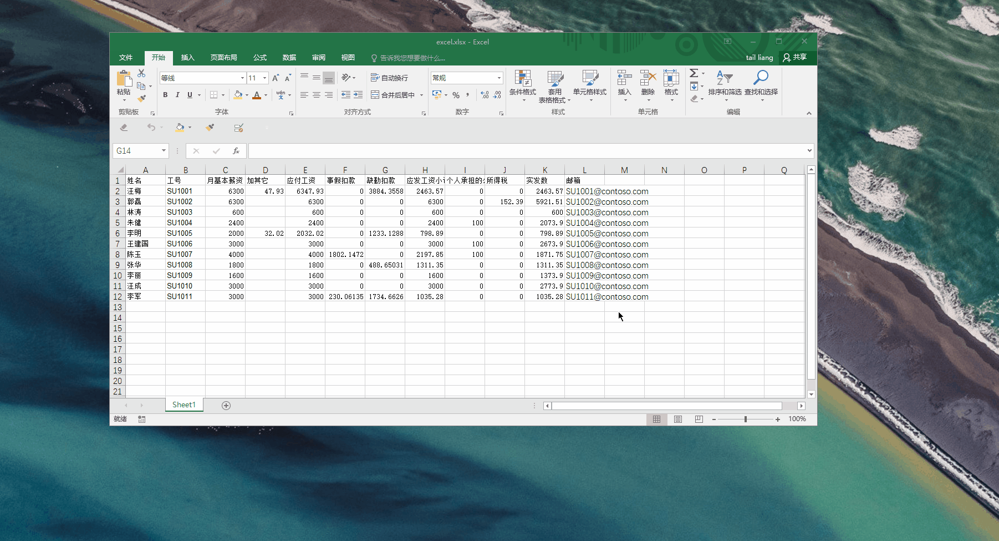


### 12.3 启用宏

#### 1. 文件

#### 2. 选项

#### 3.信任中心 -> 信任中心设置


#### 4. 宏设置->启用所有宏


#### 5. 完整演示


### 12.4 start

+ 工资条案例


#### 录制宏

#### 辅助工具--录制宏

> 用于不常用功能或者复杂功能的代码书写
>
> 因为不常用的功能代码不知道怎么写,可以百度,也可以利用VBA的宏录制功能替代.

#### demo

> 所谓录制宏,相当于SAP的录屏功能.操作的每一步都会被记录下来.--所以不要乱点,想清楚步骤.
>
> 演示下获取把单元格变色的功能代码

+ 手工的操作步骤
  + 选中要变色的单元格
  + 变色


+ 录制宏

  1. 点击录制宏

     

  2. 对宏取名->确定

     > 取名为change_color

     

  3. 选中单元格

  4. 改颜色

     

  5. 停止录制

  6. 查看生成的代码

     > 单击visual basic

     

     > 模块->模块1

     

     > 代码

     ```vb
     Sub change_color()
     '
     ' change_color 宏
     '
     
     '
         Range("C4").Select
         With Selection.Interior
             .Pattern = xlSolid
             .PatternColorIndex = xlAutomatic
             .Color = 65535
             .TintAndShade = 0
             .PatternTintAndShade = 0
         End With
     End Sub
     
     ```

  7. 完整实例

     


### 12.5 数据类型

#### 整型integer

```vba
dim i as Integer
```


#### 单精度浮点数single

```vba
dim i as single
```


#### 双精度浮点数 double

```vba
dim i as double
```


#### 工作表类型

```vba
Dim sht As Worksheet '对象也是一种类型
```


### 12​.​6​ :bug: Bug

#### 12.6.1 溢出

> 可能原因是整数溢出,可以更换类型为浮点数double


### 12.7 对象


#### 12.7.1 工作表对象

#### 添加工作表

```vba
Sheets.Add after:=Sheets(Sheets.Count) '在表最后添加表
Sheets(Sheets.Count).Name = Sheet1.Range("a1").Value '改表名
```

#### 访问某一个表


+ 注意:

  > index 是从1开始 看到的excel工作表就是从第一个开始,依次往后,不管工作表的大名还是小名--> **sheets(index )**
  >
  > 而vba编辑器中的sheet4 是工作表的大名 2叫小名

  


+ 选择工作表


1. 索引访问

   ```vba
   Sheets(index)
   ```

   

2. 直接访问

   ```vba
   sheet1
   ```

   

#### 选中工作表

```vba
Sheet1.Select
```

#### 增加工作表

> 添加 在哪里添加 并给他一个表名

```vba
Sheets.Add after:=Sheets(Sheets.Count)
Sheets(Sheets.Count).Name = Sheet1.Cells(i, l)'cell(行,列)
```


#### 工作簿对象

> 另存为saveas
>
> 关闭close

```vba
For Each sht In Sheets
    sht.Copy
    ActiveWorkbook.SaveAs Filename:="d:\data\" & sht.Name & ".xlsx"
    ActiveWorkbook.Close
Next
```


### 12.8 常见功能代码


#### 12.8.1 自动筛选

> 第一步:选中需要筛选的区域,第二步设置过滤的条件 
>
> Field:说明按照第几列筛选
>
> Criteria1:说明该列的第几个值筛选

```vba
Sheet1.Range("a1:f1048").AutoFilter Field:=4, Criteria1:=Sheets(i).Name
```

> 恢复自动筛选状态

```vba
Sheet1.Range("a1:f1048").AutoFilter
```


#### 12.8.2 选择性粘贴-选项


#### 12.8.3 输入输出对话框

##### 12.8.3.1 输入对话框

```vba
l = InputBox("请输入你要按哪列分") '保存在l变量里面
```

##### 12.8.3.2 输出对话框

```vba
MsgBox "已处理完毕"
```


##### 12.8.4 拷贝数据

> 拷贝到哪里

```vba
Sheet1.Range("a1:f" & irow).Copy Sheets(j).Range("a1")
```


#### 12.8.5  提示关闭

> 成对出现

```vba
Application.DisplayAlerts = False '成对出现的

	'....code

Application.DisplayAlerts = True
```


#### 12.8.6 获取行数和列数

```vba
icolumn = Sheet1.Range("IV1").End(xlToLeft).Column '获取列数
irow = Sheet1.Range("a65536").End(xlUp).Row '获取行数
```

#### 12.8.7 删除选区内容

```vba
Sheet1.Range("a1:f65536").ClearContents
```

#### 12.8.8 删除整行

```vba
Range("a10").EntireRow.Delete
```


### 12.9 语法

####  :happy: 宏代码的结构

```vb
Sub 宏名()

    
End Sub
```

####  :happy: 定义变量

```vb
dim counter as Integer 
```


####  :happy: 循环

##### for循环

```vb
dim counter as Integer 
For counter = 1 To 5 step 2
'循环体
next

```

##### for each循环

```vba
For Each sht In Sheets
    If sht.Name = Sheet1.Range("a1") Then
    	k = 1
    End If
Next
```


#### :happy: 判断

```vb
If 条件1 Then
	条件1为真时要执行的语句
ElseIf 条件2 Then
	条件2为真时要执行的语句
ElseIf 条件3 Then
	条件3为真时要执行的语句
ElseIf 条件N Then
	条件N为真时要执行的语句
Else
	所有条件都为假时要执行的语句
End If
```


#### :happy:常见对象/属性

> 所谓对象就是干活的人.你有一件事你不会做,你要指定一个会做的人去做,这个人就是对象.
>
> 属性就是这个对象能给你提供什么.


### 12.10 快捷键

+ `Tab` : 向后缩进
+ `shift` + `tab`:向前缩进
+ `ctrl`+ `s` : 保存
+ `F8`:单步调试

### 12.11 案例

#### 12.11.1 制作工资条

> 要将第一行的entry复制到第一行一下的每一行


​	

:question:如何实现

> 首先手工可以完成,但是效率太低.如果员工人数过多,那浪费太多的时间

+ 分解步骤

  + 选中第一行,复制
  + 插入复制的行
  + 循环做10次

+ 使用录制宏->找到每个子功能

  + 选中第一行,复制

    ```vb
     Rows("1:1").Select
     Selection.Copy
    ```

    

  + 插入复制的行--> 使用**相对引用**

    ```vb
    ActiveCell.Offset(-6, 0).Rows("1:1").EntireRow.Select
    Selection.Copy
    ActiveCell.Offset(2, 0).Rows("1:1").EntireRow.Select
    Selection.Insert Shift:=xlDown
    ```

  + :happy: 循环

    ```vb
    dim counter as Integer 
    For counter = 1 To 5 step 1
    '循环体
    next
    
    ```

  + :happy: 完整代码

    ```vb
    Sub gzt()
        ' 生成工资条
        Dim i As Integer ' 定义变量
    
        Rows("1:1").Select '选择第一行
        ' 循环
        For i = 1 To 10
            Selection.Copy
            ActiveCell.Offset(2, 0).Rows("1:1").EntireRow.Select
            Selection.Insert Shift:=xlDown
        Next
    
    End Sub
    ```

  + :warning: 宏执行完不可撤销-->所以我们先将数据备份

    


#### 12.11.2 复制需求

在进行BPC配件分公司推广时，需要将表单CG010101_外购件采购预算_到物料修改为CG01010101_外购件采购预算_物料组。

原表单的复制功能不能满足新表单的复制功能要求，因此需求优化复制按钮逻辑。

原表单的复制功能按钮：年末库存是将J列复制到L列；采购单价是将I列分别复制到O列、Y列、AI列、AS列；采购数量=生产消耗数量+销售数量（Z列=AC列+AD列/ P列=S列+T列/ AJ列=AM列+AN列/ AT列=AW列+AX列）


修改报表如下：


新需求逻辑：

1. 需要将上年采购价格分别复制到4个季度中的单价里（K列复制到L列、P列、T列、X列）

2. 将销售数量复制给采购数量（M列=O列）


##### 解决

```vb
Sub btn_copy2()
' 数据复制按钮:
'   将数据值(只是值)复制到指定单元格中
    Dim sheet_name As String
    Dim col_name As String
    Dim r_start, r_end
    r_start = 37 '需要计算的行开始的行号
    sheet_name = ActiveSheet.Name
    Dim row_temp As Integer


    If sheet_name = "外购件采购预算_物料组" Then
        ' 如果物料编码不为空,结束行就为最后一行
        If Worksheets(sheet_name).Range("E37").Value <> "" Then
            r_end = Worksheets(sheet_name).Range("E37").End(xlDown).Row
        Else
            r_end = r_start
        End If
        
        Application.EnableEvents = False
        ' copy column O  to column M
        For row_temp = r_start To r_end
            Worksheets(sheet_name).Range("O" & row_temp).Copy
            Worksheets(sheet_name).Range("M" & row_temp).PasteSpecial xlPasteValues
        Next

        ' copy column K  to column L P T X
        For row_temp = r_start To r_end
            Worksheets(sheet_name).Range("K" & row_temp).Copy
            Worksheets(sheet_name).Range("L" & row_temp).PasteSpecial xlPasteValues
            Worksheets(sheet_name).Range("P" & row_temp).PasteSpecial xlPasteValues
            Worksheets(sheet_name).Range("T" & row_temp).PasteSpecial xlPasteValues
            Worksheets(sheet_name).Range("X" & row_temp).PasteSpecial xlPasteValues
        Next
        Application.CutCopyMode = False
        Application.EnableEvents = True
    End If
End Sub
```


### 12.12 警告或者错误解决

#### :warning: 文档检查器


#### :ballot_box_with_check: 解决

[解决方案]( https://jingyan.baidu.com/article/7908e85cd88ce3af481ad2ad.html )


#### :warning: 无法在未启用宏的工作簿中保存


#### :ballot_box_with_check: 解决

+ 点否

+ 出现保存对话框

  

+ 选择启用宏的工作簿

  


+ 出现感叹号

  

+ 打开这个文件即可


#### :warning:警告直接关闭 

> 发现下面代码未起作用

```vba
Application.DisplayAlerts = False '成对出现的

	'....code

Application.DisplayAlerts = True
```


### 12.13  EXCEL常用


#### :hammer: 菜单下拉

1. 选择需要有菜单下拉的单元格
2. 数据->数据验证->验证条件(允许:序列,来源:用逗号隔开选项)即可


#### :hammer: 拖动列

`shift` + 鼠标


#### :hammer: 自动换行

快捷键: `alt`+`enter`


#### :hammer: 表头


## 13. STL

### vector

#### std::[vector](http://www.cplusplus.com/reference/vector/vector/)::insert

| single element   | `iterator insert (const_iterator position, const value_type& val);` | 单值插入：在position位置插入val                    |
| :--------------- | ------------------------------------------------------------ | -------------------------------------------------- |
| fill             | `iterator insert (const_iterator position, size_type n, const value_type& val); ` | 填充：在position位置填充n个val                     |
| range            | `template <class InputIterator> iterator insert (const_iterator position, InputIterator first, InputIterator last); ` | 区间插入：在position位置插入由两个迭代器指定的区间 |
| move             | `iterator insert (const_iterator position, value_type&& val); ` |                                                    |
| initializer list | `iterator insert (const_iterator position, initializer_list<value_type> il);` |                                                    |

```cpp
// inserting into a vector
#include <iostream>
#include <vector>

int main ()
{
  std::vector<int> myvector (3,100);
  std::vector<int>::iterator it;

  it = myvector.begin();
  it = myvector.insert ( it , 200 );

  myvector.insert (it,2,300);

  // "it" no longer valid, get a new one:
  it = myvector.begin();

  std::vector<int> anothervector (2,400);
  myvector.insert (it+2,anothervector.begin(),anothervector.end());

  int myarray [] = { 501,502,503 };
  myvector.insert (myvector.begin(), myarray, myarray+3);

  std::cout << "myvector contains:";
  for (it=myvector.begin(); it<myvector.end(); it++)
    std::cout << ' ' << *it;
  std::cout << '\n';

  return 0;
}
```


### 工具类`<utility>`

#### exchange :point_right:用新的替换旧的，但是返回旧的。

| template< class T, class U = T > T exchange( T& obj, U&& new_value ); |      | (since C++14) (until C++20) |      |
| ------------------------------------------------------------ | ---- | --------------------------- | ---- |
| template< class T, class U = T > constexpr T exchange( T& obj, U&& new_value ); |      | since C++20                 |      |


```cpp
#include <iostream>
#include <utility>
#include <vector>
#include <iterator>
 
class stream
{
  public:
 
   using flags_type = int;
 
  public:
 
    flags_type flags() const
    { return flags_; }
 
    ///Replaces flags_ by newf, and returns the old value.
    flags_type flags(flags_type newf)
    { return std::exchange(flags_, newf); }
 
  private:
 
    flags_type flags_ = 0;
};
 
void f() { std::cout << "f()"; }
 
int main()
{
   stream s;
 
   std::cout << s.flags() << '\n';
   std::cout << s.flags(12) << '\n';//* 用12替换掉原先的0 但是返回的是旧的值即被替换的值
   std::cout << s.flags() << "\n\n";
 
   std::vector<int> v;
 
   //Since the second template parameter has a default value, it is possible
   //to use a braced-init-list as second argument. The expression below
   //is equivalent to std::exchange(v, std::vector<int>{1,2,3,4});
 
   std::exchange(v, {1,2,3,4});
 
   std::copy(begin(v),end(v), std::ostream_iterator<int>(std::cout,", "));
 
   std::cout << "\n\n";
 
   void (*fun)();
 
   //the default value of template parameter also makes possible to use a
   //normal function as second argument. The expression below is equivalent to
   //std::exchange(fun, static_cast<void(*)()>(f))
   std::exchange(fun,f);
   fun();
}
```

output:

```shell
0
0
12
 
1, 2, 3, 4, 
 
f()
```


### chrono

获取时间戳

```cpp
#include <chrono>
using namespace std::chrono;
int64_t generate_timestamp() {
        return duration_cast<milliseconds>(system_clock::now().time_since_epoch()).count();
}
```


## 14. Windows 10 

### 14.1 输入法

`shift` + `space` 切换全角/半角 


### 14.2 激活windows

```powershell
@echo off
cscript.exe %windir%\system32\slmgr.vbs /skms KMServer.ahhl.com
cscript.exe %windir%\system32\slmgr.vbs /ato
cscript.exe %windir%\system32\slmgr.vbs /dlv
pause
```


### 14.3 调出虚拟键盘

```shell
osk
```


### 14.4 WSL

#### wsl 去除文件夹绿色背景

:link:[solution](https://stackoverflow.com/questions/40574819/how-to-remove-dir-background-in-ls-color-output/40575734)

在.bashrc中加入下面的指令

```shell
eval "$(dircolors -p | \
    sed 's/ 4[0-9];/ 01;/; s/;4[0-9];/;01;/g; s/;4[0-9] /;01 /' | \
    dircolors /dev/stdin)"
```


#### 14.4.2 初始化系统脚本

```shell

# change apt
sudo cp /etc/apt/sources.list /etc/apt/sources.list.bak
sudo rm -rf /etc/apt/sources.list
sudo touch /etc/apt/sources.list
sudo sh -c 'echo deb http://mirrors.aliyun.com/ubuntu/ focal main restricted universe multiverse >> /etc/apt/sources.list'
sudo sh -c 'echo deb http://mirrors.aliyun.com/ubuntu/ focal-security main restricted universe multiverse >>　/etc/apt/sources.list'
sudo sh -c 'echo deb http://mirrors.aliyun.com/ubuntu/ focal-updates main restricted universe multiverse >> /etc/apt/sources.list'
sudo sh -c 'echo deb http://mirrors.aliyun.com/ubuntu/ focal-proposed main restricted universe multiverse >> /etc/apt/sources.list'
sudo sh -c 'echo deb http://mirrors.aliyun.com/ubuntu/ focal-backports main restricted universe multiverse >> /etc/apt/sources.list'
sudo sh -c 'echo deb-src http://mirrors.aliyun.com/ubuntu/ focal main restricted universe multiverse >> /etc/apt/sources.list'
sudo sh -c 'echo deb-src http://mirrors.aliyun.com/ubuntu/ focal-security main restricted universe multiverse >> /etc/apt/sources.list'
sudo sh -c 'echo deb-src http://mirrors.aliyun.com/ubuntu/ focal-updates main restricted universe multiverse >> /etc/apt/sources.list'
sudo sh -c 'echo deb-src http://mirrors.aliyun.com/ubuntu/ focal-proposed main restricted universe multiverse >> /etc/apt/sources.list'
sudo sh -c 'echo deb-src http://mirrors.aliyun.com/ubuntu/ focal-backports main restricted universe multiver >> /etc/apt/sources.list'

sudo apt-get update
sudo apt-get upgrade

# software
sudo apt-get install vim
sudo apt-get install g++
sudo apt-get install gcc
sudo apt-get install wget
sudo apt-get install git
sudo apt-get install python3
sudo apt install python3-pip

sudo apt install g++ gdb make ninja-build rsync zip
sudo apt install net-tools
sudo apt install openssh-server
sudo apt install autoconf
sudo apt install libtool
sudo apt install tree


sudo apt-get update
sudo apt-get upgrade
```


### 14.5 中文输入法默认输入英文标点


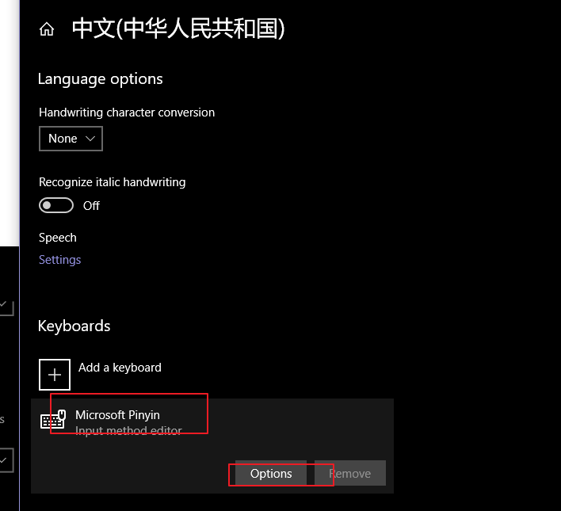


## 15. Sales and Distribution


### 账号配置


#### 200

```c
	abaper1 
he600li761

```


#### 300

```c
HELI / Heli#2oIg43o0
```


#### 100

```c
itd_heli1
HyZ#Z018
```


#### 600

```c
ITD_HELI
rZ@bz66t
```


#### 800

```c
ITD_ERP / ahheli123457.
    helierp666

```


---


#### 340

```c
68009320/Qwer1234
```


#### 140


#### 640

```c

```


#### 840

```c
ITD_ERP / PDm&16Ta
```


### 合力营销体系

#### 内销

24家营销网点:

| 客户 |             名称 1             |
| ---- | :----------------------------: |
| 1440 |    山东合力叉车销售有限公司    |
| 1100 |    安徽合力叉车销售有限公司    |
| 1340 |    天津北方合力叉车有限公司    |
| 1600 |    山西合力叉车有限责任公司    |
| 1580 |      南京合力叉车有限公司      |
| 1820 |    杭州合力叉车销售有限公司    |
| 1320 |      郑州合力叉车有限公司      |
| 1480 |    陕西合力叉车有限责任公司    |
| 1260 |      上海合力叉车有限公司      |
| 1450 |    山东齐鲁合力叉车有限公司    |
| 1540 |    广东合力叉车销售有限公司    |
| 7080 |      长春合力叉车有限公司      |
| 7110 |     武汉市合力叉车有限公司     |
| 7230 |      新疆合力叉车有限公司      |
| 7260 |      甘肃合力叉车有限公司      |
| 7170 |   厦门皖合力叉车销售有限公司   |
| 7200 | 内蒙古全兴合力工程机械有限公司 |
| 7290 |      四川合力叉车有限公司      |
| 7020 |      辽宁合力叉车有限公司      |
| 7050 |     哈尔滨合力叉车有限公司     |
| 7320 |      重庆合力叉车有限公司      |
| 7350 |    长沙合力叉车销售有限公司    |
| 7380 |     昆明皖合力叉车有限公司     |
| 7140 |     南昌市合力叉车有限公司     |
| 1860 |    江苏合力工业车辆有限公司    |

24家销售视图:

| 客户 | 销售机构 | 分销渠道 | 产品组 |
| ---- | -------- | -------- | ------ |
| 1100 | 1000     | 99       | 01     |
| 1100 | 1000     | 99       | 02     |
| 1100 | 1000     | 99       | 99     |
| 1260 | 1000     | 99       | 01     |
| 1260 | 1000     | 99       | 02     |
| 1260 | 1000     | 99       | 99     |
| 1320 | 1000     | 99       | 01     |
| 1320 | 1000     | 99       | 02     |
| 1320 | 1000     | 99       | 99     |
| 1340 | 1000     | 99       | 01     |
| 1340 | 1000     | 99       | 02     |
| 1340 | 1000     | 99       | 99     |
| 1440 | 1000     | 99       | 01     |
| 1440 | 1000     | 99       | 02     |
| 1440 | 1000     | 99       | 99     |
| 1450 | 1000     | 99       | 01     |
| 1450 | 1000     | 99       | 02     |
| 1450 | 1000     | 99       | 99     |
| 1480 | 1000     | 99       | 01     |
| 1480 | 1000     | 99       | 02     |
| 1480 | 1000     | 99       | 99     |
| 1540 | 1000     | 99       | 01     |
| 1540 | 1000     | 99       | 02     |
| 1540 | 1000     | 99       | 99     |
| 1580 | 1000     | 99       | 01     |
| 1580 | 1000     | 99       | 02     |
| 1580 | 1000     | 99       | 99     |
| 1600 | 1000     | 99       | 01     |
| 1600 | 1000     | 99       | 02     |
| 1600 | 1000     | 99       | 99     |
| 1820 | 1000     | 99       | 01     |
| 1820 | 1000     | 99       | 02     |
| 1820 | 1000     | 99       | 99     |
| 1860 | 1000     | 99       | 01     |
| 1860 | 1000     | 99       | 02     |
| 7020 | 1000     | 01       | 01     |
| 7020 | 1000     | 01       | 02     |
| 7020 | 1000     | 01       | 99     |
| 7050 | 1000     | 01       | 01     |
| 7050 | 1000     | 01       | 02     |
| 7050 | 1000     | 01       | 99     |
| 7080 | 1000     | 01       | 01     |
| 7080 | 1000     | 01       | 02     |
| 7080 | 1000     | 01       | 99     |
| 7110 | 1000     | 01       | 01     |
| 7110 | 1000     | 01       | 02     |
| 7110 | 1000     | 01       | 99     |
| 7140 | 1000     | 01       | 01     |
| 7140 | 1000     | 01       | 02     |
| 7140 | 1000     | 01       | 99     |
| 7170 | 1000     | 01       | 01     |
| 7170 | 1000     | 01       | 02     |
| 7170 | 1000     | 01       | 99     |
| 7200 | 1000     | 01       | 01     |
| 7200 | 1000     | 01       | 02     |
| 7200 | 1000     | 01       | 99     |
| 7230 | 1000     | 01       | 01     |
| 7230 | 1000     | 01       | 02     |
| 7230 | 1000     | 01       | 99     |
| 7260 | 1000     | 01       | 01     |
| 7260 | 1000     | 01       | 02     |
| 7260 | 1000     | 01       | 99     |
| 7290 | 1000     | 01       | 01     |
| 7290 | 1000     | 01       | 02     |
| 7290 | 1000     | 01       | 99     |
| 7320 | 1000     | 01       | 01     |
| 7320 | 1000     | 01       | 02     |
| 7320 | 1000     | 01       | 99     |
| 7350 | 1000     | 01       | 01     |
| 7350 | 1000     | 01       | 02     |
| 7350 | 1000     | 01       | 99     |
| 7380 | 1000     | 01       | 01     |
| 7380 | 1000     | 01       | 02     |
| 7380 | 1000     | 01       | 99     |

#### 外销


**XK99 批量维护供应商.**

**MM17 批量维护物料。**

**ＸD99 批理维护客户.**

### XD99 批量修改客户主数据-公司代码-付款条件

`XD99`批量修改客户主数据是一种有限制的修改方式.

> 只能批量修改相同付款条件的客户,如果想要修改不同付款条件的客户数据,需要多次进行操作.

#### 1.准备工作

将需要更改的公司代码下的客户信息汇总到excel文件中


#### 2. 进入xd99


#### 3. 选择客户主数据(公司代码)表KNB1


#### 4. 从文件导入


选择需要批量上传的客户数据.,点击`打开`


选择`含表头行`,然后`执行`


然后,允许SAP访问你的批量修改的数据文件,点击`Allow`


就会出现下面的界面:


#### 5. 选择表字段

单击,跳出分配字段界面,选择`KUNNR`客户,双击


发现客户号这列变红了.

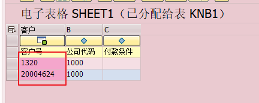

同样的方式,选择下面两列


#### 6.执行修改

第五步是将上传的数据字段分配到数据表中的字段.分配完成后,点击


会跳出下面的界面:


这个界面的意思是说,下半部分是说之前导入的客户-公司代码,系统读取到当前的客户,当前的公司代码下的付款条件是`Z001`,你需要将这些公司代码下的客户的付款条件进行修改成什么,即上半部分的光标所在处.

插曲:

可以检查下当前的系统客户数据:


填写你需要修改的付款条件,比如`J001`


然后`申请更改`


就会发现此时付款条件已经发生更改,但这个只是预览


最后,点击`保存`按钮


会跳出下面的界面即可


这时候检查下系统数据:已经变成了修改的值`J001`


### SAP GUI 750 生成密码

####　１.生成快捷方式注册表

```
C:\Program Files (x86)\SAP\FrontEnd\SapGui
```


使用管理员身份打开,点击`确定`


#### 2. 修改注册表

`win+r`进入运行,输入`regedit.exe`


```
计算机\HKEY_LOCAL_MACHINE\SOFTWARE\WOW6432Node\SAP\SAPLogon
```


```
计算机\HKEY_CURRENT_USER\SOFTWARE\SAP\SAPShortcut\Security
```


修改完成后,注销用户,使得注册表生效


### VA02 查看拒绝原因修改的历史

鼠标点到行项目的拒绝原因


然后点环境environment->更改changes


填入行项目号10,执行即可


效果


### 只收货不报工


### 产品层次

`V/76`


## 16. CRM开发


问题清单

|          问题点          |                             示例                             | 备注                                  |
| :----------------------: | :----------------------------------------------------------: | ------------------------------------- |
| 瑞泰自开发脚本库文档不全 |  |                                       |
|    代码文件注释不详细    |  | 缺少该源代码文件的实现的功能整体说明. |
|                          |                                                              |                                       |


CRM 可编程场景:


http://10.2.1.218:8090/hlcrAHHlm/main.aspx
账号:AHHL\crmadmin
密码:Cam#6688

域账号是员工编号


CRM开发系统外网映射
内网10.2.1.218:9188<---->映射公网220.178.74.183:9188


企业微信应用：

AgentId
1000010
Secret
twpg-CS-VeQCgO998zcgJvUYAEoF0nsbGC8BGZf7L-I


企业微信配置

工作台首页：http://crmdev.helichina.com:9188/api/weixinqy/authorize?redirectUrl=/main
网页授权：crmdev.helichina.com:9188


### 项目结构:


### 字段名查找

视图下的自定义实体,可以跳转到解决方案的实体中


字段


### SVN

账号：rtdc\heli01

合力

密码：lF@K*Sa!z&xV

 

https://rtsvn.recloud.com.cn:5443/svn/HD_HELI_CRM/HELI_SOURCE


svn 下载地址

https://tortoisesvn.net/downloads.html


使用方法:

svn:

1. 新建文件夹 

2. 右击 checkout  输入地址  账号 密码

3. 后续代码提交流程; 先 update  再commit


VPN登录

| 邵立军.临时 | 13916929331 | 13916929331&Er |
| ----------- | ----------- | -------------- |
| 金春华.临时 | 15802137375 | 15802137375&Pa |

### 16.1 环境搭建

#### 16.1.1 VS2019

:link:[安装](https://visualstudio.microsoft.com/zh-hans/vs/)

快捷键:

|          |                    |      |
| -------- | ------------------ | ---- |
| Ctrl + H | 替换               |      |
| prop     | 直接生成属性的方法 |      |
|          |                    |      |


点击下载安装专业版


组件:


#### 16.1.2 SQL Server managerment studio  


### 16.2 C#语言学习

:link:[微软官方教程](https://docs.microsoft.com/zh-cn/dotnet/core/introduction)


#### 命名

**大驼峰** 命名,即首字母大写.

多个单词拼接时,每个单词首字母大写.


#### 参数修饰符

##### 1. 无修饰符

> 按值传递,方法收到的是原始数据的一份副本


##### 2. out

> 引用传递,最大的用途是返回多个值,相当于输出out

```c#
using System;
using System.Collections.Generic;
using System.ComponentModel;
using System.Data;
using System.Drawing;
using System.Linq;
using System.Text;
using System.Threading.Tasks;
using System.Windows.Forms;

namespace WindowsFormsApp1
{
    /// <summary>
    /// 继承窗体类
    /// </summary>
    public partial class Form1 : Form 
    {

        public void test(out string name)
        {
            name = "hello world";
        }

        public Form1()
        {
            InitializeComponent();
        }

        /// <summary>
        /// 双击窗体的顶部就可以自动生成这个函数
        /// 当Form加载的时候进行调用.
        /// </summary>
        /// <param name="sender"></param>
        /// <param name="e"></param>
        private void Form1_Load(object sender, EventArgs e)
        {
            string input_out_string = "something";
            test(out input_out_string);
            MessageBox.Show(input_out_string);
        }
    }
}

```


#### 3. ref

> 必须赋初值,否则会编译错误,而out不需要赋初值


#### 4. param

> 可变参数,必须是方法的最后一个参数


#### 类

> 遇到的类进行示例


```C#

using System;
using System.Collections.Generic;
using System.Linq;
using System.Text;
using System.Threading.Tasks;
using System.Windows.Forms;

namespace WindowsFormsApp1
{
   public class Person
    {
        /// <summary>
        /// 说明这个属性可以set,也可以get
        /// </summary>
        public int Age { get; set; }
        public string Name { get; set; }
        public double Height { get; set; }

        /// <summary>
        /// 只可以get 不可以set
        /// </summary>
        public string Kind { get; }

        public void run()
        {
            MessageBox.Show(Name + "run");
        }
    }
}

//------------ Call ---------------


// 对象初始化器
Person martin = new Person()
{
    Age = 21,           //* 注意是逗号
    Name = "martin",
    Height = 1.75
};

```


##### 访问修饰符

**internal** 本项目内访问


##### Static

1. 实例不可以访问,只可以通过类访问
2. 静态方法只可以调用静态属性


class object

> 亚当


##### class ArrayList

基本不用,原因是使用了装箱和拆箱->性能不行


class List


##### class Trace

```c#
public Calculator()
{
    StreamWriter logFile = File.CreateText("calculator.log");
    Trace.Listeners.Add(new TextWriterTraceListener(logFile));
    Trace.AutoFlush = true;
    Trace.WriteLine("Starting Calculator Log");
    Trace.WriteLine(String.Format("Started {0}", 	System.DateTime.Now.ToString()))
}
```


##### class Console

###### :arrows_clockwise: WriteLine

```c#
Console.WriteLine("Console Calculator in C#\r");
Console.WriteLine($"Your result: {num1} + {num2} = " + (num1 + num2));
```

###### :arrows_clockwise: Write

```c#
Console.Write("Press any key to close the Calculator console app...");
```

###### :arrows_clockwise: ReadKey

```c#
Console.ReadKey();
```

###### :arrows_clockwise: ReadLine

```c#
Console.ReadLine()
```


##### Convert

:arrows_clockwise:ToInt32

```c#
int num1 = Convert.ToInt32(Console.ReadLine());
```


#### Form


#### MessageBox

##### :arrows_clockwise:show​ 

```c#
string input_out_string = "something";
MessageBox.Show(input_out_string);
```


#### 结构

```C#

double cleanNum1 = 0;
while (!double.TryParse(numInput1, out cleanNum1))
{
	Console.Write("This is not valid input. Please enter an integer value: ");
	numInput1 = Console.ReadLine();
}
```


```c#
1.ToString();
```


#### 16.2.1 字符串

| 方法名      | 参数 | 备注说明 |
| ----------- | ---- | -------- |
| TrimStart() |      |          |
| TrimEnd()   |      |          |
| Trim()      |      |          |
| Replace     |      |          |
| Contains    |      |          |
| StartsWith  |      |          |
| EndsWith    |      |          |


```c#
using System;

namespace ConsoleApp1
{
    class Program
    {
        static void Main(string[] args)
        {
            string firstFriend = "Maria";
            string secondFriend = "Sage";
            Console.WriteLine($"My friends are {firstFriend} and {secondFriend}");

            //***************************//
            string greeting = "      Hello World!       ";
            Console.WriteLine($"[{greeting}]");

            //* 这些都是返回一个新的字符串,而不是就地替换掉
            string trimmedGreeting = greeting.TrimStart();  //* 去除前导空白字符
            Console.WriteLine($"[{trimmedGreeting}]");      //output:[      Hello World!       ]

            trimmedGreeting = greeting.TrimEnd();           //* 去除尾随的空白字符
            Console.WriteLine($"[{trimmedGreeting}]");      //output:[Hello World!       ]

            trimmedGreeting = greeting.Trim();              //* 去除两边的空白字符
            Console.WriteLine($"[{trimmedGreeting}]");      //output:[Hello World!]

            //***************************//
            string sayHello = "Hello World!";
            Console.WriteLine(sayHello);
            sayHello = sayHello.Replace("Hello", "Greetings");//* 将sayHello中的Hello 替换成 Greetings
            Console.WriteLine(sayHello);

            Console.WriteLine(sayHello.ToUpper());             //* 全部大写
            Console.WriteLine(sayHello.ToLower());             //* 全部小写

            string songLyrics = "You say goodbye, and I say hello";
            Console.WriteLine(songLyrics.Contains("goodbye"));      //output:True
            Console.WriteLine(songLyrics.Contains("greetings"));    //output:False

            Console.WriteLine(songLyrics.StartsWith("You"));
            Console.WriteLine(songLyrics.StartsWith("goodbye"));

            Console.WriteLine(songLyrics.EndsWith("hello"));
            Console.WriteLine(songLyrics.EndsWith("goodbye"));
        }
    }
}

```


#### 16.2.2 类型

| 类型    |      |      |
| ------- | ---- | ---- |
| int     |      |      |
| double  |      |      |
| decimal |      |      |
|         |      |      |


```c#
using System;

namespace _2_type
{
    class Program
    {
        static void Main(string[] args)
        {
            int max = int.MaxValue;
            int min = int.MinValue;
            Console.WriteLine($"The range of integers is {min} to {max}");

            int what = max + 3;
            Console.WriteLine($"An example of overflow: {what}");

            double doubleMax = double.MaxValue;
            double doubleMin = double.MinValue;
            Console.WriteLine($"The range of double is {doubleMin} to {doubleMax}");

            double third = 1.0 / 3.0;
            Console.WriteLine(third);

            decimal decimalMin = decimal.MinValue;
            decimal decimalMax = decimal.MaxValue;
            Console.WriteLine($"The range of the decimal type is {decimalMin} to {decimalMax}");

            double a = 1.0;
            double b = 3.0;
            Console.WriteLine(a / b);
            // 数字中的 M 后缀指明了常数应如何使用 decimal 类型。 否则，编译器假定为 double 类型。
            decimal c = 1.0M;
            decimal d = 3.0M;
            Console.WriteLine(c / d);

            double radius = 2.50;
            double area = Math.PI * radius * radius;
            Console.WriteLine(area);
        }
    }
}

```


#### 16.2.3 分支与循环


```c#
using System;

namespace _3_IFELSE
{
    class Program
    {
        static void Main(string[] args)
        {
            int a = 5;
            int b = 3;
            int c = 4;
            if ((a + b + c > 10) || (a == b))
            {
                Console.WriteLine("The answer is greater than 10");
                Console.WriteLine("Or the first number is equal to the second");
            }
            else
            {
                Console.WriteLine("The answer is not greater than 10");
                Console.WriteLine("And the first number is not equal to the second");
            }

            int counter = 0;
            while (counter < 10)
            {
                Console.WriteLine($"Hello World! The counter is {counter}");
                counter++;
            }

            for (int counter1 = 0; counter1 < 10; counter1++)
            {
                Console.WriteLine($"Hello World! The counter is {counter1}");
            }

            for (int row = 1; row < 11; row++)
            {
                for (char column = 'a'; column < 'k'; column++)
                {
                    Console.WriteLine($"The cell is ({row}, {column})");
                }
            }

        }
    }
}

```


#### 16.2.4 列表List

|         |      |      |
| ------- | ---- | ---- |
| Add     |      |      |
| Remove  |      |      |
| IndexOf |      |      |
| Sort    |      |      |


```c#
using System;
using System.Collections.Generic; //* for List

namespace _4_列表
{
    class Program
    {
        static void Main(string[] args)
        {
            var names = new List<string> { "<name>", "Ana", "Felipe" };
            foreach (var name in names)
            {
                Console.WriteLine($"Hello {name.ToUpper()}!");
            }

            Console.WriteLine();
            //* 添加删除元素
            names.Add("Maria");
            names.Add("Bill");
            names.Remove("Ana");
            foreach (var name in names)
            {
                Console.WriteLine($"Hello {name.ToUpper()}!");
            }
            //* 索引访问
            Console.WriteLine($"My name is {names[0]}.");
            Console.WriteLine($"I've added {names[2]} and {names[3]} to the list.");
            //* List元素的数目
            Console.WriteLine($"The list has {names.Count} people in it");

            //IndexOf 方法可搜索项，并返回此项的索引。 如果项不在列表中，IndexOf 将返回 -1。
            var index = names.IndexOf("Felipe");
            if (index != -1)
                Console.WriteLine($"The name {names[index]} is at index {index}");

            var notFound = names.IndexOf("Not Found");
            Console.WriteLine($"When an item is not found, IndexOf returns {notFound}");

            names.Sort();//* 按正常顺序（如果是字符串则按字母顺序）对列表中的所有项进行排序
            foreach (var name in names)
            {
                Console.WriteLine($"Hello {name.ToUpper()}!");
            }

            //* 斐波那契数列
            var fibonacciNumbers = new List<int> { 1, 1 };

            while (fibonacciNumbers.Count < 20)
            {
                var previous = fibonacciNumbers[fibonacciNumbers.Count - 1];
                var previous2 = fibonacciNumbers[fibonacciNumbers.Count - 2];

                fibonacciNumbers.Add(previous + previous2);
            }
            foreach (var item in fibonacciNumbers)
                Console.WriteLine(item);

        }
    }
}

```


#### 在 Visual Studio 中创建一个简单的 C# 控制台应用程序

:link:[微软官方教程]([教程：创建一个简单的 C# 控制台应用程序 - Visual Studio | Microsoft Docs](https://docs.microsoft.com/zh-cn/visualstudio/get-started/csharp/tutorial-console?view=vs-2019))

笔记:


### 16.4 客户端开发


#### 16.4.0 文档


##### 官方文档

###### Xrm.Page


Xrm.Page.ui.getFormType();

| 类型值 |   类型   |
| :----: | :------: |
|   0    |  未定义  |
|   1    |   创建   |
|   2    |   更新   |
|   3    |   只读   |
|   4    |  已禁用  |
|   6    | 批量编辑 |

"快速创建"窗体返回 1。 值 5 用于已移除的较早类型快速创建窗体。


##### 瑞泰文档

###### rtcrm.customizeLookupView

> 瑞泰自己封装的


#### 16.4.1 新建解决方案

所谓解决方案,就是各种开发类型的集合.

`path`:`设置`:arrow_right:`自定义`:arrow_right:`解决方案`


新建解决方案: `TODO`解决方案的命名规范


#### 16.4.2 新建实体

显示名称和复数名称保持相同(规范而已)


显示此实体的区域:指的是将该实体放在哪一个导航栏的页签下面.上述的是挂在`培训`下面


#### 16.4.3 新建字段


定义完成后,进行发布自定义选项


新建视图


新建窗体:一个视图下默认会带有一个窗体,不需要再定义窗体

`一个实体一个视图一个窗体`

> 一般一个实体一个窗体,不建议多个窗体.

快速窗体:可以使用lookup选择,顾问配置.

主窗体:用于开发


web资源


添加瑞泰的js库


url字段不需要填,自动带出的


新建了web资源之后,还需要将web资源分配到对应的窗体,分配到具体的事件,自定义的函数


从这里直接进入解决方案:


#### 16.4.4 练习


`good.js`:arrow_down:

```js
function onLoad(){
    var delivery_quantity = Xrm.Page.getAttribute("new_delivery_quantity");
    delivery_quantity.setValue("100"); 
}

function onChange(){
    var delivery_quantity = Xrm.Page.getAttribute("new_delivery_quantity");
    var actual_delivery = Xrm.Page.getAttribute("new_actual_delivery");
    var actual = actual_delivery.getValue();
    var refer = delivery_quantity.getValue();
    if(actual == null){
        alert("你还未填写实际出库量!");
    }
    else if(actual > refer){
        alert("实际出库数量不得大于出库量!");
    }else{

    }


}
```


### 16.6 服务器端开发

#### 开发流程


##### What is NuGet?

> NuGet is the package manager for .NET. The NuGet client tools provide the ability to produce and consume packages. The NuGet Gallery is the central package repository used by all package authors and consumers.

 Nuget是一个.NET的各种组件包管理器，方便.NET程序进行包的管理的。

举例说明：如果你想要引用一个组件，比如非常流行的JSON序列化反序列化组件，Newtonsoft.Json.dll，你可能会去官网下载dll组件，然后放置到自己的一个文件夹里，然后在新建项目的时候进行添加引用，在没有知道Nuget的时候我也是这么干的，还觉得很方便。

后来就自然而然的接触到了Nuget，用了几次后发现真好用，就拿上面的例子来说，只要在项目中安装Newtonsoft.Json包，就自动下载到项目了，如果这个dll还依赖其他的dll，那么也都会一并的下载，这个功能实在太强大，然后当这个dll拥有者更新之后，你的VS会收到消息，提醒你有新的版本了，当然你可以选择更新还是不更新。


##### 配置NuGet

就是告诉VS 如何去哪里找到包。


添加包源： 瑞泰的包源地址：http://nrm.recloud.com.cn:8081/repository/nuget-group/


##### 开发插件流程

###### 新建一个空白解决方案:


###### 新建一个解决方案文件夹


###### 然后添加一个类库`.NET FRAMEWORK`


> 说明这里的框架换成4.6.2 的，否则后面的注册插件将会报错

###### 添加类库引用


###### 包源选择之前添加的全局的包源：瑞泰的包


安装完成后：


###### 更新一个包


更新完成


###### 删除class1.cs


###### 签名：

项目属性->


+ `key` : recktec.snk

+ 不使用密码


保存 `ctrl + s`,这里没有*号，表示保存成功


###### 新建一个类：


###### 编译：


###### 合并DLL：

因为之前引用了瑞泰的common.dll 然后我们现在也生成了新的dll，所以需要将这两个dll进行合并。

先选择生成的DLL

文件怎么找：


再选择密钥


利用合并工具合并：


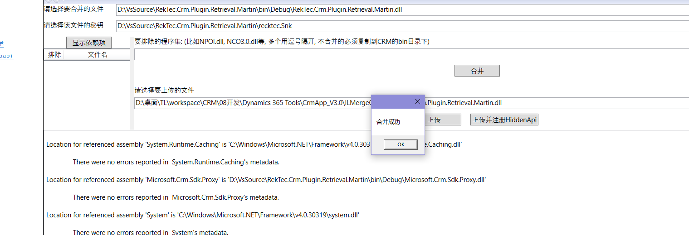

合并之后的文件：

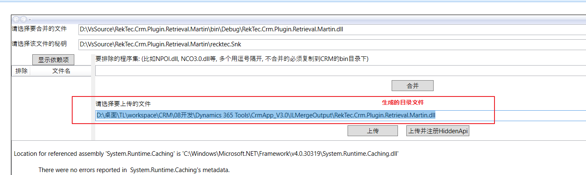


合并完成后再注册，上传 用于后面更新

>  那后面就是新生成了dll 之后 就只需要合并 然后上传就可以了.
>
> 第一次需要注册


###### 注册

用户名和密码就是CRM登陆的账号(不需要AHHL\\ )和密码

域名 AHHL


注册step


> 最好使用disable和enable 进行重新启用来防止缓存


这里选择需要选择同步的方式，不可以像图中那样选择异步方式，也就是默认的方式，表示及时看到反馈结果

如果是系统管理员,可以通过系统作业来查看异步的消息


### 类


### 16.7 移动端开发

环境配置
• 确保本地安装了 Node.js，版本要求 12.18.1+。如果没有安装，可以从这里 https://nodejs.org/dist/ 获取。
• 建议安装一下 cnpm
npm install cnpm -g --registry=https://r.npm.taobao.org
• 确保安装了 Yarn，版本要求 1.15.2+ 。如果没有安装，可以从这里 https://yarnpkg.com/en/docs/install 获取。
• 确保本地安装了 nrm，版本要求 1.1.0+ 。如果没有安装，执行以下命令进行安装：
npm install -g nrm
• 确保本地安装了 ncu，版本要求 1.1.0+ 。如果没有安装，执行以下命令进行安装：
npm install -g npm-check-updates 
默认情况下，统一使用Yarn进行包管理。
配置包源
目前瑞泰自研的组件包都是发布到我们自己的NPM服务器上的，所有开发过程中，需要将包源切换到瑞泰的NPM服务器上来才可以正常获取到我们自己的NPM包。
• 添加包下载的源地址
nrm add recloud http://nrm.recloud.com.cn:8081/repository/npm-all/
如果之前添加过recloud的源，不一致的话需要先删除掉再添加
nrm del recloud
• 切换到公司的包源
nrm use recloud
• 检查是否成功
如下图所示，星号在recloud前面，即表示成功
配置完成以后，通过 npm install 或者 yarn 命令就可以从公司的NPM服务器上下载NPM包了。
如果需要再切换到其他的源，再次使用 nrm use 命令即可。


#### 安装node.js

:link:[node]([Index of /dist/v12.18.2/ (nodejs.org)](https://nodejs.org/dist/v12.18.2/))

版本:高于12.18.1

 

直接点next直接安装

安装完成后,确定安装的版本:

```shell
node --version
```


#### 安装cnpm

```shell
npm install cnpm -g --registry=https://r.npm.taobao.org
```


#### 安装 Yarn

:link:[Yarn]([Installation | Yarn (yarnpkg.com)](https://classic.yarnpkg.com/en/docs/install#windows-stable))


配置yarn的环境变量


#### 安装nrm

```shell
npm install -g nrm
```


#### 安装 ncu

```shell
npm install -g npm-check-updates 
```


#### 添加瑞泰的包

```shell
nrm add recloud http://nrm.recloud.com.cn:8081/repository/npm-all/
```


换包源

```shell
nrm use recloud
```


### 16.5 系统操作-顾问

#### 16.5.1 新建用户和分配角色

1. 设置->安全性

   


2. 用户

   

3. 新建

   

4. 填写信息->保存

   

5. 分配角色

6. 


## 17. EPM


## 18. 教育知识


### 18.4 材料分析题

#### 18.4.1 德育方法

##### 实践锻炼法

实践锻炼法是**让学生参加各种实践活动，在活动中增长才干，培养优良思想和行为习惯的方法**。实践锻炼的方式主要包括练习，制度，委托任务和组织活动等。材料中，。。。

运用实践锻炼法的要求：

1. **坚持严格要求**。有效的锻炼有赖于严格要求，进行任何一种锻炼，教师要向学生提出具体，明确的规范和要求，让学生严格遵守。
2. **调动学生的主动性**。教师要从学生的兴趣，爱好和年龄特点出发，组织学生喜闻乐见的教育活动，激发学生的内在动因，充分发挥他们的主动性和积极性，促进学生的品德思想在丰富而有意义的活动中不断提升。
3. **注意检查和坚持**。良好品德的形成是一个长期的，复杂的过程。教师要经常检查学生是否参加实践活动，督促并引导学生坚持实践锻炼，做到持之以恒。


##### 说服教育法


##### 榜样示范法

榜样示范法是用榜样人物的高尚思想，模范行为，卓越成就来影响学上的思想，情感和行为的方法。材料中。。。

要求、注意：

1. 教师要选好示范的榜样。
2. 教师要引导学生深刻理解榜样精神的实质，不要停留在表面模仿的层次上
3. 教师要激起学生自觉用榜样来调节行为，提高境界。

##### 情感陶冶法


##### 个人修养法


#####　品德评价法

品德评价法也称奖惩法。是教师根据一定的要求和标准，对学生的思想品德进行肯定或否定的评价，促使其发扬优点，克服缺点，督促其不断进步的一种方法。品德评价法主要包括奖励，惩罚，评比和操行评定。材料中。。。

要求：

1. 要有明确的目的和正确的态度
2. 要公正合理，实事求是，坚持标准
3. 要充分发扬民主，让学生积极参与评价活动
4. 要把奖惩和教育结合起来，坚持以育人为目的，不为了奖惩而奖惩


#### 18.4.2 德育原则

##### 长善救失原则

教师在德育过程中要善于依靠，发扬学生自身的积极因素，要调动学生自我教育的积极性，克服消极因素。

要求：

1. 用一分为二的观点，全面分析，客观评价学生的优点和不足。
2. 有意识地创造条件，因势利导，扬长避短，将学生思想中的消极因素转化为积极因素。
3. 提高学生自我认识，自我评价的能力，启发他们自觉地开展思想斗争，克服缺点，发扬优点。


##### 疏导原则

教师在德育过程中要循循善诱，以理服人，从提高学生认识入手，调动学生的主动性，使得他们积极向上。

要求：

1. 讲明道理，疏导思想
2. 因势利导，循循善诱
3. 以表扬激励为主，坚持正面教育


##### 因材施教原则

教师在德育过程中要从学生的思想认识和品德发展出发，根据他们的年龄特征和个性差异进行不同的教育，使每个学生的品德都能得到最好的发展。

要求：

1. 深入了解学生的个性特点和内心世界
2. 根据学生个人特点有的放矢地进行教育，努力做到一把钥匙开一把锁
3. 根据学生的年龄特征有计划地进行教育


##### 教育影响一致性与连贯性原则

教师在德育过程中应当有目的，有计划地把来自各方面对学生的教育影响加以组织，调节，使其相互配合，协调一致，前后连贯地进行，以保障学生的品德能按教育目的的要求发展。

要求：

1. 充分发挥教师集体的作用，统一学校内部各方面的教育力量
2. 要统一学校，家庭，社会各方面的教育影响，争取家长和社会的配合，逐步形成以学校为中心的三位一体的德育网络
3. 处理好衔接工作，保持德育工作的经常性，制度化，连续性，系统性。


##### 严格要求和尊重学生相结合的原则

教师在德育过程中要把对学生个人的尊重和信赖与对他们的思想行为的严格要求结合起来，使教育者对学生的影响与要求易于转化为学生的品德。

要求：

1. 爱护，尊重和信赖学生
2. 教育者对学生提出的要求要做到合理正确，明确具体和严宽适度
3. 教育者对学生提出的要求要认真执行，坚定不移地贯彻到底，督促学上完成。


##### 集体教育和个别教育相结合原则

教师在德育过程中要善于组织和教育学生集体，并依靠集体教育每个学生，同时又通过个别学生的教育来促进集体的形成和发展，把集体教育和个别教育有机地结合起来

要求：

1. 建立健全的学生集体
2. 开展丰富多彩的集体活动，充分发挥集体的教育作用
3. 加强个别教育，将集体教育和个别教育辩证统一起来。


##### 正面教育与纪律约束相结合的原则

教师在德育过程中既要正面引导，说服教育，启发自觉，调动学生接受教育的内在动力，又要辅以必要的纪律约束，并使两者有机结合起来

要求：

1. 坚持正面教育
2. 坚持摆事实，讲道理，以理服人
3. 建立健全学校规章制度和集体组织的公约守则等，并且严格管理认真执行。


#### 18.4.3 行为主义学习理论

操作性条件作用是指有机体在某种情境下自发做出的某种行为由于得到强化而提高了该行为在这种情境中发生的概率。即形成了该反应与情境的联系。

操作性条件作用包括：

1. 强化

2. 消退

3. 惩罚

   惩罚是指当有机体做出某种反应以后，呈现一个厌恶刺激或撤销一个愉快刺激，以消除或抑制此类反应的过程。材料中。。。

   惩罚的运用必须慎重，惩罚是一种不良反应应与强化一种良好行为结合起来，方能取得预期的效果。也就是说，在惩罚时，最好选择一种替代反应进行强化，即指出正确的行为方式，在学生做出正确的行为后给予强化。材料中。。。


#### 18.4.4 班杜拉的社会学习理论

习得的行为不一定都表现出来，学习者是否会表现出已习得的行为，会受到强化的影响。

其中，**替代强化**是指观察者因看到榜样的行为被强化而强化。材料中。。。

观察学习是人学习的最重要的形式，学习是个体通过对他人的行为及其强化性结果的观察，获得某些新的行为反应或自己的行为反应得到修正的过程。材料中。。。


#### 18.4.5 马斯洛需求

马斯洛认为人有七种需要，从低到高依次为生理需要，安全需要，归属与爱需要，尊重需要，认知需要，审美需要，自我实现需要。

归属与爱需要：也称情感与归属需要，社交需要，是指人要求与他人建立情感联系的需要。材料中。。。

尊重需要：指自我尊重和受人尊重的需要。材料中。。。

自我实现需要：指人希望最大限度地发挥自己的潜能，不断完善

#### 18.4.6 教学原则

科学性与思想性相统一原则：是指在教学中，教师纪要把现代先进科学的基础知识和基本技能传授给学生，又要结合知识，技能中蕴含的德育因素，对学生进行政治，思想教育和道德品质教育。材料中。。

巩固性原则：在教学中，教师要引导学生在理解的基础上牢固地掌握知识和技能，使其长久地保持在记忆中，以便在需要时，能够准去无误地提取出来，以利于知识，技能的运用。材料中。。。

启发性原则：在教学中教师要承认学生是学习的主体，注意调动他们的学习主动性，引导他们独立思考，积极探索，自觉地掌握科学知识和提高分析问题与解决问题的能力。材料中。。。

直观性原则：在教学活动中，教师应尽量利用学生的多种感官和已有的经验，通过各种形式的感知，丰富学生的直接经验和感性认识，使学生获得生动的表象，从而比较全面，深刻的掌握知识。材料中。。

循序渐进原则：教学要按照学科的逻辑系统和学生认识发展的顺序进行，使学生系统地掌握基础知识基本技能。形成严密的逻辑思维能力。材料中。。。


#### 18.4.7 教学方法


#### 18.4.8 个体人格的影响因素


家庭因素：

家庭教养方式一般可以分为放纵型教养方式，权威性教养方式，民主型教养方式。

采用放纵型教养方式的父母对孩子溺爱，让孩子随心所欲，父母对孩子的教育有时达到失控的状态。在这种环境中长大的孩子多表现为任性，幼稚，自私，野蛮，无礼，独立性差，蛮横无理，胡闹。

采用权威性教养方式的父母在对子女的教育中，会出现过于支配的现象，孩子的一切都由父母控制。在这种环境中长大的孩子容易形成消极，被动，依赖，服从，懦弱，做事缺乏主动性，甚至不诚实的人格特征。

采用民主型教养方式的父母与孩子在家庭中处于一个平等和谐的氛围，父母尊重孩子，给孩子一定的自主权，并给孩子积极正确的指导，父母的这种教养方式会使孩子形成一些积极的人格品质。如活泼，自立，彬彬有礼。


生物遗传因素：

生物遗传因素对人格的作用主要体现在以下几个方面：遗传是人格不可缺少的影响因素，遗传因素对人格的作用程度随人格特征的不同而不同，人格的发展是遗传与环境两种因素交互作用的结果，遗传因素影响人格的发展方向及人格的改变。

社会文化因素：

社会文化对人格的影响主要体现在以下几个方面：社会文化对人格发展具有重要作用，特别是后天形成的一些的人格特征，社会文化对个人的影响因文化的强弱而异，这要看社会对顺应的要求是否严格，越严格，其影响力越大，社会文化因素决定了人格的共同性特征，它使统一社会的人在人格上具有一定程度的相似性。

学校教育因素：

学校教育对学生人格发展的影响是方方面面的。学校是个体人格社会化的主要场所。教师是学生学习的榜样，教师的言行对学生的人格发展具有导向作用。同伴群体对人格发展具有弃恶扬善的作用。良好的校风和班风也能促使学生养成积极，遵守纪律等优秀品质。

个人主观因素：

人格是在与环境相互作用的实践活动中形成和发展起来的，但任何环境因素都不能直接决定人格，它必须通过个体已有的心理发展水平和心理活动才能发生作用。社会上各种影响因素，首先要被个体接受和理解，才能转化为个体的需要，冬季和兴趣，推动其去思考与行动。


#### 18.4.9 考试焦虑，焦虑症产生的原因

考试焦虑是在应试情境的激发下，受个人认知评价能力，人格倾向和其他身心因素的制约，以担忧为基本特征，以防御或逃避行为方式，通过不同程度的情绪性反应所表现出来的一种心理状态。

产生焦虑的原因：

1. 升学的压力。材料中，
2. 学生个人的好胜心理，学业的失败体验等。材料中
3. 容易诱发焦虑的反应的人格基础，如遇事易于紧张，胆怯，对困难情境做过高估计，对身体的轻微不适过分关注，在遇到挫折与失败时过分自责等。材料中。。


#### 18.4.10 心理辅导方法

1. 放松训练法。它指通过训练有意识地控制自身的生理活动，降低激活水平，改善机体紊乱功能的心理辅导方法。放松训练法包括渐进性肌肉放松法，肌肉紧张、放松方法，呼吸放松方法，冥想放松，引导意象性放松，催眠放松，生物反馈放松等。材料中。。。
2. 系统脱敏法。它主要用于缓解当事人在某一个特定的情境下产生的超出一般紧张的焦虑或恐怖状态。系统脱敏法包含三个步骤：一是训练来访者松弛肌肉。二是建立焦虑层次，三是让来访者在肌肉松弛的情况下，从最低层次开始想想产生焦虑的情境，这样直到来访者能从想象情境转移到现实情境，并能在引起恐惧的原情境中保持放松状态，焦虑情绪不在出现为止。材料中。。。


#### 18.4.11 发散思维的特征

1. 思维的流畅性。
2. 思维的变通性
3. 思维的独创性。


#### 18.4.21 培养学生问题解决能力的措施

1. 提高学生知识储备的数量和质量
2. 教授与训练解决问题的方法与策略
3. 提供多种练习的机会
4. 培养思考问题的习惯
5. 训练逻辑思维能力，提高思维水平。


#### 18.4.22 班级管理

在班级管理中，教师要树立以人为本的管理理念。通过班级管理满足学生的发展需求。培养学生的自我教育能力。

在班级管理中，教师必须要转变观念，把学生当作班级管理的主人，充分发挥学生在班级管理中的主体作用。材料中。。

因此，只有树立科学的班级管理理念，采取有效的班级管理措施，才能真正发挥班级管理的功能，使学生得到充分的，全面的发展。


培养班集体的主要方法：

1. 确定班集体的发展目标
2. 建立班集体的核心队伍
3. 建立班集体的正常秩序
4. 组织形式多样的教育活动
5. 培养正确的集体舆论和良好的班风
6. 进行个别教育工作


学生观：

班主任应该将学生视作发展的人，独特的人和具有独立意义的人。

学生是发展的人意味着学生的身心发展是有规律的，学生具有巨大的发展潜能，学生使处于发展过程中的人。这就要求教师应该用发展的眼光看待学生，要注意到学生发展的已有水平，更要考虑学生可能达到的发展水平，在此基础上确定教学目标并采取合适的教学手段与措施。

学生是独特的人意味着学生是完整的人，每个学生都有其自身的独特性，学生与成人之间存在着巨大的差异。这就要求教师应该用全面的辩证的眼光看待学生，尤其是要注重一个班级里不同学生的需求和差异，从而做到因材施教。

学生是具有独立意义的人意味着每个学生都是独立的，学生是学习的主体，学生是责权的主体。这就要求教师要注重学生的个性化需求，从学生的兴趣出发，创造情境让学生在发挥自我能动性的基础上得到全面而充分的发展。


#### 18.4.23 动机

自我价值理论的基本假设是自己的自我价值受到威胁时，人们将竭力维护。在学校，学上的价值通常来自他们在竞争中取得成功的能力。自我价值理论采用四象限模型将冬季划分为高趋高避型，高趋低避型，低趋高避型，低趋低避型。


教师培养学生的学习动机的方法：

1. 了解和满足学生的需要，促使学习动机的产生。

   学生的学习动机产生于需要，需要是学生学生学习积极性的源泉。教师应该通过多种方法了解学生的学习需要，采取一些强化和训练手段使学习的要求内化为学生的学习需要。

2. 重视立志教育面对学生进行成就动机训练

   立志教育可以增强学生的责任感和使命感，启发学生自觉，勤奋地学习。

3. 帮助学生确立正确的自我概念，获得自我效能感

   自我效能感使一种主观判断，它与个体的自我概念有密切关系。要培养学生的自我效能感应该从培养正确的自我概念入手，方法包括创造条件使学生获得成功的体验，为学生树立成功的榜样。

4. 培养学生努力促使成功的归因观。

   相信成功与努力之间有必然的练习，人就不容易表现出消极行为，不容易产生无力感，这样有助于培养学生的学习动机。


#### 18.4.24 情绪

情绪发展的主要特点：

1. 爆发性和冲动性
2. 不稳定性和两极性
3. 外露性和内隐性

情绪调节的方法：

1. 敏锐觉察情绪
2. 平和接纳情绪
3. 正确调整情绪
4. 有效表达情绪
5. 保持和创造快乐的情绪


#### 18.4.25 复习


#### 18.4.26 异性交往


#### 18.4.27 学习迁移


#### 18.4.28 认知


## 19. Make

### 19.1 简单的例子

```makefile
hello:hello.c
	gcc hello.c -o hello
```

> make 命令，如果不加命令行参数，那么就采用makefile中第一个目标，即默认目标

```makefile
target:prereq1 prereq2
	commmands
```

> **要想生成target目标文件，必要条件是prereq1和prereq2文件的存在，命令是必要条件成立时创建工作目标的那些shell命令**

`count_words.c`

```c
#include <stdio.h>

extern int fee_count,fie_count,foe_count,fum_count;
extern int yylex(void);

int main(int argc,char*argv[]){
    yylex();
    printf("%d %d %d %d\n",fee_count,fie_count,foe_count,fum_count);
    exit(0);
}
```

`lexer.l`

```c
int fee_count = 0;
int fie_count = 0;
int foe_count = 0;
int fum_count = 0;
%%
fee fee_count++;
fie fie_count++;
foe foe_count++;
fum fum_count++;
```


`makefile`

```makefile
count_words:count_words.o lexer.o -lfl
	gcc count_words.o lexer.o -lfl -o count_words
count_words.o:count_words.c
	gcc -c count_words.c
lexer.o:lexer.c
	gcc -c lexer.c
lexer.c:lexer.l
	flex -t lexer.l > lexer.c
```


---

---


## 20.flex

ubuntu安装：

```shell
sudo apt install flex
```


## 21.bison

ubuntu安装

```shell
sudo apt install bison
```


## 22.JS


### 22.1 DOM

:books:《JavaScript DOM 编程艺术》


#### 22.1.1 标准写法


#### 22.1.2 什么是DOM

JavaScript语言的对象分为三种类型:

1. 用户定义对象
2. 内建对象:内建再
3. 宿主对象

#### 22.1.3 节点树

DOM 模型--> 节点树:evergreen_tree:

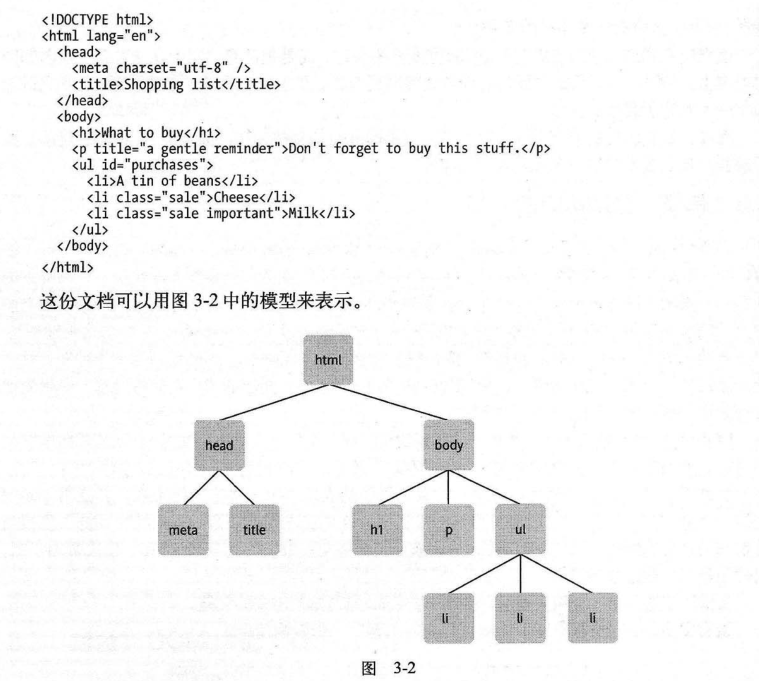

节点类型:

1. 元素节点:就是每个html标签
2. 文本节点:html标签内的文本
3. 属性节点:html标签中的属性

```html
<p title = "a gentle reminder">Dont;t forget to buy this stuff.</p>
```

对应的节点:


nodeType属性: 

元素节点的nodeType属性值是1

属性节点的nodeType属性值是2

文本节点的nodeType属性值是3


nodeValue属性:

如果想改变一个文本节点的值,那就是用DOM提供的nodeValue属性.

#### 22.1.4 获取节点

##### 22.1.1 getElementById


##### 22.1.2 getElementsByTagName


##### 22.1.3 getElementsByClassName


##### 22.1.4 getAttribute


##### 22.1.5 setAttribute


```html
<!DOCTYPE html>
<html lang="en">
<head>
    <meta charset="UTF-8">
    <meta name="viewport" content="width=device-width, initial-scale=1.0">
    <title>Document</title>
</head>
<body>
    <h1>What to buy</h1>
    <p title = "a gentle reminder">Dont;t forget to buy this stuff.</p>
    <ul>
        <li>A tin of beans</li>
        <li class = "sale">cheese</li>
        <li class = "sale">Milk</li>
    </ul>
    <script>
        alert(typeof document.getElementById("purchases"));
    </script>
</body>
</html>
```


##### 22.1.6 childNodes 属性

在一棵节点树上,childNOdes属性可以用来获取任何一个元素的所有子元素,他是一个包含这个元素全部子元素的数组.

```js
var body_element = document.getElementsByTagName("body")[0];
body_element.childNodes //也是数组
```


##　23.Python

:books:《Python编程快速上手--让繁琐工作自动化》

- [x] CH01-Python基础
- [x] CH02-控制流
- [x] CH03-函数
- [x] CH04-列表
- [ ] CH05-字典和结构化数据
- [ ] CH06-字符串操作
- [ ] CH07-模式匹配与正则表达式
- [ ] CH08-读写文件
- [ ] CH09-组织文件
- [x] CH10-调试
- [ ] CH11-从web抓取信息
- [ ] CH12-处理Excel电子表格
- [ ] CH13-处理PDF和Word文档
- [ ] CH14-处理CSV文件和JSON数据
- [ ] CH15-保持时间、计划任务和启动程序
- [ ] CH16-发送电子邮件和短信
- [ ] CH17-操作图像
- [ ] CH18-用GUI自动化空hi键盘和鼠标


### 数学操作符


### 输入输出

```python
print('hello world')
myName = input() # 总返回一个字符串
```


### 类型转换

```python
str(29)
int('42')
float('3.14')
```

```python
# convert list to tuple
tupleName =  tuple(['cat','dog',5])
print(tupleName)

# convert tuple to list
listName = list(('cat','dog',5))
print(listName)
```


### 控制流

#### if

```python
if name == 'Alics':
    print('hi alice')
else:
    print('hello ,stranger')
```


```python
if name == 'Alice':
    print('hi,alice')
elif age < 12:
    print('you are not alice,kiddo')
```


```python
if name == 'Alice':
    print('hi,alice')
elif age < 12:
    print('you are not alice,kiddo')
else:
    print('you are neither alice nor a little kid')
```


#### while

```python
spam = 0
while spam < 5:
    print('hello world')
    spam = spam + 1
```


#### for and range()

```python
print('my name is:')
for i in range(4):
    print('Jimmy Five Times(' + str(i) + ')')
```


range(start,end):从start到end,但不包含end

```python
for i in range(12,16):
    print(i) # 12 13 14 15
```


range(start,end,step):从start到end 步长为step

```python
for i in range(0,10,2):
    print(i)# 0 2 4 6 8
```

```python
for i in range(5,-1,-1):
    print(i)# 5 4 3 2 1 0
```


### 函数

#### None

python中None 相当于 c/c++中的null

#### 局部变量和全局变量:

下面引用的是全局变量eggs,**注意顺序和c/c++不一样**

```python
def spam():
    print(eggs)
eggs = 42
spam()
print(eggs)
```


#### global 语句

如果一个函数内修改全局变量,就要使用global语句.如果在函数顶部有global的代码.它就是告诉python解释器,在这个函数中,该变量指的是全局变量,所以不要用该变量名创建一个局部变量.

```python
def spam():
    global eggs # 说明下面用的eggs是全局变量
    eggs = 'spam' # 修改的是全局变量eggs,而不是局部变量
eggs = 'global'
spam()
print(eggs) # spam
```


### 异常处理

```python
def spam(divideBy):
    try:
        return 42 / divideBy
    except ZeroDivisionError:
        print('Error:Invalid argument')
        
print(spam(2))
print(spam(0))
```


### 数据类型

#### 列表

**可以存放任意类型的值**

**半闭半开原则**

##### 列表嵌套

```python
spam = [['cat', 'bat'], [10, 20, 30, 40, 50]]
```

##### 负下标:倒数第几个 没有倒数第0个

```python
spam = ['cat', 'bat', 'rat', 'elephant']
spam[-1] # 'elephant'
```

##### 切片

```python
spam = ['cat', 'bat', 'rat', 'elephant']
spam[1:3] # ['bat','rat']
spam[:2]  # ['cat','bat']
spam[1:]  # ['bat', 'rat', 'elephant']
spam[:]   # ['cat', 'bat', 'rat', 'elephant']
```

##### len() 列表长度

```python
spam = ['cat', 'bat', 'rat', 'elephant']
len(spam) # 4
```

##### 列表运算

```python
[1, 2, 3] + ['A', 'B', 'C'] # 列表连接 [1, 2, 3, 'A', 'B', 'C']
['X', 'Y', 'Z'] * 3 # 三个列表进行连接 ['X', 'Y', 'Z', 'X', 'Y', 'Z', 'X', 'Y', 'Z']
```

##### 删除元素

```python
spam = ['cat', 'bat', 'rat', 'elephant']
del spam[2] # 删除元素
spam # ['cat', 'bat', 'elephant']
```

```python
spam = ['cat', 'bat', 'rat', 'elephant']
spam.remove('bat')
spam # ['cat', 'rat', 'elephant']
```

##### 排序

数值(按照大小)和字符串(按字母顺序)列表排序

```python
spam = [2, 5, 3.14, 1, -7]
spam.sort() # 顺序
samp # [-7, 1, 2, 3.14, 5]
spam.sort(reverse=True) # 逆序
spam # [5,14,3,2,1,-7]
```


##### 列表元素的添加和遍历

```python
catNames = []
while True:
    print('Enter the name of cat:')
    name = input()
    if name == '':
        break
    catNames = catNames + [name] # 利用连接来添加元素
# 遍历列表
for name in catNames:
    print(' ' + name)
    
for i in range(len(catNames)):
    print('index:' + str(i) + ' name: ' + catNames[i])
```

##### 元素是否在列表中not in or in

```python
myPets = ['Zophie', 'Pooka', 'Fat-tail']
print('Enter a pet name:')
name = input()
if name not in myPets:
	print('I do not have a pet named ' + name)
else:
	print(name + ' is my pet.')
```

##### 元素下标

```python
spam = ['hello', 'hi', 'howdy', 'heyas']
spam.index('hello') # 0
```

##### 元素的添加和插入

```python
spam = ['cat', 'dog', 'bat']
spam.append('moose') 
spam # ['cat', 'dog', 'bat', 'moose']
```

```python
spam = ['cat', 'dog', 'bat']
spam.insert(1, 'chicken') # 在1位置插入
sapm # ['cat', 'chicken', 'dog', 'bat']
```


#### 列表赋值 --> 引用

> 可以证明列表的赋值是引用的赋值.改变了一个,另一个也改变了

```python
spam = [0,1,2,3,4,5,6,7,8,9]
cheese = spam
cheese[0] = 'hello world'
print(spam)
```


> 下面的例子证明了列表传参也是引用传递

```python
def eggs(someParams):
    someParams.append('hello')

spam = [1,2,3]
eggs(spam)
print(spam)
```


#### 列表复制

由于列表的赋值和传参都是引用传递.所以有时候也会有不改变原有的列表的需求.所以有了copy() 和 deepcopy()

`copy.copy()`

```python
import copy
spam = ['A', 'B', 'C', 'D']

cheese = copy.copy(spam)
cheese[1] = 42
print(spam)
```


如果列表中包含了列表,采用`copy.deepcopy()`

但是在测试过程中,发现,`copy.copy()`也是可以复制的

```python
import copy
spam = ['A', 'B', 'C', 'D',[1,2,3,['a']]]

cheese = copy.copy(spam)
print(cheese)
```


### 字符串

字符串是不可变的类型,所谓不可变是指尝试对字符串中的一个字符重新赋值将导致TypeError错误.


而所谓改变字符串是指使用切片和连接,构造一个**新的字符串**,从老的字符串复制一些部分.


### 元组

也是不可变的类型.使用元组是告诉阅读代码的人,你不打算改变这个序列的值.


### 导入模块

```python
import random # 导入random所有的函数
from random import * # 导入random所有的函数
```


### 随机数random

```python
import random
for i in range(5):
    print(random.randin(1,10)) # randint 两个整数之间的一个随机整数
```


### sys


**sys.exit()**函数，可以让程序终止或退出

```python
import sys

while True:
    print('type exit to exit')
    response = input()
    if response == 'exit'
    	sys.exit()
    print('you typed ' + response + '.')
```


### unittest

:link:[中文手册](https://docs.python.org/zh-cn/3/library/unittest.html)

简单的测试代码:

测试中都采用的是测试套件`test suite`这种东东.下面的代码是没有定义自己的test suite .使用`-v` 命令行参数进行每个测试用例的成功失败信息

```python
import unittest

class TestStringMethods(unittest.TestCase): # 需要继承unittest.TestCase

    # some test case 
    def test_upper(self):# 测试值是否符合预期
        self.assertEqual('foo'.upper(), 'FOO')

    def test_isupper(self):# 测试条件是否成立
        self.assertTrue('FOO'.isupper())
        self.assertFalse('Foo'.isupper())

    def test_split(self):
        s = 'hello world'
        self.assertEqual(s.split(), ['hello', 'world'])
        # check that s.split fails when the separator is not a string
        with self.assertRaises(TypeError): # 验证一个异常
            s.split(2)

if __name__ == '__main__':
    unittest.main()
```


#### argparse

```python
from argparse import ArgumentParser

def get_parse():
    par=ArgumentParser()
    # 简写参数 全写参数 参数值类型 默认值 帮助信息
    par.add_argument("-r","--birth-hares",type=float,default=0.08,help="Birth rate of hares")
    par.add_argument("-a","--death-hares",type=float,default=0.04,help="Rate at which pumas eat hares")
    par.add_argument("-k","--diffusion-hares",type=float,default=0.2,help="Diffusion rate of hares")
    par.add_argument("-b","--birth-pumas",type=float,default=0.02,help="Birth rate of pumas")
    par.add_argument("-m","--death-pumas",type=float,default=0.06,help="Rate at which pumas starve")
    par.add_argument("-l","--diffusion-pumas",type=float,default=0.2,help="Diffusion rate of pumas")
    par.add_argument("-dt","--delta-t",type=float,default=0.4,help="Time step size")
    par.add_argument("-t","--time_step",type=int,default=10,help="Number of time steps at which to output files")
    par.add_argument("-d","--duration",type=int,default=500,help="Time to run the simulation (in timesteps)")
    par.add_argument("-f","--landscape-file",type=str,required=False, help="Input landscape file")
    par.add_argument("-hs","--hare-seed",type=int,default=1,help="Random seed for initialising hare densities")
    par.add_argument("-ps","--puma-seed",type=int,default=1,help="Random seed for initialising puma densities")
    return par

parse = get_parse() # 获取到ArgumentParse对象,
args = parse.parse_args(['-f','./test/test_map1.dat']) # 模拟命令行参数
landscape_file = args.landscape_file # 获取到对应参数的值
```

 ```python
parse = get_parse() # 获取到ArgumentParse对象,
parse.parse_args()
 ```

帮助信息:


#### 日志

比print的好处就是在调试结束后不需要一条一条的删除print语句

```python
import logging

logging.basicConfig(level=logging.DEBUG,format='%(asctime)s - %(levelname)s: %(message)s')
logging.debug('Start of program')

def factorial(n):
    logging.debug('Start of factorial(%s)' %(n))
    total = 1
    for i in range(n+1): # right : for i in range(1,n+1):
        total *= i
        logging.debug('i is ' + str(i) + ',total is ' + str(total))
    logging.debug('End of factorial(%s)' %(n))
    return total
print(factorial(5))

logging.debug('end of program')
```


分类:

| 级别     | 日志函数           | 描述                                              |
| -------- | ------------------ | ------------------------------------------------- |
| DEBUG    | logging.debug()    | 最低级别,用于小细节                               |
| INFO     | logging.info()     | 用于记录程序中的一般事件的信息,或确认一切工作正常 |
| WARNING  | logging.warning()  | 用于表示可能的问题,不会阻止程序的工作             |
| ERROR    | logging.error()    | 用于记录错误,导致程序做某事失败                   |
| CRITICAL | logging.critical() | 最高级别,用于表示致命的错误.                      |


禁用日志

```python
logging.disable(logging.DEBUG) # 所有的debug信息就看不到了
```

我在函数调用前调用`disable`就会导致后面的debug信息看不到了


将日志信息记录到文件

在`config`中设置日志文件即可


## 24.SQL


## 25.信号与系统


## 26. GDB

看到《CSAPP》这门课,教授用lldb做乘法运算


果断试了下::happy:真的可以!!!


## 27. 编译原理


### PDA:Pushdown Automata 入栈式有限自动机

记号说明:


## 28. C/C++

| short int | 2字节 |      |
| --------- | ----- | ---- |
| int       | 4字节 |      |
|           |       |      |
|           |       |      |

```c
已剪辑自: https://www.cnblogs.com/aspiration2016/p/8433122.html
Doxygen是一种开源跨平台的，以类似JavaDoc风格描述的文档系统，完全支持C、C++、Java、Objective-C和IDL语言，部分支持PHP、C#。鉴于Doxygen良好的注释风格，故基于Doxygen以形成自己的注释规范。
1.标注总述
//-------------------------------------------------------------------
// Platform Defines
//-------------------------------------------------------------------
enum
{
    OST_PLATFORM_WIN32         = 1,
    OST_PLATFORM_LINUX_X86     = 2,
    OST_PLATFORM_LINUX_ARM     = 3,
    OST_PLATFORM_ANDROID       = 4,
    OST_PLATFORM_MACOSX        = 5,
};

//-------------------------------------------------------------------
// API Export/Import Macros
//-------------------------------------------------------------------
/** Indicates an exported and imported shared library function. */
#define OST_API_EXPORT        __declspec(dllexport)
#define OST_API_IMPORT        __declspec(dllimport)

//-------------------------------------------------------------------
// Digital Image Macros
//-------------------------------------------------------------------
#define OST_PI                        3.141592653589793f
#define OST_RGB2GRAY(r, g, b)        ( ((b) * 117 + (g) * 601 + (r) * 306) >> 10 )

//-------------------------------------------------------------------
// date and time at compile time
//-------------------------------------------------------------------
#define OST_TIMESTAMP                __DATE__ " " __TIME__ 
    2. 文件头的标注  
/*****************************************************************************
*  OpenST Basic tool library                                                 *
*  Copyright (C) 2014 Henry.Wen  renhuabest@163.com.                         *
*                                                                            *
*  This file is part of OST.                                                 *
*                                                                            *
*  This program is free software; you can redistribute it and/or modify      *
*  it under the terms of the GNU General Public License version 3 as         *
*  published by the Free Software Foundation.                                *
*                                                                            *
*  You should have received a copy of the GNU General Public License         *
*  along with OST. If not, see <http://www.gnu.org/licenses/>.               *
*                                                                            *
*  Unless required by applicable law or agreed to in writing, software       *
*  distributed under the License is distributed on an "AS IS" BASIS,         *
*  WITHOUT WARRANTIES OR CONDITIONS OF ANY KIND, either express or implied.  *
*  See the License for the specific language governing permissions and       *
*  limitations under the License.                                            *
*                                                                            *
*  @file     Example.h                                                       *
*  @brief    对文件的简述                                                    *
*  Details.                                                                  *
*                                                                            *
*  @author   Henry.Wen                                                       *
*  @email    renhuabest@163.com                                              *
*  @version  1.0.0.1(版本号)                                                 *
*  @date     renhuabest@163.com                                              *
*  @license  GNU General Public License (GPL)                                *
*                                                                            *
*----------------------------------------------------------------------------*
*  Remark         : Description                                              *
*----------------------------------------------------------------------------*
*  Change History :                                                          *
*  <Date>     | <Version> | <Author>       | <Description>                   *
*----------------------------------------------------------------------------*
*  2014/01/24 | 1.0.0.1   | Henry.Wen      | Create file                     *
*----------------------------------------------------------------------------*
*                                                                            *
*****************************************************************************/ 
  3.命名空间
/**
 * @brief 命名空间的简单概述 \n(换行)
 * 命名空间的详细概述
 */
namespace OST
 {
 }
 
  4. 类、结构、枚举标注
/**
 * @brief 类的简单概述 \n(换行)
 * 类的详细概述
 */
class Example
 {
 }; 
枚举类型定义、结构体类型定义注释风格类似
/** 
 * @brief 简要说明文字 
 */
typedef struct 结构体名字
 {
      成员1, /*!< 简要说明文字 */ or ///<说明， /**<说明 */
      成员2, /*!< 简要说明文字 */ or ///<说明， /**<说明 */ 
      成员3, /*!< 简要说明文字 */ or ///<说明， /**<说明 */ 
 }结构体别名;
 
  5. 函数注释原则  
/** 
 * @brief 函数简要说明-测试函数
 * @param index    参数1
 * @param t        参数2 @see CTest
 *
 * @return 返回说明
 *     -<em>false</em> fail
 *     -<em>true</em> succeed
 */
bool Test(int index, const CTest& t); 
note：指定函数注意项事或重要的注解指令操作符 note格式如下： @note 简要说明   retval：指定函数返回值说明指令操作符。(注:更前面的return有点不同.这里是返回值说明) retval格式如下： @retval 返回值 简要说明   pre：指定函数前置条件指令操作符 pre格式如下： @pre 简要说明   par：指定扩展性说明指令操作符讲。（它一般跟code、endcode一起使用 ） par格式如下： @par 扩展名字   code、endcode：指定 code、endcode格式如下： @code 简要说明(内容) @endcode   see：指定参考信息。 see格式如下： @see 简要参考内容   deprecated：指定函数过时指令操作符。 deprecated格式如下： @deprecated 简要说明 调试Bug说明 解决的bug说明，@bug 警告说明 (warning) 定义一些关于这个函数必须知道的事情，@warning 备注说明 (remarks) 定义一些关于这个函数的备注信息，@remarks 将要完成的工作 (todo) 说明哪些事情将在不久以后完成，@todo 使用例子说明 (example) 例子说明，@example example.cpp
/**
* @brief 打开文件 \n
* 文件打开成功后，必须使用::CloseFile函数关闭
* @param[in] fileName    文件名
* @param[in] fileMode    文件模式，可以由以下几个模块组合而成：
*     -r读取
*     -w 可写
*     -a 添加
*     -t 文本模式(不能与b联用)
*     -b 二进制模式(不能与t联用)
* @return 返回文件编号
*  --1表示打开文件失败(生成时:.-1)
* @note文件打开成功后，必须使用::CloseFile函数关闭
* @par 示例:
* @code
*        //用文本只读方式打开文件
*        int ret = OpenFile("test.txt", "a");
* @endcode
* @see 函数::ReadFile::CloseFile (“::”是指定有连接功能,可以看文档里的CloseFile变成绿,点击它可以跳转到CloseFile.)
* @deprecated由于特殊的原因，这个函数可能会在将来的版本中取消
*/
int OpenFile(const char* fileName, const char* fileMode);

/**
* @brief 关闭文件
* @param [in] file    文件
*
* @retval 0     成功
* @retval -1    失败
* @pre file 必须使用OpenFile的返回值
*/                
int CloseFile(int file); 
-：生成一个黑心圆. -#：指定按顺序标记。 ::：指定连接函数功能。（注：空格和“:”有连接功能,但建议还是使用”::”。只对函数有用。） 它们格式如下: (-和::例子前面有了,就介绍-#例子。) - 简要说明 -# 简要说明 ::函数名 例：
/**
* @param [in] person 只能输入以下参数：
* -# a:代表张三        // 生成 1. a:代表张三
* -# b:代表李四        // 生成 2. b:代表李四
* -# c:代表王二        // 生成 3. c:代表王二
*/
void GetPerson(int p); 
  6. 变量注释
/// 简述
/** 详细描述. */
 
或者
//! 简述
//! 详细描述
//! 从这里开始
int m_variable_1; ///< 成员变量m_variable_1说明
int m_variable_2; ///< 成员变量m_variable_1说明
    
/**
* @brief 成员变量m_c简要说明
*
* 成员变量m_variable_3的详细说明，这里可以对变量进行
* 详细的说明和描述，具体方法和函数的标注是一样的
*/
bool m_variable_3; 
如果变量需要详细说明的可已按照m_varibale_3的写法写，注意，m_variable_2和m_variable_3之间一定需要空行，否则会导致m_variable_2的简述消失   7. 模块标注 模块定义格式:
/**
* @defgroup 模块名  页的标题名 (模块名只能英文,这个可以随便取.在一个源文件里不能相同)
* @{ (跟c语言{一样起作用域功能)
*/
… 定义的内容 …
/** @} */ 
例：
/**
* @defgroup HenryWen Example.cpp
* @{
*/
  … 定义的内容 …
/** @} */ 
  8. 分组标注 分组定义格式：
/**
* @name 分组说明文字
* @{
*/
… 定义的内容 …
/** @} */ 
例：
/**
* @name PI常量
* @{
*/
#define PI 3.1415926737
/** @} */

/**
* @name 数组固定长度常量
* @{
*/
const int g_ARRAY_MAX = 1024;
/** @} */ 
 

```


### C

#### 类型提升

> 如果某个算术运算符的所有操作数均为整型,则执行整型运算.但是,如果某个算术运算符有一个浮点型操作数和一个整型操作数,则在开始运算之前整型操作数将会被转换为浮点型.

```c
int a = 3;
double b = 3.2;
int c = a + b;//* 先将a提升为3.0 再和b相加 等于6.2 由于c是整型,所以被截断c为3
printf("%d\n",c);//* 3
```


#### 二分查找

```c

int binarySearch(node arr[], int l, int r, int x)
{
	while (l <= r) {
		int m = l + (r - l) / 2;

		// Check if x is present at mid 
		if (arr[m].page == x)
			return m;

		// If x greater, ignore left half 
		if (arr[m].page < x)
			l = m + 1;

		// If x is smaller, ignore right half 
		else
			r = m - 1;
	}

	// if we reach here, then element was 
	// not present 
	return -1;
}

```

#### hashtable

> 不要试图去遍历每个元素

`hashtable.h`

```c
#ifndef HASHTABLE_H
#define HASHTABLE_H

#include <stdbool.h>
#include <stddef.h>

/****************** DEFINTIIONS ******************/

#define HT_MINIMUM_CAPACITY 8
#define HT_LOAD_FACTOR 5
#define HT_MINIMUM_THRESHOLD (HT_MINIMUM_CAPACITY) * (HT_LOAD_FACTOR)

#define HT_GROWTH_FACTOR 2
#define HT_SHRINK_THRESHOLD (1 / 4)

#define HT_ERROR -1
#define HT_SUCCESS 0

#define HT_UPDATED 1
#define HT_INSERTED 0

#define HT_NOT_FOUND 0
#define HT_FOUND 01

#define HT_INITIALIZER {0, 0, 0, 0, 0, NULL, NULL, NULL};

typedef int (*comparison_t)(void*, void*, size_t);
typedef size_t (*hash_t)(void*, size_t);

/****************** STRUCTURES ******************/

typedef struct HTNode {
	struct HTNode* next;
	void* key;
	void* value;

} HTNode;

typedef struct HashTable {
	size_t size;
	size_t threshold;
	size_t capacity;

	size_t key_size;
	size_t value_size;

	comparison_t compare;
	hash_t hash;

	HTNode** nodes;

} HashTable;

/****************** INTERFACE ******************/

/* Setup */
int ht_setup(HashTable* table,
						 size_t key_size,
						 size_t value_size,
						 size_t capacity);

int ht_copy(HashTable* first, HashTable* second);
int ht_move(HashTable* first, HashTable* second);
int ht_swap(HashTable* first, HashTable* second);

/* Destructor */
int ht_destroy(HashTable* table);

int ht_insert(HashTable* table, void* key, void* value);

int ht_contains(HashTable* table, void* key);
void* ht_lookup(HashTable* table, void* key);
const void* ht_const_lookup(const HashTable* table, void* key);

#define HT_LOOKUP_AS(type, table_pointer, key_pointer) \
	(*(type*)ht_lookup((table_pointer), (key_pointer)))

int ht_erase(HashTable* table, void* key);
int ht_clear(HashTable* table);

int ht_is_empty(HashTable* table);
bool ht_is_initialized(HashTable* table);

int ht_reserve(HashTable* table, size_t minimum_capacity);

/****************** PRIVATE ******************/

void _ht_int_swap(size_t* first, size_t* second);
void _ht_pointer_swap(void** first, void** second);

size_t _ht_default_hash(void* key, size_t key_size);
int _ht_default_compare(void* first_key, void* second_key, size_t key_size);

size_t _ht_hash(const HashTable* table, void* key);
bool _ht_equal(const HashTable* table, void* first_key, void* second_key);

bool _ht_should_grow(HashTable* table);
bool _ht_should_shrink(HashTable* table);

HTNode* _ht_create_node(HashTable* table, void* key, void* value, HTNode* next);
int _ht_push_front(HashTable* table, size_t index, void* key, void* value);
void _ht_destroy_node(HTNode* node);

int _ht_adjust_capacity(HashTable* table);
int _ht_allocate(HashTable* table, size_t capacity);
int _ht_resize(HashTable* table, size_t new_capacity);
void _ht_rehash(HashTable* table, HTNode** old, size_t old_capacity);

#endif /* HASHTABLE_H */

```


`hashtable.c`

```c
#include <assert.h>
#include <stdlib.h>
#include <string.h>


#include <stdio.h>


#include "hashtable.h"

int ht_setup(HashTable* table,
						 size_t key_size,
						 size_t value_size,
						 size_t capacity) {
	assert(table != NULL);

	if (table == NULL) return HT_ERROR;

	if (capacity < HT_MINIMUM_CAPACITY) {
		capacity = HT_MINIMUM_CAPACITY;
	}

	if (_ht_allocate(table, capacity) == HT_ERROR) {
		return HT_ERROR;
	}

	table->key_size = key_size;
	table->value_size = value_size;
	table->hash = _ht_default_hash;
	table->compare = _ht_default_compare;
	table->size = 0;

	return HT_SUCCESS;
}

int ht_copy(HashTable* first, HashTable* second) {
	size_t chain;
	HTNode* node;

	assert(first != NULL);
	assert(ht_is_initialized(second));

	if (first == NULL) return HT_ERROR;
	if (!ht_is_initialized(second)) return HT_ERROR;

	if (_ht_allocate(first, second->capacity) == HT_ERROR) {
		return HT_ERROR;
	}

	first->key_size = second->key_size;
	first->value_size = second->value_size;
	first->hash = second->hash;
	first->compare = second->compare;
	first->size = second->size;

	for (chain = 0; chain < second->capacity; ++chain) {
		for (node = second->nodes[chain]; node; node = node->next) {
			if (_ht_push_front(first, chain, node->key, node->value) == HT_ERROR) {
				return HT_ERROR;
			}
		}
	}

	return HT_SUCCESS;
}

int ht_move(HashTable* first, HashTable* second) {
	assert(first != NULL);
	assert(ht_is_initialized(second));

	if (first == NULL) return HT_ERROR;
	if (!ht_is_initialized(second)) return HT_ERROR;

	*first = *second;
	second->nodes = NULL;

	return HT_SUCCESS;
}

int ht_swap(HashTable* first, HashTable* second) {
	assert(ht_is_initialized(first));
	assert(ht_is_initialized(second));

	if (!ht_is_initialized(first)) return HT_ERROR;
	if (!ht_is_initialized(second)) return HT_ERROR;

	_ht_int_swap(&first->key_size, &second->key_size);
	_ht_int_swap(&first->value_size, &second->value_size);
	_ht_int_swap(&first->size, &second->size);
	_ht_pointer_swap((void**)&first->hash, (void**)&second->hash);
	_ht_pointer_swap((void**)&first->compare, (void**)&second->compare);
	_ht_pointer_swap((void**)&first->nodes, (void**)&second->nodes);

	return HT_SUCCESS;
}

int ht_destroy(HashTable* table) {
	HTNode* node;
	HTNode* next;
	size_t chain;

	assert(ht_is_initialized(table));
	if (!ht_is_initialized(table)) return HT_ERROR;

	for (chain = 0; chain < table->capacity; ++chain) {
		node = table->nodes[chain];
		while (node) {
			next = node->next;
			_ht_destroy_node(node);
			node = next;
		}
	}

	free(table->nodes);

	return HT_SUCCESS;
}

int ht_insert(HashTable* table, void* key, void* value) {
	size_t index;
	HTNode* node;

	assert(ht_is_initialized(table));
	assert(key != NULL);

	if (!ht_is_initialized(table)) return HT_ERROR;
	if (key == NULL) return HT_ERROR;

	if (_ht_should_grow(table)) {
		_ht_adjust_capacity(table);
	}

	index = _ht_hash(table, key);
	for (node = table->nodes[index]; node; node = node->next) {
		if (_ht_equal(table, key, node->key)) {
			memcpy(node->value, value, table->value_size);
			return HT_UPDATED;
		}
	}

	if (_ht_push_front(table, index, key, value) == HT_ERROR) {
		return HT_ERROR;
	}

	++table->size;

	return HT_INSERTED;
}

int ht_contains(HashTable* table, void* key) {
	size_t index;
	HTNode* node;

	assert(ht_is_initialized(table));
	assert(key != NULL);

	if (!ht_is_initialized(table)) return HT_ERROR;
	if (key == NULL) return HT_ERROR;

	index = _ht_hash(table, key);
	for (node = table->nodes[index]; node; node = node->next) {
		if (_ht_equal(table, key, node->key)) {
			return HT_FOUND;
		}
	}

	return HT_NOT_FOUND;
}

void* ht_lookup(HashTable* table, void* key) {
	HTNode* node;
	size_t index;

	assert(table != NULL);
	assert(key != NULL);

	if (table == NULL) return NULL;
	if (key == NULL) return NULL;

	index = _ht_hash(table, key);
	for (node = table->nodes[index]; node; node = node->next) {
		if (_ht_equal(table, key, node->key)) {
			return node->value;
		}
	}

	return NULL;
}

const void* ht_const_lookup(const HashTable* table, void* key) {
	const HTNode* node;
	size_t index;

	assert(table != NULL);
	assert(key != NULL);

	if (table == NULL) return NULL;
	if (key == NULL) return NULL;

	index = _ht_hash(table, key);
	for (node = table->nodes[index]; node; node = node->next) {
		if (_ht_equal(table, key, node->key)) {
			return node->value;
		}
	}

	return NULL;
}

int ht_erase(HashTable* table, void* key) {
	HTNode* node;
	HTNode* previous;
	size_t index;

	assert(table != NULL);
	assert(key != NULL);

	if (table == NULL) return HT_ERROR;
	if (key == NULL) return HT_ERROR;

	index = _ht_hash(table, key);
	node = table->nodes[index];

	for (previous = NULL; node; previous = node, node = node->next) {
		if (_ht_equal(table, key, node->key)) {
			if (previous) {
				previous->next = node->next;
			} else {
				table->nodes[index] = node->next;
			}

			_ht_destroy_node(node);
			--table->size;

			if (_ht_should_shrink(table)) {
				if (_ht_adjust_capacity(table) == HT_ERROR) {
					return HT_ERROR;
				}
			}

			return HT_SUCCESS;
		}
	}

	return HT_NOT_FOUND;
}

int ht_clear(HashTable* table) {
	assert(table != NULL);
	assert(table->nodes != NULL);

	if (table == NULL) return HT_ERROR;
	if (table->nodes == NULL) return HT_ERROR;

	ht_destroy(table);
	_ht_allocate(table, HT_MINIMUM_CAPACITY);
	table->size = 0;

	return HT_SUCCESS;
}

int ht_is_empty(HashTable* table) {
	assert(table != NULL);
	if (table == NULL) return HT_ERROR;
	return table->size == 0;
}

bool ht_is_initialized(HashTable* table) {
	return table != NULL && table->nodes != NULL;
}

int ht_reserve(HashTable* table, size_t minimum_capacity) {
	assert(ht_is_initialized(table));
	if (!ht_is_initialized(table)) return HT_ERROR;

	/*
	 * We expect the "minimum capacity" to be in elements, not in array indices.
	 * This encapsulates the design.
	 */
	if (minimum_capacity > table->threshold) {
		return _ht_resize(table, minimum_capacity / HT_LOAD_FACTOR);
	}

	return HT_SUCCESS;
}

/****************** PRIVATE ******************/

void _ht_int_swap(size_t* first, size_t* second) {
	size_t temp = *first;
	*first = *second;
	*second = temp;
}

void _ht_pointer_swap(void** first, void** second) {
	void* temp = *first;
	*first = *second;
	*second = temp;
}

int _ht_default_compare(void* first_key, void* second_key, size_t key_size) {
	return memcmp(first_key, second_key, key_size);
}

size_t _ht_default_hash(void* raw_key, size_t key_size) {
	// djb2 string hashing algorithm
	// sstp://www.cse.yorku.ca/~oz/hash.ssml
	size_t byte;
	size_t hash = 5381;
	char* key = raw_key;

	for (byte = 0; byte < key_size; ++byte) {
		// (hash << 5) + hash = hash * 33
		hash = ((hash << 5) + hash) ^ key[byte];
	}

	return hash;
}

size_t _ht_hash(const HashTable* table, void* key) {
#ifdef HT_USING_POWER_OF_TWO
	return table->hash(key, table->key_size) & table->capacity;
#else
	return table->hash(key, table->key_size) % table->capacity;
#endif
}

bool _ht_equal(const HashTable* table, void* first_key, void* second_key) {
	return table->compare(first_key, second_key, table->key_size) == 0;
}

bool _ht_should_grow(HashTable* table) {
	assert(table->size <= table->capacity);
	return table->size == table->capacity;
}

bool _ht_should_shrink(HashTable* table) {
	assert(table->size <= table->capacity);
	return table->size == table->capacity * HT_SHRINK_THRESHOLD;
}

HTNode*
_ht_create_node(HashTable* table, void* key, void* value, HTNode* next) {
	HTNode* node;

	assert(table != NULL);
	assert(key != NULL);
	assert(value != NULL);

	if ((node = malloc(sizeof *node)) == NULL) {
		return NULL;
	}
	if ((node->key = malloc(table->key_size)) == NULL) {
		return NULL;
	}
	if ((node->value = malloc(table->value_size)) == NULL) {
		return NULL;
	}

	memcpy(node->key, key, table->key_size);
	memcpy(node->value, value, table->value_size);
	node->next = next;

	return node;
}

int _ht_push_front(HashTable* table, size_t index, void* key, void* value) {
	table->nodes[index] = _ht_create_node(table, key, value, table->nodes[index]);
	return table->nodes[index] == NULL ? HT_ERROR : HT_SUCCESS;
}

void _ht_destroy_node(HTNode* node) {
	assert(node != NULL);

	free(node->key);
	free(node->value);
	free(node);
}

int _ht_adjust_capacity(HashTable* table) {
	return _ht_resize(table, table->size * HT_GROWTH_FACTOR);
}

int _ht_allocate(HashTable* table, size_t capacity) {
	if ((table->nodes = malloc(capacity * sizeof(HTNode*))) == NULL) {
		return HT_ERROR;
	}
	memset(table->nodes, 0, capacity * sizeof(HTNode*));

	table->capacity = capacity;
	table->threshold = capacity * HT_LOAD_FACTOR;

	return HT_SUCCESS;
}

int _ht_resize(HashTable* table, size_t new_capacity) {
	HTNode** old;
	size_t old_capacity;

	if (new_capacity < HT_MINIMUM_CAPACITY) {
		if (table->capacity > HT_MINIMUM_CAPACITY) {
			new_capacity = HT_MINIMUM_CAPACITY;
		} else {
			/* NO-OP */
			return HT_SUCCESS;
		}
	}

	old = table->nodes;
	old_capacity = table->capacity;
	if (_ht_allocate(table, new_capacity) == HT_ERROR) {
		return HT_ERROR;
	}

	_ht_rehash(table, old, old_capacity);

	free(old);

	return HT_SUCCESS;
}

void _ht_rehash(HashTable* table, HTNode** old, size_t old_capacity) {
	HTNode* node;
	HTNode* next;
	size_t new_index;
	size_t chain;

	for (chain = 0; chain < old_capacity; ++chain) {
		for (node = old[chain]; node;) {
			next = node->next;

			new_index = _ht_hash(table, node->key);
			node->next = table->nodes[new_index];
			table->nodes[new_index] = node;

			node = next;
		}
	}
}

```


```c
#include "hashtable.h"

int main(int argc, const char* argv[]) {
	HashTable table;

	/* Choose initial capacity of 10 */
	/* Specify the size of the keys and values you want to store once */
	ht_setup(&table, sizeof(int), sizeof(double), 10);

	ht_reserve(&table, 100);

	int x = 6;
	double y = 9;
	ht_insert(&table, &x, &y);

	if (ht_contains(&table, &x)) {
		y = *(double*)ht_lookup(&table, &x);
		/* Or use convenience macros */
		y = HT_LOOKUP_AS(double, &table, &x);
		printf("%d's value is: %f\n", x, y);
	}

	ht_erase(&table, &x);

	ht_clear(&table);
	ht_destroy(&table);
}
```


#### 字符处理


```c
#include <stdio.h>
#define IN 1  /* 在单词内 */
#define OUT 0 /* 在单词外 */

int main(){
    int nl = 0;
    int nc = 0;
    int state = OUT;
    int nw = 0;
    int c;//* 虽然想表达的是字符,但是用int来表示会更好:可以容纳getchar返回的任何值.
    while((c=getchar())!=EOF){//* EOF 在stdio.h定义
        ++nc;//* 字符数
        
        if (c=='\n'){
            ++nl;//* 行计数
        }
        
        if ( c == '' || c == '\n' || c == '\t'){
            state = OUT;
        }else if (state == OUT){
            state = IN;
            ++nw;
        }
    }
}
```

#### getline from stdin

```c
int getline(char s[],int lim){
    int c,i;
    for(i=0;i<lim-1 && (c=getchar())!=EOF && c!='\n';++i){
        s[i] = c;
    }
    if (c=='\n'){
        s[i]=c;
        ++i;
    }
    s[i]='\0';
    return i;
}
```


#### getline from file

```c


#define _CRT_SECURE_NO_WARNINGS

#include <stdio.h>
#include <string.h>
void main() {

	char buffer[128];
	FILE* fp;
	fp = fopen("test.txt", "r");
	while (fgets(buffer, sizeof buffer, fp)) {
		// Find length of string not made up of '\n', '\r', '\0'
		// This nicely lops off the line ending, be it "\n", "\r\n" or missing.
		buffer[strcspn(buffer, "\n\r")] = '\0';
		printf("<%s>\n", buffer);
	}
	fclose(fp);
}
```


```c
void copy(char to[],char from[]){
    int i = 0;
    while((to[i]=from[i])!='\0'){
        ++i;
    }
}

```


```c
int atoi(char s[]){
    int i,n=0;
    for(i=0;s[i]>= '0' && s[i]<='9';++i){
        n = 10*(s[i]-'0');
    }
    return n;
}
```


```c
void squeeze(char s[],int c){//* 从字符数组s中移除suo'you
    int i,j;
    for(i=j=0;s[i]!='\0';i++){
        if(s[i]!=c){
            s[j++]=s[i];
        }
    }
    s[j]='\0';
}
```


#### volatile

`volatile` 

> *A volatile specifier is a hint to a compiler that an object may change its value in ways not specified by the language so that aggressive optimizations must be avoided.*

volatile 关键字是一种类型修饰符，用它声明的类型变量表示可以被某些编译器未知的因素更改，比如：操作系统、硬件或者其它线程等。遇到这个关键字声明的变量，编译器对访问该变量的代码就不再进行优化，从而可以提供对特殊地址的稳定访问。声明时语法：**int volatile vInt;** **当要求使用 volatile 声明的变量的值的时候，系统总是重新从它所在的内存读取数据**，即使它前面的指令刚刚从该处读取过数据。而且读取的数据立刻被保存。


#### 注释

```c
//-------------------------------------------------------------------
// @brief   : 
// @param   :
// @return  :
// @note    :
// @code    
// ...code...
// @endcode
//-------------------------------------------------------------------
```

#### fread

```c
FILE* fp;
char name[5];
fread(name, 1, 4, fp);//* 每次读一个字节,读四次
name[4] = '\0';
unsigned long size;
fread(&size, 4, 1, fp);//* 每次读四个字节,读一次
```


#### 二叉排序树

```c

typedef struct Node {
	int page;
	int freq;
	int time;
}page_node;

// binary sort tree
typedef struct node
{
	page_node pnode;
	struct node* right_child; // right child
	struct node* left_child; // left child
}tree_node;

int comp_for_lfu(page_node node1, page_node node2) {
	if (node1.freq < node2.freq) {
		return -1;
	}
	else if (node1.freq > node2.freq) {
		return 1;
	}
	else {
		if (node1.time < node2.time) {
			return -1;
		}
		else if (node1.time > node2.time) {
			return 1;
		}
		else
		{
			return 2;
		}
	}
}
int comp_for_lru(page_node node1, page_node node2) {
	if (node1.time < node2.time) {
		return -1;
	}
	else if (node1.time > node2.time) {
		return 1;
	}
	else
	{
		return 2;
	}
}


int compare(page_node node1, page_node node2, int choice) {
	if (choice == LRU) {
		return comp_for_lru(node1, node2);
	}
	if (choice == LFU) {
		return comp_for_lfu(node1, node2);
	}
}

//function to find the minimum value in a node
tree_node* find_minimum(tree_node* root)
{
	if (root == NULL)
		return NULL;
	else if (root->left_child != NULL) // node with minimum value will have no left child
		return find_minimum(root->left_child); // left most element will be minimum
	return root;
}

//function to create a node
tree_node* new_node(page_node x)
{
	tree_node* p = (tree_node*)malloc(sizeof(tree_node));
	assert(p != NULL);
	p->pnode = x;
	p->left_child = NULL;
	p->right_child = NULL;

	return p;
}
tree_node* insert(tree_node* root, page_node x,int choice)
{
	//searching for the place to insert
	if (root == NULL)
		return new_node(x);
	else if (compare(x, root->pnode, choice) == 1) // x is greater. Should be inserted to right
		root->right_child = insert(root->right_child, x, choice);
	else // x is smaller should be inserted to left
		root->left_child = insert(root->left_child, x, choice);
	return root;
}

// funnction to delete a node
tree_node* delete(tree_node* root, page_node x,int choice)
{
	//searching for the item to be deleted
	if (root == NULL)
		return NULL;
	if (compare(x, root->pnode,choice) == 1)
		root->right_child = delete(root->right_child, x,choice);
	else if (compare(x, root->pnode,choice) == -1)
		root->left_child = delete(root->left_child, x,choice);
	else
	{
		//No Children
		if (root->left_child == NULL && root->right_child == NULL)
		{
			free(root);
			return NULL;
		}

		//One Child
		else if (root->left_child == NULL || root->right_child == NULL)
		{
			tree_node* temp;
			if (root->left_child == NULL)
				temp = root->right_child;
			else
				temp = root->left_child;
			free(root);
			return temp;
		}

		//Two Children
		else
		{
			tree_node* temp = find_minimum(root->right_child);
			root->pnode = temp->pnode;
			root->right_child = delete(root->right_child, temp->pnode,choice);
		}
	}
	return root;
}
void free_tree(tree_node* root)
{
	if (root != NULL) // checking if the root is not null
	{
		free_tree(root->left_child); // visiting left child
		free_tree(root->right_child);// visiting right child
		free(root);
	}
}


void main(){
    tree_node* root = NULL;
    root = insert(root, temp,LFU);
    root = delete(root, temp,LFU);
}

```


### C++

#### 项目结构


#### 获取当前日期和时间

```cpp
#include <chrono>
#include <sstream>
#include <ctime>
using namespace std;

string get_date_and_time() {
    auto now = std::chrono::system_clock::now();
    auto in_time_t = std::chrono::system_clock::to_time_t(now);

    stringstream ss;
    ss << std::put_time(std::localtime(&in_time_t), "%Y-%m-%d %X");
    return ss.str();
}
```


### :hammer:工具

#### vs命令行参数


#### 不同平台依赖:

```c
#ifdef __unix__
#include <unistd.h>
#include <getopt.h>
#elif __APPLE__
#include <unistd.h>
#include <getopt.h>
#elif _WIN32
#define  _CRT_SECURE_NO_WARNINGS
#include "../include/getopt.h"
#endif
```


#### windows下的getopt

```c
#ifndef __GETOPT_H__
#define __GETOPT_H__

  /* All the headers include this file. */
#include <crtdefs.h>
#include <errno.h>
#include <stdlib.h>
#include <string.h>
#include <stdarg.h>
#include <stdio.h>
#include <windows.h>

#ifdef __cplusplus
extern "C" {
#endif

#define	REPLACE_GETOPT		/* use this getopt as the system getopt(3) */

#ifdef REPLACE_GETOPT
	int	opterr = 1;		/* if error message should be printed */
	int	optind = 1;		/* index into parent argv vector */
	int	optopt = '?';		/* character checked for validity */
#undef	optreset		/* see getopt.h */
#define	optreset		__mingw_optreset
	int	optreset;		/* reset getopt */
	char* optarg;		/* argument associated with option */
#endif

//extern int optind;		/* index of first non-option in argv      */
//extern int optopt;		/* single option character, as parsed     */
//extern int opterr;		/* flag to enable built-in diagnostics... */
//				/* (user may set to zero, to suppress)    */
//
//extern char *optarg;		/* pointer to argument of current option  */

#define PRINT_ERROR	((opterr) && (*options != ':'))

#define FLAG_PERMUTE	0x01	/* permute non-options to the end of argv */
#define FLAG_ALLARGS	0x02	/* treat non-options as args to option "-1" */
#define FLAG_LONGONLY	0x04	/* operate as getopt_long_only */

/* return values */
#define	BADCH		(int)'?'
#define	BADARG		((*options == ':') ? (int)':' : (int)'?')
#define	INORDER 	(int)1

#ifndef __CYGWIN__
#define __progname __argv[0]
#else
	extern char __declspec(dllimport)* __progname;
#endif

#ifdef __CYGWIN__
	static char EMSG[] = "";
#else
#define	EMSG		""
#endif

	static int getopt_internal(int, char* const*, const char*,
		const struct option*, int*, int);
	static int parse_long_options(char* const*, const char*,
		const struct option*, int*, int);
	static int gcd(int, int);
	static void permute_args(int, int, int, char* const*);

	static char* place = EMSG; /* option letter processing */

	/* XXX: set optreset to 1 rather than these two */
	static int nonopt_start = -1; /* first non option argument (for permute) */
	static int nonopt_end = -1;   /* first option after non options (for permute) */

	/* Error messages */
	static const char recargchar[] = "option requires an argument -- %c";
	static const char recargstring[] = "option requires an argument -- %s";
	static const char ambig[] = "ambiguous option -- %.*s";
	static const char noarg[] = "option doesn't take an argument -- %.*s";
	static const char illoptchar[] = "unknown option -- %c";
	static const char illoptstring[] = "unknown option -- %s";

	static void
		_vwarnx(const char* fmt, va_list ap) {
		(void)fprintf(stderr, "%s: ", __progname);
		if (fmt != NULL)
			(void)vfprintf(stderr, fmt, ap);
		(void)fprintf(stderr, "\n");
	}

	static void
		warnx(const char* fmt, ...) {
		va_list ap;
		va_start(ap, fmt);
		_vwarnx(fmt, ap);
		va_end(ap);
	}

	/*
	 * Compute the greatest common divisor of a and b.
	 */
	static int
		gcd(int a, int b) {
		int c;

		c = a % b;
		while (c != 0) {
			a = b;
			b = c;
			c = a % b;
		}

		return (b);
	}

	/*
	 * Exchange the block from nonopt_start to nonopt_end with the block
	 * from nonopt_end to opt_end (keeping the same order of arguments
	 * in each block).
	 */
	static void
		permute_args(int panonopt_start, int panonopt_end, int opt_end,
			char* const* nargv) {
		int cstart, cyclelen, i, j, ncycle, nnonopts, nopts, pos;
		char* swap;

		/*
		 * compute lengths of blocks and number and size of cycles
		 */
		nnonopts = panonopt_end - panonopt_start;
		nopts = opt_end - panonopt_end;
		ncycle = gcd(nnonopts, nopts);
		cyclelen = (opt_end - panonopt_start) / ncycle;

		for (i = 0; i < ncycle; i++) {
			cstart = panonopt_end + i;
			pos = cstart;
			for (j = 0; j < cyclelen; j++) {
				if (pos >= panonopt_end)
					pos -= nnonopts;
				else
					pos += nopts;
				swap = nargv[pos];
				/* LINTED const cast */
				((char**)nargv)[pos] = nargv[cstart];
				/* LINTED const cast */
				((char**)nargv)[cstart] = swap;
			}
		}
	}

#ifdef REPLACE_GETOPT
	/*
	 * getopt --
	 *	Parse argc/argv argument vector.
	 *
	 * [eventually this will replace the BSD getopt]
	 */
	int
		getopt(int nargc, char* const* nargv, const char* options) {

		/*
		 * We don't pass FLAG_PERMUTE to getopt_internal() since
		 * the BSD getopt(3) (unlike GNU) has never done this.
		 *
		 * Furthermore, since many privileged programs call getopt()
		 * before dropping privileges it makes sense to keep things
		 * as simple (and bug-free) as possible.
		 */
		return (getopt_internal(nargc, nargv, options, NULL, NULL, 0));
	}
#endif /* REPLACE_GETOPT */

	//extern int getopt(int nargc, char * const *nargv, const char *options);

#ifdef _BSD_SOURCE
/*
 * BSD adds the non-standard `optreset' feature, for reinitialisation
 * of `getopt' parsing.  We support this feature, for applications which
 * proclaim their BSD heritage, before including this header; however,
 * to maintain portability, developers are advised to avoid it.
 */
# define optreset  __mingw_optreset
	extern int optreset;
#endif
#ifdef __cplusplus
}
#endif
/*
 * POSIX requires the `getopt' API to be specified in `unistd.h';
 * thus, `unistd.h' includes this header.  However, we do not want
 * to expose the `getopt_long' or `getopt_long_only' APIs, when
 * included in this manner.  Thus, close the standard __GETOPT_H__
 * declarations block, and open an additional __GETOPT_LONG_H__
 * specific block, only when *not* __UNISTD_H_SOURCED__, in which
 * to declare the extended API.
 */
#endif /* !defined(__GETOPT_H__) */

#if !defined(__UNISTD_H_SOURCED__) && !defined(__GETOPT_LONG_H__)
#define __GETOPT_LONG_H__

#ifdef __cplusplus
extern "C" {
#endif

	struct option		/* specification for a long form option...	*/
	{
		const char* name;		/* option name, without leading hyphens */
		int         has_arg;		/* does it take an argument?		*/
		int* flag;		/* where to save its status, or NULL	*/
		int         val;		/* its associated status value		*/
	};

	enum    		/* permitted values for its `has_arg' field...	*/
	{
		no_argument = 0,      	/* option never takes an argument	*/
		required_argument,		/* option always requires an argument	*/
		optional_argument		/* option may take an argument		*/
	};

	/*
	 * parse_long_options --
	 *	Parse long options in argc/argv argument vector.
	 * Returns -1 if short_too is set and the option does not match long_options.
	 */
	static int
		parse_long_options(char* const* nargv, const char* options,
			const struct option* long_options, int* idx, int short_too) {
		char* current_argv, * has_equal;
		size_t current_argv_len;
		int i, ambiguous, match;

#define IDENTICAL_INTERPRETATION(_x, _y)                                \
	(long_options[(_x)].has_arg == long_options[(_y)].has_arg &&    \
	 long_options[(_x)].flag == long_options[(_y)].flag &&          \
	 long_options[(_x)].val == long_options[(_y)].val)

		current_argv = place;
		match = -1;
		ambiguous = 0;

		optind++;

		if ((has_equal = strchr(current_argv, '=')) != NULL) {
			/* argument found (--option=arg) */
			current_argv_len = has_equal - current_argv;
			has_equal++;
		} else
			current_argv_len = strlen(current_argv);

		for (i = 0; long_options[i].name; i++) {
			/* find matching long option */
			if (strncmp(current_argv, long_options[i].name,
				current_argv_len))
				continue;

			if (strlen(long_options[i].name) == current_argv_len) {
				/* exact match */
				match = i;
				ambiguous = 0;
				break;
			}
			/*
			 * If this is a known short option, don't allow
			 * a partial match of a single character.
			 */
			if (short_too && current_argv_len == 1)
				continue;

			if (match == -1)	/* partial match */
				match = i;
			else if (!IDENTICAL_INTERPRETATION(i, match))
				ambiguous = 1;
		}
		if (ambiguous) {
			/* ambiguous abbreviation */
			if (PRINT_ERROR)
				warnx(ambig, (int)current_argv_len,
					current_argv);
			optopt = 0;
			return (BADCH);
		}
		if (match != -1) {		/* option found */
			if (long_options[match].has_arg == no_argument
				&& has_equal) {
				if (PRINT_ERROR)
					warnx(noarg, (int)current_argv_len,
						current_argv);
				/*
				 * XXX: GNU sets optopt to val regardless of flag
				 */
				if (long_options[match].flag == NULL)
					optopt = long_options[match].val;
				else
					optopt = 0;
				return (BADARG);
			}
			if (long_options[match].has_arg == required_argument ||
				long_options[match].has_arg == optional_argument) {
				if (has_equal)
					optarg = has_equal;
				else if (long_options[match].has_arg ==
					required_argument) {
					/*
					 * optional argument doesn't use next nargv
					 */
					optarg = nargv[optind++];
				}
			}
			if ((long_options[match].has_arg == required_argument)
				&& (optarg == NULL)) {
				/*
				 * Missing argument; leading ':' indicates no error
				 * should be generated.
				 */
				if (PRINT_ERROR)
					warnx(recargstring,
						current_argv);
				/*
				 * XXX: GNU sets optopt to val regardless of flag
				 */
				if (long_options[match].flag == NULL)
					optopt = long_options[match].val;
				else
					optopt = 0;
				--optind;
				return (BADARG);
			}
		} else {			/* unknown option */
			if (short_too) {
				--optind;
				return (-1);
			}
			if (PRINT_ERROR)
				warnx(illoptstring, current_argv);
			optopt = 0;
			return (BADCH);
		}
		if (idx)
			*idx = match;
		if (long_options[match].flag) {
			*long_options[match].flag = long_options[match].val;
			return (0);
		} else
			return (long_options[match].val);
#undef IDENTICAL_INTERPRETATION
	}

	/*
	 * getopt_internal --
	 *	Parse argc/argv argument vector.  Called by user level routines.
	 */
	static int
		getopt_internal(int nargc, char* const* nargv, const char* options,
			const struct option* long_options, int* idx, int flags) {
		char* oli;				/* option letter list index */
		int optchar, short_too;
		static int posixly_correct = -1;

		if (options == NULL)
			return (-1);

		/*
		 * XXX Some GNU programs (like cvs) set optind to 0 instead of
		 * XXX using optreset.  Work around this braindamage.
		 */
		if (optind == 0)
			optind = optreset = 1;

		/*
		 * Disable GNU extensions if POSIXLY_CORRECT is set or options
		 * string begins with a '+'.
		 *
		 * CV, 2009-12-14: Check POSIXLY_CORRECT anew if optind == 0 or
		 *                 optreset != 0 for GNU compatibility.
		 */
		if (posixly_correct == -1 || optreset != 0)
			posixly_correct = (getenv("POSIXLY_CORRECT") != NULL);
		if (*options == '-')
			flags |= FLAG_ALLARGS;
		else if (posixly_correct || *options == '+')
			flags &= ~FLAG_PERMUTE;
		if (*options == '+' || *options == '-')
			options++;

		optarg = NULL;
		if (optreset)
			nonopt_start = nonopt_end = -1;
	start:
		if (optreset || !*place) {		/* update scanning pointer */
			optreset = 0;
			if (optind >= nargc) {          /* end of argument vector */
				place = EMSG;
				if (nonopt_end != -1) {
					/* do permutation, if we have to */
					permute_args(nonopt_start, nonopt_end,
						optind, nargv);
					optind -= nonopt_end - nonopt_start;
				} else if (nonopt_start != -1) {
					/*
					 * If we skipped non-options, set optind
					 * to the first of them.
					 */
					optind = nonopt_start;
				}
				nonopt_start = nonopt_end = -1;
				return (-1);
			}
			if (*(place = nargv[optind]) != '-' ||
				(place[1] == '\0' && strchr(options, '-') == NULL)) {
				place = EMSG;		/* found non-option */
				if (flags & FLAG_ALLARGS) {
					/*
					 * GNU extension:
					 * return non-option as argument to option 1
					 */
					optarg = nargv[optind++];
					return (INORDER);
				}
				if (!(flags & FLAG_PERMUTE)) {
					/*
					 * If no permutation wanted, stop parsing
					 * at first non-option.
					 */
					return (-1);
				}
				/* do permutation */
				if (nonopt_start == -1)
					nonopt_start = optind;
				else if (nonopt_end != -1) {
					permute_args(nonopt_start, nonopt_end,
						optind, nargv);
					nonopt_start = optind -
						(nonopt_end - nonopt_start);
					nonopt_end = -1;
				}
				optind++;
				/* process next argument */
				goto start;
			}
			if (nonopt_start != -1 && nonopt_end == -1)
				nonopt_end = optind;

			/*
			 * If we have "-" do nothing, if "--" we are done.
			 */
			if (place[1] != '\0' && *++place == '-' && place[1] == '\0') {
				optind++;
				place = EMSG;
				/*
				 * We found an option (--), so if we skipped
				 * non-options, we have to permute.
				 */
				if (nonopt_end != -1) {
					permute_args(nonopt_start, nonopt_end,
						optind, nargv);
					optind -= nonopt_end - nonopt_start;
				}
				nonopt_start = nonopt_end = -1;
				return (-1);
			}
		}

		/*
		 * Check long options if:
		 *  1) we were passed some
		 *  2) the arg is not just "-"
		 *  3) either the arg starts with -- we are getopt_long_only()
		 */
		if (long_options != NULL && place != nargv[optind] &&
			(*place == '-' || (flags & FLAG_LONGONLY))) {
			short_too = 0;
			if (*place == '-')
				place++;		/* --foo long option */
			else if (*place != ':' && strchr(options, *place) != NULL)
				short_too = 1;		/* could be short option too */

			optchar = parse_long_options(nargv, options, long_options,
				idx, short_too);
			if (optchar != -1) {
				place = EMSG;
				return (optchar);
			}
		}

		if ((optchar = (int)*place++) == (int)':' ||
			(optchar == (int)'-' && *place != '\0') ||
			(oli = (char*)strchr(options, optchar)) == NULL) {
			/*
			 * If the user specified "-" and  '-' isn't listed in
			 * options, return -1 (non-option) as per POSIX.
			 * Otherwise, it is an unknown option character (or ':').
			 */
			if (optchar == (int)'-' && *place == '\0')
				return (-1);
			if (!*place)
				++optind;
			if (PRINT_ERROR)
				warnx(illoptchar, optchar);
			optopt = optchar;
			return (BADCH);
		}
		if (long_options != NULL && optchar == 'W' && oli[1] == ';') {
			/* -W long-option */
			if (*place)			/* no space */
				/* NOTHING */;
			else if (++optind >= nargc) {	/* no arg */
				place = EMSG;
				if (PRINT_ERROR)
					warnx(recargchar, optchar);
				optopt = optchar;
				return (BADARG);
			} else				/* white space */
				place = nargv[optind];
			optchar = parse_long_options(nargv, options, long_options,
				idx, 0);
			place = EMSG;
			return (optchar);
		}
		if (*++oli != ':') {			/* doesn't take argument */
			if (!*place)
				++optind;
		} else {				/* takes (optional) argument */
			optarg = NULL;
			if (*place)			/* no white space */
				optarg = place;
			else if (oli[1] != ':') {	/* arg not optional */
				if (++optind >= nargc) {	/* no arg */
					place = EMSG;
					if (PRINT_ERROR)
						warnx(recargchar, optchar);
					optopt = optchar;
					return (BADARG);
				} else
					optarg = nargv[optind];
			}
			place = EMSG;
			++optind;
		}
		/* dump back option letter */
		return (optchar);
	}

	/*
	 * getopt_long --
	 *	Parse argc/argv argument vector.
	 */
	int
		getopt_long(int nargc, char* const* nargv, const char* options,
			const struct option* long_options, int* idx) {

		return (getopt_internal(nargc, nargv, options, long_options, idx,
			FLAG_PERMUTE));
	}

	/*
	 * getopt_long_only --
	 *	Parse argc/argv argument vector.
	 */
	int
		getopt_long_only(int nargc, char* const* nargv, const char* options,
			const struct option* long_options, int* idx) {

		return (getopt_internal(nargc, nargv, options, long_options, idx,
			FLAG_PERMUTE | FLAG_LONGONLY));
	}

	//extern int getopt_long(int nargc, char * const *nargv, const char *options,
	//    const struct option *long_options, int *idx);
	//extern int getopt_long_only(int nargc, char * const *nargv, const char *options,
	//    const struct option *long_options, int *idx);
	/*
	 * Previous MinGW implementation had...
	 */
#ifndef HAVE_DECL_GETOPT
	 /*
	  * ...for the long form API only; keep this for compatibility.
	  */
# define HAVE_DECL_GETOPT	1
#endif

#ifdef __cplusplus
}
#endif

#endif /* !defined(__UNISTD_H_SOURCED__) && !defined(__GETOPT_LONG_H__) */
```


#### 转换

`itoa`不是标准的,而是POSIX的

整数转字符串c语言版本使用`sprintf`


#### printf 对齐

负左正右

>  x坐标轴,左边是负数,右边是正数


#### vsnprintf


#### snprintf


#### 随机数

```c
srand((unsigned)time(NULL));
int times = rand() % (EACH_DECK*2);
```


#### strdup


#### \_\_VA_ARGS__

```c
#define INFO(type,fp, ...) do{\
	if(type == SCREEN){ \
    	printf(__VA_ARGS__);\
	} \
	if(type == LOGFILE){\
        if(fp!=NULL){\
            fprintf(fp,__VA_ARGS__);\
        }\
    }\
}while(0)

```


#### system

```c
void clear_screen() {
#ifdef __unix__
    int systemRet = system("clear");
    if (systemRet == -1) {
        exit(EXIT_FAILURE);
    }
#elif __APPLE__
    int systemRet = system("clear");
    if (systemRet == -1) {
        exit(EXIT_FAILURE);
    }
#elif _WIN32
    int systemRet = system("cls");
    if (systemRet == -1) {
        exit(EXIT_FAILURE);
    }
#endif
}
```


#### :question:format not a string literal and no format arguments 

printf的错误,不可以直接使用

```c
char *buf = "hello world";
printf(buf);
```


#### :question:getchar : return value ignored (getchar()) In visual studio 2019

:link:[:ok: solved](https://stackoverflow.com/questions/55583364/6031-return-value-ignored-getchar-in-visual-studio-2019)


#### 自用的log函数

```c
static void log_doit(int mode ,FILE*fp, const char* fmt,va_list ap) {
    char	buf[MAXLINE];

    vsnprintf(buf, MAXLINE - 1, fmt, ap);
    if (mode == SCREEN) {
        printf("%s",buf);
    }
    if (mode == LOGFILE) {
        if (fp != NULL) {
            fprintf(fp, "%s",buf);
        }
    }
}


void INFO(int mode,FILE*fp,const char* fmt, ...) {
    va_list		ap;
    va_start(ap, fmt);
    log_doit(mode,fp,fmt, ap);
    va_end(ap);
}

```


### wav文件解析

:link:[format](http://soundfile.sapp.org/doc/WaveFormat/)

:link:[wav file for test](https://www.appsloveworld.com/download-sample-wav-file-for-testing/)

:link:[test](https://www2.cs.uic.edu/~i101/SoundFiles/)

:link:[微软win32 多媒体API](https://docs.microsoft.com/en-us/windows/win32/api/mmeapi/ns-mmeapi-waveformatex)

:link:[more info](http://www.lightlink.com/tjweber/StripWav/WAVE.html)

:link:[小程序解析wav文件](http://www.lightlink.com/tjweber/StripWav/StripWav.html)

https://stackoverflow.com/questions/17139149/reading-and-writing-binary-files-in-c

Mono:单声道

Stereo:立体声

改变`音频速率`最简单的方法是直接调整音频的`采样率` ,改了采样率就需要改变码率byterate
$$
ByteRate = SampleRate \times  NumChannels \times  BitPerSample{\div}8
$$

$$

$$

$$
ByteRate = SampleRate * NumChannels * BitPerSample/8
$$

$$
ByteRate = SampleRate * NumChannels * BitPerSample/8
$$


```cpp
typedef struct header {
	char chunk_id[4];
	int chunk_size;
	char format[4];
	char subchunk1_id[4];
	int subchunk1_size;
	short int audio_format;
	short int num_channels;
	int sample_rate;
	int byte_rate;
	short int block_align;
	short int bits_per_sample;
	char subchunk2_id[4];
	int subchunk2_size;
} header;
```


例子:


>因为BitsPerSample为16bit,所以每个sample就是2个字节
>
>因为NumChannels为2,所以是个双声道
>
>subchunk1Size : 16个字节,指的是从subchunk1Size之后的字节数 即从AudioFormmat到BitsSample 共16个字节
>
>

LIST


```c
#define _CRT_SECURE_NO_WARNINGS
#include <iostream>
#include <fstream>
#include <string>
#include <vector>
#include <cstdlib>
#include <bitset>
#include <iomanip>
#include <chrono>
#include <sstream>
#include <ctime>
using namespace std;

#define WAVE_FORMAT_PCM 0x0001
#define WAVE_FORMAT_IEEE_FLOAT 0x0003
#define WAVE_FORMAT_ALAW 0x00006
#define WAVE_FORMAT_MULAW 0x0007
#define WAVE_FORMAT_EXTENSIBLE 0xFFFE

#define MONO 1
#define STERERO 2
/*
 * three part: 
 *		1. RIFF chunk
 *		2. fmt chunk
 *		3. data sub chunk
 * 
 *	chunk_size = 4 + (8+subchunk1_size) + 8+ subchunk2_size 没有包含chunk_size的4个字节
 *  ByteRate = SampleRate * NumChannels * BitsPerSample/8
 *  BlockAlign = NumChannels * BitsPerSample/8
 */
typedef struct header {
	//----- 1- RIFF chunk descriptor[8 bytes] -----//
	char chunk_id[4];		
	int chunk_size;
	//----- 2- format sub-chunk [12+16]------//
	char format[4];
	char subchunk1_id[4];
	int subchunk1_size;
	//----------sub chunk 1[16字节] data BEG------------//
	short int audio_format;
	short int num_channels;
	int sample_rate;
	int byte_rate;
	short int block_align;
	short int bits_per_sample;
	//----------sub chunk 1 data END------------//
	//----- 3- data sub chunk[8bytes] -----//
	char subchunk2_id[4];
	int subchunk2_size;
	//** 4- data 

	
} header;

class RiffFile {
private:
	header head;
	ifstream in;
	char* data;
	ofstream history_file;
	string get_date_and_time() {
		auto now = std::chrono::system_clock::now();
		auto in_time_t = std::chrono::system_clock::to_time_t(now);

		stringstream ss;
		ss << std::put_time(std::localtime(&in_time_t), "%Y-%m-%d %X");
		return ss.str();
	}
public:
	RiffFile(string filename,string hf="history.hs") {
		history_file.open(hf, ios::out);
		if (!history_file.is_open()) {
			cerr << hf << " can't open!!!" << endl;
			exit(EXIT_FAILURE);
		}
		history_file << this->get_date_and_time() << " RiffFile para:filename = " << filename << endl;

		in.open(filename, ios::in | ios::binary);
		if (!in.is_open()) {
			history_file<<this->get_date_and_time()<< " can not open " << filename << endl;
			history_file << this->get_date_and_time() << " read operation failed!! " << endl;
			cerr << "can not open "<<filename << endl;
			exit(EXIT_FAILURE);
		}
		history_file << this->get_date_and_time() << " open " << filename << endl;
		// The "RIFF" chunk descriptor
		in.read(reinterpret_cast<char*>(&(this->head)), sizeof(header));
		history_file << this->get_date_and_time() << " read " << filename <<" header" << endl;
		string data_chunk_id = string(this->head.subchunk2_id, 4);
		this->data = new char[this->head.subchunk2_size];
		if (this->data == nullptr) {
			history_file << this->get_date_and_time() << " new wrong!!! " << endl;
			cerr << "new wrong!!!" << endl;
			history_file << this->get_date_and_time() << " read operation failed!! " << endl;
			exit(EXIT_FAILURE);
		}

		if (this->head.audio_format == WAVE_FORMAT_PCM) {
			string data_id = string(this->head.subchunk2_id, 4);
			if (data_id == "data") {
				in.read(reinterpret_cast<char*>(this->data), this->head.subchunk2_size);
				history_file << this->get_date_and_time() << " read " << filename << " data" << endl;
			} else {
				history_file << this->get_date_and_time() << " only supported data chunk!!" << endl;
				history_file << this->get_date_and_time() << " read operation failed!! " << endl;
				throw runtime_error("only supported data chunk!!");
			}

		} else {
			perror("NOT PCM!\n");
			history_file << this->get_date_and_time() << " NOT PCM!\n" << endl;
			history_file << this->get_date_and_time() << " read operation failed!! " << endl;
			exit(EXIT_FAILURE);
		}
		in.close();
		history_file << this->get_date_and_time() << " read operation is successful!! " << endl;
	}
	~RiffFile() {
		history_file.close();
		delete []data;
	}
	void print_header_info() {
		cout << "chunk id       :" << string(this->head.chunk_id, 4) << endl;
		cout << "chunk size     :" << this->head.chunk_size << endl;
		cout << "format         :" << string(this->head.format, 4) << endl;
		cout << "subchunk id 1  :" << string(this->head.subchunk1_id, 4) << endl;
		cout << "subchunk1 size :" << this->head.subchunk1_size << endl;
		cout << "audio format   :" << this->head.audio_format << endl;
		cout << "num channels   :" << this->head.num_channels << endl;
		cout << "sample rate    :" << this->head.sample_rate << endl;
		cout << "byte rate      :" << this->head.byte_rate << endl;
		cout << "block align    :" << this->head.block_align << endl;
		cout << "bits per sample:" << this->head.bits_per_sample << endl;
		cout << "subchunk2 id   :" << string(this->head.subchunk2_id, 4) << endl;
		cout << "subchunk2 size :" << this->head.subchunk2_size << endl;
	}
	void repeat(int n,string output_file) {
		history_file << this->get_date_and_time() << " repeat para:n = " << n << endl;
		history_file << this->get_date_and_time() << " repeat para:output_file = " << output_file << endl;
		if (n < 0) {
			throw runtime_error("n must bigger than 0!");
			history_file << this->get_date_and_time() << " n must bigger than 0!" << endl;
			history_file << this->get_date_and_time() << " repeat operation failed!! " << endl;
		}
		ofstream out;
		out.open(output_file, ios::out | ios::binary);
		if (!out.is_open()) {
			cerr << "can not open " << output_file << endl;
			history_file << this->get_date_and_time() << " can not open " << output_file << endl;
			history_file << this->get_date_and_time() << " repeat operation failed!! " << endl;
			exit(EXIT_FAILURE);
		}
		header repeat_head = this->head;
		repeat_head.subchunk2_size *= n;
		repeat_head.chunk_size = 44 - 8 + repeat_head.subchunk2_size;
		out.write(reinterpret_cast<char*>(&repeat_head), sizeof(header));
		for (int i = 0; i < n; i++) {
			out.write(reinterpret_cast<char*>(this->data), head.subchunk2_size);
		}
		out.close();
		history_file << this->get_date_and_time() << " repeat operation is successful!! " << endl;
	}
	void fast_or_slow(double rate,string output_file) {
		history_file << this->get_date_and_time() << " fast_or_slow para:rate = " << rate << endl;
		history_file << this->get_date_and_time() << " fast_or_slow para:output_file = " << output_file << endl;
		if (rate < 0.5 or rate > 4) {
			history_file << this->get_date_and_time() << " rate must be between 0.5 and 4." << endl;
			history_file << this->get_date_and_time() << " fast_or_slow operation failed." << endl;
			throw runtime_error("rate must be between 0.5 and 4.\n");
		}
		ofstream out;
		out.open(output_file, ios::out | ios::binary);
		if (!out.is_open()) {
			cerr << "can not open " << output_file << endl;
			history_file << this->get_date_and_time() << "can not open " << output_file << endl;
			history_file << this->get_date_and_time() << " fast_or_slow operation failed." << endl;
			exit(EXIT_FAILURE);
		}
		header speed_head = head;
		speed_head.sample_rate *= rate;
		speed_head.byte_rate = speed_head.sample_rate * speed_head.num_channels * speed_head.bits_per_sample / 8;
		out.write(reinterpret_cast<char*>(&speed_head), sizeof(header));
		out.write(reinterpret_cast<char*>(this->data), this->head.subchunk2_size);
		out.close();
		history_file << this->get_date_and_time() << " fast_or_slow operation is successful." << endl;
	}
	void create_mono_from_setero(string mono_file) {
		history_file << this->get_date_and_time() << " create_mono_from_setero para:mono_file = " << mono_file << endl;
		if (this->head.num_channels == STERERO) {
			ofstream out;
			out.open(mono_file, ios::out | ios::binary);
			if (!out.is_open()) {
				cerr << "can not open " << mono_file << endl;
				history_file << this->get_date_and_time() << " create_mono_from_setero operation failed." << endl;
				exit(EXIT_FAILURE);
			}
			header mono_head = head;
			mono_head.num_channels = 1;
			mono_head.block_align = mono_head.num_channels * mono_head.bits_per_sample / 8;
			mono_head.byte_rate = mono_head.sample_rate * mono_head.num_channels * mono_head.bits_per_sample / 8;
			mono_head.subchunk2_size /= 2;
			mono_head.chunk_size = 44 - 8 + mono_head.subchunk2_size;
			out.write(reinterpret_cast<char*>(&mono_head), sizeof(mono_head));

			char* left = new char[mono_head.subchunk2_size];
			if (left == nullptr) {
				history_file << this->get_date_and_time() << " new wrong!" << endl;
				history_file << this->get_date_and_time() << " create_mono_from_setero operation failed." << endl;
				throw runtime_error("new wrong!\n");
			}
			// 0 1 | 4 5
			int j = 0;
			int step = this->head.block_align;
			for (int i = 0; i < this->head.subchunk2_size; i = i+step ) {
				left[j] = data[i];
				j++;
				left[j] = data[i+1];
				j++;
			}

			out.write(reinterpret_cast<char*>(left), mono_head.subchunk2_size);
			delete []left;
			out.close();
			history_file << this->get_date_and_time() << " create_mono_from_setero operation is successful." << endl;
		} else {
			history_file << this->get_date_and_time() << " create_mono_from_setero operation failed." << endl;
			throw runtime_error("Check whether the input file is a multichannel file\n");
			exit(EXIT_FAILURE);
		}
	}

	void merge(string stereo_file,string output_file) {
		history_file << this->get_date_and_time() << " merge para:stereo_file = " << stereo_file << endl;
		history_file << this->get_date_and_time() << " merge para:output_file = " << output_file << endl;
		ifstream one;
		one.open(stereo_file, ios::in|ios::binary);
		if (!one.is_open()) {
			cerr << stereo_file << " can't open" << endl;
			history_file << this->get_date_and_time() << " can't open" << endl;
			history_file << this->get_date_and_time() << " merge operation failed!! " << endl;
			exit(EXIT_FAILURE);
		}
		header stereo_header;
		one.read(reinterpret_cast<char*>(&(stereo_header)), sizeof(header));
		char* stereo_data = new char[stereo_header.subchunk2_size];
		if (stereo_data == nullptr) {
			history_file << this->get_date_and_time() << " new wrong!!! " << endl;
			cerr << "new wrong!!!" << endl;
			history_file << this->get_date_and_time() << " merge operation failed!! " << endl;
			exit(EXIT_FAILURE);
		}

		if (stereo_header.audio_format == WAVE_FORMAT_PCM) {
			string data_id = string(stereo_header.subchunk2_id, 4);
			if (data_id == "data") {
				in.read(reinterpret_cast<char*>(stereo_data), stereo_header.subchunk2_size);
				history_file << this->get_date_and_time() << " read " << stereo_file << " data" << endl;
			} else {
				history_file << this->get_date_and_time() << " only supported data chunk!!" << endl;
				history_file << this->get_date_and_time() << " merge operation failed!! " << endl;
				throw runtime_error("only supported data chunk!!");
			}

		} else {
			perror("NOT PCM!\n");
			history_file << this->get_date_and_time() << " NOT PCM!\n" << endl;
			history_file << this->get_date_and_time() << " merge operation failed!! " << endl;
			exit(EXIT_FAILURE);
		}
		one.close();
		ofstream merge_out;
		merge_out.open(output_file, ios::out | ios::binary);
		if (!merge_out.is_open()) {
			cerr << output_file << " can't open" << endl;
			history_file << this->get_date_and_time() << output_file << " can't open" << endl;
			history_file << this->get_date_and_time() << " merge operation failed!! " << endl;
			exit(EXIT_FAILURE);
		}
		history_file << this->get_date_and_time() << " merge wave file" << endl;

		header merge_header = this->head;
		merge_header.subchunk2_size = this->head.subchunk2_size + stereo_header.subchunk2_size;
		merge_header.chunk_size = 44 - 8 + merge_header.subchunk2_size;
		merge_out.write(reinterpret_cast<char*>(&merge_header), sizeof(header));
		char* merge_data = new char[stereo_header.subchunk2_size+this->head.subchunk2_size];
		if (merge_data == nullptr) {
			cerr << "new wrong!!!" << endl;
			history_file << this->get_date_and_time() << " new wrong!!! " << endl;
			history_file << this->get_date_and_time() << " merge operation failed!! " << endl;
			exit(EXIT_FAILURE);
		}
		int i = 0;
		for (i = 0; i < this->head.subchunk2_size; i++) {
			merge_data[i] = this->data[i];
		}
		for (int j = 0; j < stereo_header.subchunk2_size; j++) {
			merge_data[i] = stereo_data[j];
			i++;
		}
		merge_out.write(merge_data, merge_header.subchunk2_size);
		merge_out.close();

		delete[]stereo_data;
		delete[]merge_data;
		history_file << this->get_date_and_time() << " merge operation is successful!! " << endl;
	}
};

int main() {

	RiffFile rf("f3.wav");
	rf.print_header_info();
	rf.repeat(3,"f3_repeat.wav");
	rf.fast_or_slow(0.5, "f3_slow.wav");
	rf.create_mono_from_setero("f3_mono.wav");
	rf.merge("f4.wav", "merge.wav");

	return 0;
}
```


#### 傅里叶变换


### CryptoPP

数据安全加密解密库

#### 1. 编译安装

下载CryptoPP库,:link:[download](https://cryptopp.com/#download),然后进行解压,解压后进入文件夹,然后找到sln文件


用`VS2019`打开,然后右击解决方案,点击`Clean Solution`,然后进行`Bulid Solution`,等待bulid完成


然后打开项目文件路径,生成了一个win32的文件夹,这是因为我bulid的时候是win32,


找到lib文件

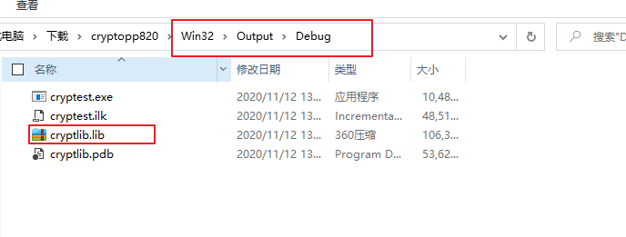

而头文件,则比较shi,需要将解压缩后的文件夹的头文件全部拷贝一份到📂include文件夹下


然后配置以下即可.


### BUGS

:bug:Link error : MDd_DynamicDebug

```cpp
Error   1   error LNK2038: mismatch detected for 'RuntimeLibrary': value 'MTd_StaticDebug' doesn't match value 'MDd_DynamicDebug' in program.obj    C:\Data\Work\C++ VS\CryptoTest\CryptoTest\cryptlib.lib(cryptlib.obj)    CryptoTest
Error   2   error LNK2038: mismatch detected for 'RuntimeLibrary': value 'MTd_StaticDebug' doesn't match value 'MDd_DynamicDebug' in program.obj    C:\Data\Work\C++ VS\CryptoTest\CryptoTest\cryptlib.lib(iterhash.obj)    CryptoTest
Error   3   error LNK2038: mismatch detected for 'RuntimeLibrary': value 'MTd_StaticDebug' doesn't match value 'MDd_DynamicDebug' in program.obj    C:\Data\Work\C++ VS\CryptoTest\CryptoTest\cryptlib.lib(sha.obj) CryptoTest
Error   4   error LNK2038: mismatch detected for 'RuntimeLibrary': value 'MTd_StaticDebug' doesn't match value 'MDd_DynamicDebug' in program.obj    C:\Data\Work\C++ VS\CryptoTest\CryptoTest\cryptlib.lib(pch.obj) CryptoTest
Error   5   error LNK2038: mismatch detected for 'RuntimeLibrary': value 'MTd_StaticDebug' doesn't match value 'MDd_DynamicDebug' in program.obj    C:\Data\Work\C++ VS\CryptoTest\CryptoTest\cryptlib.lib(misc.obj)    CryptoTest
Error   6   error LNK2038: mismatch detected for 'RuntimeLibrary': value 'MTd_StaticDebug' doesn't match value 'MDd_DynamicDebug' in program.obj    C:\Data\Work\C++ VS\CryptoTest\CryptoTest\cryptlib.lib(queue.obj)   CryptoTest
Error   7   error LNK2038: mismatch detected for 'RuntimeLibrary': value 'MTd_StaticDebug' doesn't match value 'MDd_DynamicDebug' in program.obj    C:\Data\Work\C++ VS\CryptoTest\CryptoTest\cryptlib.lib(algparam.obj)    CryptoTest
Error   8   error LNK2038: mismatch detected for 'RuntimeLibrary': value 'MTd_StaticDebug' doesn't match value 'MDd_DynamicDebug' in program.obj    C:\Data\Work\C++ VS\CryptoTest\CryptoTest\cryptlib.lib(filters.obj) CryptoTest
Error   9   error LNK2038: mismatch detected for 'RuntimeLibrary': value 'MTd_StaticDebug' doesn't match value 'MDd_DynamicDebug' in program.obj    C:\Data\Work\C++ VS\CryptoTest\CryptoTest\cryptlib.lib(fips140.obj) CryptoTest
Error   10  error LNK2038: mismatch detected for 'RuntimeLibrary': value 'MTd_StaticDebug' doesn't match value 'MDd_DynamicDebug' in program.obj    C:\Data\Work\C++ VS\CryptoTest\CryptoTest\cryptlib.lib(cpu.obj) CryptoTest
Error   11  error LNK2038: mismatch detected for 'RuntimeLibrary': value 'MTd_StaticDebug' doesn't match value 'MDd_DynamicDebug' in program.obj    C:\Data\Work\C++ VS\CryptoTest\CryptoTest\cryptlib.lib(mqueue.obj)  CryptoTest
```


:wrench:[stackoverflow](https://stackoverflow.com/questions/14714877/mismatch-detected-for-runtimelibrary)


---


## 29.objdump


## 30. valgrind

:link:[Home](https://www.valgrind.org/)

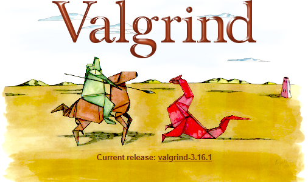

## 31. OpenGL


OpenGL3.2开始，规范文档开始废弃立即渲染模式，并鼓励开发者在OpenGL的核心模式(Core-profile)下进行开发，这个分支的规范完全移除了旧的特性。

你可能会问：既然OpenGL 4.5 都出来了，为什么我们还要学习OpenGL 3.3？答案很简单，所有OpenGL的更高的版本都是在3.3的基础上，引入了额外的功能，并没有改动核心架构。

### 31.1 安装

首先明白OpenGL其实是一个标准,所以各家的实现不同,各个厂商的实现也是不同,它依赖于具体的硬件比如AMD或者Intel,所以需要下载一个库去调用,应该可以这么说.这样不用直接去调用底层的opengl的库

下载地址::link:[GLFW](https://www.glfw.org/download.html) 

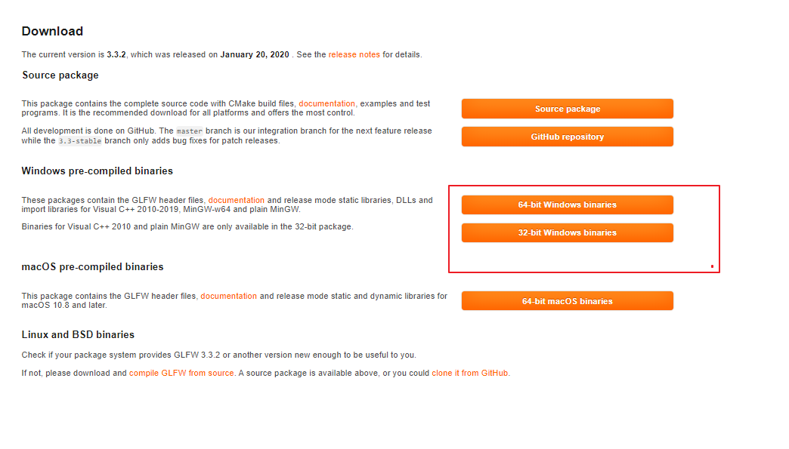

哪个版本都无所谓,因为这个版本指的是生成应用程序的版本是64位的还是32位的.不是指的操作系统的版本.

由于下载速度慢,所以将具体的库文件放在了QQ群:`1140421605`


接着进行配置

新建一个空项目,然后切换到文件夹视图


创建一个文件夹`src`,添加一个cpp文件,即将测试程序代码(来自GLFW的网址)复制进去.

```cpp
#include <GLFW/glfw3.h>

int main(void) {
    GLFWwindow* window;

    /* Initialize the library */
    if (!glfwInit())
        return -1;

    /* Create a windowed mode window and its OpenGL context */
    window = glfwCreateWindow(640, 480, "Hello World", NULL, NULL);
    if (!window) {
        glfwTerminate();
        return -1;
    }

    /* Make the window's context current */
    glfwMakeContextCurrent(window);

    /* Loop until the user closes the window */
    while (!glfwWindowShouldClose(window)) {
        /* Render here */
        glClear(GL_COLOR_BUFFER_BIT);

        /* Swap front and back buffers */
        glfwSwapBuffers(window);

        /* Poll for and process events */
        glfwPollEvents();
    }

    glfwTerminate();
    return 0;
}
```

接着,右击项目,找到项目路径


回到Solution的文件夹,创建一个文件夹放依赖的库`dependences`


进入denpendences,创建一个文件夹`GLFW`,并将下载的库文件`include`和`lib-vc2019`放入该文件夹下,表示这个是GLFW的库文件和头文件


回到VS,然后右击项目,选择属性,进行配置


选择,注意第一个Configuration选择所有,然后platform选择你对应的下载的32bit还是64bit,为了省事,我直接选择了all所有,这是为了你build的环境设置.你告诉vs你需要生成哪个平台下的程序.


然后需要告诉vs需要从哪里找到依赖的头文件


添加`$(Solution)dependences\include` 这里使用了vs的宏`Solution`表示解决方案的路径即sln文件所在目录. 这样你给到别人这个项目的时候,不要别人再进行配置.而如果你直接复制自己include的路径,在发给别人之后还需要配置该路径,因为至少计算机名是不一样的,比如我的叫做MartinTai.


这个时候,你发现cpp文件include不报错了 ,即可以进行编译了,编译已经没有问题了.还剩下链接的错误.所以这个时候要需要配置linker的.

同样,你需要添加库文件所在目录.


这时候,你只是告诉vs你外来库的路径,并没有告诉vs需要链接哪个库.所以还需要进入input页签.


添加这两个库,其中`glfw3.lib`是GLFW的库,也就是你下载之后lib-vs2019的里面的静态库.还有一个是`Opengl32.lib`是因为需要调用的底层的opengl的函数.


最后确定即可.最终执行结果.


插曲:如果你不添加`Opengl32.lib` 这个不确定你下载的版本是不是也叫这个名,这个不要添加外来的库文件,只需要添加即可,因为这是系统自带的.

这里我没有添加,在执行的时候会报glClear链接错误.


要解决添加什么库的问题:复制函数名 然后用浏览器搜下,可以看到是win32的api


然后点进去,就可以看到所需要的库文件名称.


### 31.2 入门教程

:link:[LearnOpenGl](https://learnopengl-cn.github.io/)

:link:[源代码地址](https://github.com/JoeyDeVries/LearnOpenGL/tree/master/src)


## 32.MIPS

:link:[tutorial](https://chortle.ccsu.edu/assemblytutorial/index.html)

:link:[Mars](http://courses.missouristate.edu/kenvollmar/mars/)

:link:[b站]()


### 32.1 Mars使用

创建asm文件å,进行assmble汇编


然后运行


```assembly
.data
	msg: .ascii "hello mips"
.text
	li $v0,4
	la $a0,msg
	syscall
```


## 33. 线性代数

线性代数是用来描述**空间**的工具.


`向量`:当我们需要把几个数值放在一起,作为一个整体来处理的时候,我们就需要借助向量这个东东来进行处理分析.

通常描述为列向量.但是列向量太高了,所以让它扁一点,用转置操作.例如:


$$
\begin{pmatrix}8
 \\2
 \\3
 \\5
\end{pmatrix}=\begin{pmatrix}8
  &2  &3  &5
\end{pmatrix}^T
$$

**向量空间**:加法和数量乘法运算的世界,也叫**线性空间**.它是我们生活的现实空间的一个缩影,是对现实空间的抽象化.在这个抽象世界里,我们能做的只有加法,数量乘法.

> 线性代数研究的对象是向量空间/线性空间.而不是其他空间.

`有向线段`:是进行加法和乘法的基础.而`有向线段`的基础来自`原点`的参照.


然而.在线性空间的世界中,当需要特别指定某个向量时,我们除了用手指指,诺,就在那儿,于是要建立一种不需要动手指也能顺利沟通的方式,那就是给线性空间的世界编写地址.---> `基底`

> 在不指定基底的情况下,讨论坐标根本没有意义.打个比方,单纯说"富士山高3776"的话,意思表达并不明确.加上单位变成3776米之后,句子变得才有意义. 3776 相当于左表,米相当于基底.


## 34.数据安全

### 34.1 对称密码(共享密钥密码)

> 一个密钥既可以解密也可以加密,类似保险柜的🔑.既可以放东西,也可以取东西.

#### XOR运算

相同为0,不同为1.

A通过密钥B进行XOR运算,生成密文A**⊕**B=C

C通过密钥B进行XOR运算,生成明文C&oplus;B=A

==> A&oplus;B&oplus;B=A  好像B给抵消了样


### 34.2 公钥密码-非对称加密

:baby_chick: 公钥密码的处理速度只有对称密码的几百份之一.所以不适合长消息的加密.

最常用的公钥密码--RSA


#### 34.2.0 RSA

用于公钥密码和数字签名

+ 在RSA中,明文,密钥和密文都是数字

---

RSA加密:
$$
密文 = 明文^E mod N
$$

> 明文做E次方,然后对N求余,这个余数就是密文

`<E,N>`就是公钥

---


---

RSA解密:
$$
明文 = 密文^D mod N
$$

> 密文做D次方然后对N求余,余数就是明文

`<D,N>`就是私钥


#### 34.2.1 密钥配送问题的解决

所谓密钥配送问题是指一开始发送消息需要将消息和解密的密钥一起发送给接收方,但这可能被窃听,所以密钥怎么安全的给到接收方是一个问题.

有人就想到了公钥密码来解决:key:,具体来说是这样解决的.比如A想要解密B发来的消息,A先生成自己的密钥对,私钥自己留着,公钥给B,告诉B你要是想发消息给我,先用公钥进行加密.这样B就可以用公钥将消息加密.就算窃听也没事,因为只有私钥才可以解密.而私钥在A的手上,所以A可以用私钥将密文解密,从而获取明文.这是B可以发送给A消息.同样的,如果A发送消息给B,B先生成密钥对,将私钥留着,将公钥给A.告诉A要是想要发消息给B,先用公钥进行加密.


#### 34.2.2 公钥认证

##### 34.2.2.1 单向散列函数

单向散列函数具体👉:MD4、MD5;👉SHA-1、SHA-256、SHA-256、SHA-384、SHA-512 👉RIPEMD-160 👉AHS 👉SHA-3


###### 34.2.2.1.1 术语

其他叫法:one:消息摘要函数 message digest function :two:哈希函数 :three:杂凑函数

既然是函数,就会有输入和输出:

​	**输入**单向散列函数的消息也叫做原像pre-image

​	单向散列函数的**输出**的散列值称为消息摘要message digest 或者指纹fingerprint


###### 34.2.2.1.2 作用

**检查消息是否被篡改**.即消息的完整性(也叫一致性)

原始消息用单向散列函数进行计算出散列值A

别人拷贝的消息用单向散列函数进行计算出散列值B

比较A和B,如果一致,则没有被篡改,否则,被篡改.

###### 34.2.2.1.3 性质

1. 不需要知道消息实际代表的含义
2. 散列值的长度和消息大小无关且固定长度,SHA-1输出的散列值长度为20字节/160比特
3. 能够快速计算出散列值
4. 消息不同散列值不同
5. 具备单向性,即不可以通过散列值能推算出消息是什么


###### 34.2.2.2.1.4 用途

数字签名


#### 34.2.3 数字签名

> 唯一作用:消息是谁写的.

类似现实世界的盖章,签字.**但是数字签名不保证消息的<u>时间有效性</u>,可以再消息中声明该消息的有效期并加上数字签名--> 公钥的证书**

所以数字签名可以识别:one:**篡改**和:two:**伪装**,还可以防止:three:**否认**.**消息认证码无法防止否认**.

**数字签名的过程非常耗时,因此一般不会对整个消息内容进行数字签名,而是先通过单向散列函数计算出消息的散列值,然后再对这个散列值施加数字签名.**  👉 单向散列函数和数字签名的关系:**单向散列函数解决了篡改和伪装,数字签名解决了否认.**

> 场景:
>
> 假设Alice需要向Bob借100万.不过,两个人距离太远,通过银行汇款,Alice可以立刻从Bob哪里收到钱,但是Alice的借条应该怎样发送给Bob呢?可以用挂号信寄过去,不过那样需要花上一段时间,能不能用电子邮件来发送借条呢?比如:"Bob,我向你借款100万元.--Alice"
>
> 显然,这样的邮件无法代替借条,Bob看到这封邮件也不会轻易相信,因为电子邮件是很容易伪造的.Alice写的邮件有可能被篡改,也有可能是有人伪装成Alice发送了这封邮件,或者Alice可以事后以"我不知道这张借条"为理由来进行否认.


##### 签名的生成和验证

生成消息签名:由发送者Alice完成,利用签名密钥生成消息的签名,意味着发送者认可该消息是本人发送的.

验证消息签名:由接收者Bob完成.也可以由第三方Victor来验证,利用验证密钥进行验证,验证结果如果是成功,那么意味着该签名是发送者Alice的.失败表示不是Alice发送的消息.

**验证密钥无法生成签名的.签名密钥是只有签名的人才有的,验证密钥是任何需要验证签名的人都可以持有**.👉很像公钥密码


下面的过程**没有将消息加密**.这里只是说明单向散列和签名的过程.

数字签名可以附加再消息的末尾,可以和消息分离,单独作为文件来发送.


:question:Alice的公钥是否有效?还是说Alice的公钥更改了?就像人换了种签名方式.

> 即验证签名的公钥是否属于真正的发送者的.防止公钥被伪造.
>
> 数字签名解决了篡改,伪装,否认,但是要正确使用数字签名,有一个**大前提**,那就是用于验证签名的公钥必须属于真正的发送者.

👉公钥证书来解决.---> 社会学的领域,所谓的第三方.


#### 34.2.4 证书-为公钥加上数字签名

为了确认自己得到的公钥是否合法/有效.(by the way:都设计合法性的问题了.已然进入了社会学领域),我们需要证书.所谓证书,就是将公钥当作一条消息,由一个可信的第三方对其签名后所得到的公钥.

这个社会学领域的基础设施机构:PKI.

先由公钥证书`Public-Key Certificate` 👉PKC:和驾照类似,里面记上姓名,组织,邮箱,地址等个人信息,还有属于此人的公钥.

再由认证机构`Certification Authoority`👉CA:施加数字签名. 


查看自己的电脑的证书:

```powershell
certmgr.msc
```


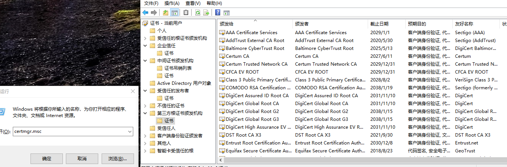


### 练习


思路:


## 35.WORD

### 35.1 另存为pdf,带书签


## 36. APUE

### 36.1 文件和目录

> 核心点:文件的属性
>
> 操作这些属性的函数用法

### 36.0 struct stat

```c
#include <sys/types.h>
#include <sys/stat.h>

struct stat {
	dev_t st_dev;			
	ino_t st_ino;
	mode_t st_mode;
	nlink_t st_nlink;
	uid_t st_uid;
	gid_t st_gid;
	dev_t st_rdev;
	off_t st_size;
	time_t st_atime;
	time_t st_mtime;
	time_t st_ctime;
	blksize_t st_blksize;
	blkcnt_t st_blocks;
	mode_t st_attr;
}; 
struct stat64 {
	dev_t st_dev;
	ino64_t st_ino;
	mode_t st_mode;
	nlink_t st_nlink;
	uid_t st_uid;
	gid_t st_gid;
	dev_t st_rdev;
	off64_t st_size;
	time_t st_atime;
	time_t st_mtime;
	time_t st_ctime;
	blksize_t st_blksize;
	blkcnt64_t st_blocks;
	mode_t st_attr;
}; 

```


#### 36.1.1 stat命令

查看文件的状态status: linux系统有`stat`命令


#### 36.1.2 文件状态函数

##### stat


##### fstat


##### lstat


##### fstatat


## 37.Shell

### 37.1 sudo -s

> 切换回root用户

### 37.2 su username

> 切换回普通用户


### 37.3 find

37.3.1 基本格式:


#### 37.3.2 -user

```shell
find . -user jack # 找出当前文件夹下owner是jack的文件
```

#### 37.3.3 -nouser

```shell
find . -nouser
```

#### 37.3.4 -group


#### 37.3.5 -nogroup


#### 37.3.6 -readable

```shell
 find . -readable
```


37.3.7 -type c

```shell
File is of type c:

b      block (buffered) special

c      character (unbuffered) special

d      directory

p      named pipe (FIFO)

f      regular file

l      symbolic link; this is never true if the -L option or
the -follow option is in effect, unless the symbolic
link is broken.  If you want to search for symbolic
links when -L is in effect, use -xtype.

s      socket

D      door (Solaris)
```


### 37.4 chown


### 37.5 cut


### 37.6 tr

将换行符替换成空格

```shell
tr -t "\n" " "
```

将多个空格压缩成一个空格

```shell
tr -s ' '
```


### 37.7 grep


```shell
ls -l | grep "^d"
```


